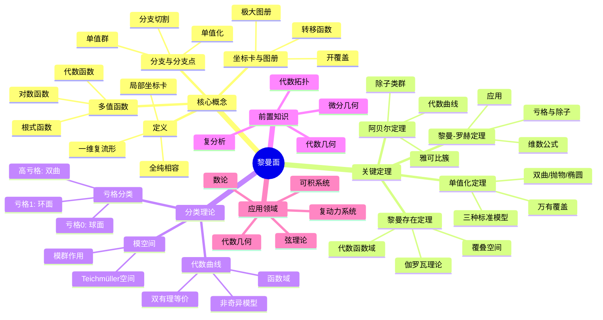

# 黎曼面思维导图

## 概述
黎曼面是一维复流形，为复函数提供自然的定义域，统一多值函数的研究。

## 核心要点

### 黎曼面定义
一维复流形：局部同胚于ℂ开集，转移函数全纯。

### 单值化定理
**定理**: 单连通黎曼面共形等价于下列之一:
- ℂ̂ (球面，椭圆型)
- ℂ (平面，抛物型)
- 𝔻 (单位圆，双曲型)

### 黎曼-罗赫定理
对于亏格 g 的紧致黎曼面:
$$l(D) - l(K-D) = \deg(D) + 1 - g$$

其中:
- D: 除子
- K: 典范除子
- l(D): 亚纯函数空间维数

### 重要例子
| 黎曼面 | 亏格 | 通用覆盖 |
|--------|------|----------|
| ℂ̂ | 0 | ℂ̂ |
| 环面 ℂ/Λ | 1 | ℂ |
| 超椭圆曲线 | g | 𝔻 |

## 参考
- 《黎曼面》Forster
- 《紧黎曼面》Narasimhan
