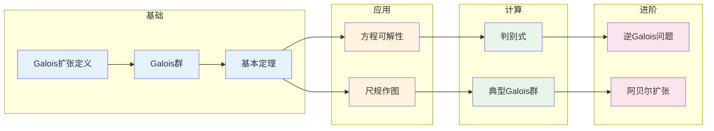

# Galois理论 - 思维导图

## 概述

Galois理论是代数学的顶峰之一，由Évariste Galois在19世纪初创立。它建立了域扩张与群之间的深刻对应，将域的代数结构转化为群的可解性结构。Galois理论不仅解决了古典的"方程根式可解性"问题，还为现代代数学、代数数论和代数几何奠定了基石。这一理论被誉为数学美的典范，展示了抽象结构之间的深层和谐。

---

## 核心思维导图

```mermaid
mindmap
  root((Galois理论<br/>Galois Theory))
    Galois对应
      基本定理
        {中间域} ↔ {子群}
        反包含关系
        度 = 指数
      正规子群
        对应正规扩张
        商群 = Galois群
    Galois扩张
      定义
        正规且可分
        自同构群作用传递
      等价条件
        分裂域

        |Gal(K/F)| = [K:F]

    Galois群
      定义
        Aut(K/F)
        固定F的自同构
      例子
        Sₙ 对称群
        循环群
        二面体群
    应用
      方程可解性
        根式可解 ⇔ Galois群可解
        五次方程一般不可解
      尺规作图
        可构造 ⇔ 度为2的幂
        三大古典问题
    计算
      分裂域
        多项式的根
      判别式
        根的对称函数
        子群判定

```

---

## Galois对应基本定理

```mermaid
graph TD
    subgraph Galois扩张
        K[K/F Galois]
        G[Gal(K/F)]
    end
    
    subgraph 对应
        Fields[中间域 E]<-->Subgroups[H ≤ G]
        AntiReverse[E₁⊆E₂ ⇔ H₂≤H₁]
    end
    
    subgraph 关键性质
        Degree[[E:F] = [G:H]]
        Index[[K:E] = |H|]

        Normal[H ◁ G ⇔ E/F Galois]
        Quotient[Gal(E/F) ≅ G/H]
    end
    
    subgraph 图示
        K1[K] --- E1[E] --- F1[F]
        H1[{e}] --- H[H] --- G1[G]
        K1 -.-> H1
        E1 -.-> H
        F1 -.-> G1
    end
    
    K --> Fields
    G --> Subgroups
    Fields --> AntiReverse
    Subgroups --> AntiReverse
    
    Fields --> Degree
    Fields --> Index
    Subgroups --> Normal
    Subgroups --> Quotient
    
    K --> K1
    G --> G1
    
    style K fill:#e3f2fd
    style G fill:#fff3e0
    style Fields fill:#c8e6c9
    style Subgroups fill:#c8e6c9

```

---

## Galois扩张的等价条件

```mermaid
graph TD
    subgraph 等价条件
        K[K/F 有限扩张]
    end
    
    subgraph 条件列表
        C1[Galois扩张]
        C2[正规且可分]
        C3[K是某多项式的分裂域]
        C4[K^G = F, G=Aut(K/F)]
        C5[[K:F] = |Aut(K/F)|]

        C6[F[x]中不可约多项式<br/>有根⇒分裂]
    end
    
    subgraph 关系
        C1 <---> C2
        C1 <---> C3
        C1 <---> C4
        C1 <---> C5
        C2 <---> C6
    end
    
    subgraph 重要推论
        Cor1[K^Aut(K/F) 是F的纯不可分闭包]
        Cor2[Galois闭包存在]
    end
    
    K --> C1
    K --> C2
    K --> C3
    K --> C4
    K --> C5
    K --> C6
    
    C1 --> Cor1
    C1 --> Cor2
    
    style K fill:#e3f2fd
    style C1 fill:#c8e6c9
    style C3 fill:#fff3e0
    style C5 fill:#e8f5e9

```

---

## 方程根式可解性

```mermaid
graph TD
    subgraph 根式可解
        Radical[根式可解]
        Def[通过加减乘除<br/>和开方运算表示根]
    end
    
    subgraph Galois判别
        Splitting[分裂域K]
        GaloisGroup[Gal(K/F)]
        Criterion[Galois群可解<br/>⇔ 方程根式可解]
    end
    
    subgraph 可解群性质
        Solvable[可解群]
        Chain[G = G₀ ⊵ G₁ ⊵ ... ⊵ {e}]
        Abelian[Gᵢ/Gᵢ₊₁ 阿贝尔]
    end
    
    subgraph 应用
        Quad[次数≤4: 总有解<br/>S₄可解]
        Quintic[次数≥5: 一般无解<br/>Aₙ, Sₙ (n≥5) 非可解]
        Specific[特殊方程可能有解<br/>x⁵-2=0 可解]
    end
    
    Radical --> Def
    Def --> Splitting
    Splitting --> GaloisGroup
    GaloisGroup --> Criterion
    
    Criterion --> Solvable
    Solvable --> Chain
    Solvable --> Abelian
    
    Criterion --> Quad
    Criterion --> Quintic
    Criterion --> Specific
    
    style Radical fill:#e3f2fd
    style GaloisGroup fill:#fff3e0
    style Criterion fill:#c8e6c9
    style Solvable fill:#e8f5e9
    style Quintic fill:#ffcdd2

```

---

## 典型Galois群

```mermaid
graph TD
    subgraph 例子
        Quadratic[x²+a x+b]<-->S2[S₂ = C₂]
        Cubic[x³+a x²+b x+c]<-->S3[S₃, 阶6]
        Quartic[x⁴+...]<-->S4[S₄, 或子群]
        Quintic[x⁵+...]<-->S5[S₅, A₅ 非可解]
    end
    
    subgraph 特殊扩张
        Cyclotomic[ℚ(ζₙ)/ℚ]<-->Unit[(ℤ/nℤ)*]
        CyclotomicGal[Gal ≅ (ℤ/nℤ)*<br/>阿贝尔扩张]
    end
    
    subgraph 有限域
        Finite[𝔽_{pⁿ}/𝔽ₚ]<-->Cyclic[Gal ≅ Cₙ<br/>由Frobenius生成]
    end
    
    subgraph Kummer扩张
        Kummer[F(ⁿ√a)/F]<-->Cond[包含n次单位根]
        KummerGal[Gal ⊆ ℤ/nℤ]
    end
    
    Quadratic --> S2
    Cubic --> S3
    Quartic --> S4
    Quintic --> S5
    
    Cyclotomic --> Unit
    Unit --> CyclotomicGal
    
    Finite --> Cyclic
    
    Kummer --> Cond
    Cond --> KummerGal
    
    style Quadratic fill:#e3f2fd
    style Cyclotomic fill:#c8e6c9
    style Finite fill:#fff3e0
    style Kummer fill:#e8f5e9
    style S5 fill:#ffcdd2

```

---

## 尺规作图

```mermaid
mindmap
  root((尺规作图))
    可构造数
      从{0,1}出发
      通过尺规操作
        直线交点
        圆交点
      形成域
        ℚ的二次扩张塔
    度条件
      可构造 ⇔ [ℚ(α):ℚ] = 2ⁿ
      度为2的幂
    古典问题
      三等分角
        cos(20°) 不可构造
        极小多项式 3次
      倍立方
        ³√2 不可构造
        3次扩张
      化圆为方
        π 超越
        不可构造
    Galois理论解释
      可构造条件
        Galois群是2-群
        存在子群链

```

---

## Galois理论证明概要

```mermaid
graph TD
    subgraph 基本定理证明
        Step1[K/F Galois]<-->Step2[Artin引理]
        Step2 --> Step3[K^H 对应子群H]
        Step3 --> Step4[度 = 指数]
        Step4 --> Step5[反包含]
    end
    
    subgraph Artin引理
        Lemma[|G|有限, K^G = F]
        Conclusion[[K:F] ≤ |G|]

        Deduction[K/F Galois, Gal(K/F)=G]
    end
    
    subgraph 可解性证明
        Solvable1[根式扩张塔]<-->Solvable2[可解群链]
        Solvable2 --> Solvable3[Galois对应]
        Solvable3 --> Solvable4[可解判别]
    end
    
    Step1 --> Lemma
    Lemma --> Conclusion
    Conclusion --> Deduction
    
    style Step1 fill:#e3f2fd
    style Lemma fill:#c8e6c9
    style Conclusion fill:#fff3e0
    style Solvable1 fill:#e8f5e9

```

---

## 判别式与Galois群计算

```mermaid
graph TD
    subgraph 判别式
        Disc[Δ = ∏ᵢ<ⱼ(αᵢ-αⱼ)²]
        Symmetric[根的对称多项式]
        Coefficient[可用系数表示]
    end
    
    subgraph Galois群信息
        Square[Δ是平方数?]
        Yes[Galois群 ⊆ Aₙ]
        No[Galois群 ⊄ Aₙ]
    end
    
    subgraph 约化方法
        Reduce[f mod p]
        Factor[分解类型]
        Cycle[对应轮换类型]
    end
    
    subgraph 例子
        Cubic[三次方程]<-->A3[A₃ vs S₃]
        Quartic[四次方程]<-->D4[D₄, V₄, A₄, S₄]
    end
    
    Disc --> Symmetric
    Symmetric --> Coefficient
    
    Disc --> Square
    Square --> Yes
    Square --> No
    
    Reduce --> Factor
    Factor --> Cycle
    
    Disc --> Cubic
    Disc --> Quartic
    
    style Disc fill:#e3f2fd
    style Square fill:#c8e6c9
    style Reduce fill:#fff3e0
    style Cubic fill:#e8f5e9

```

---

## 重要定理总结

| 定理 | 陈述 | 应用 |
|------|------|------|
| **Galois基本定理** | 中间域 ↔ Galois子群 | 域结构分析 |
| **根式可解判别** | 根式可解 ⇔ Galois群可解 | 方程可解性 |
| **Artin引理** | K^G = F ⇒ [K:F] ≤ |G| | 基本定理证明 |
| **分圆扩张** | Gal(ℚ(ζₙ)/ℚ) ≅ (ℤ/nℤ)* | 阿贝尔扩张 |
| **有限域Galois群** | Gal(𝔽_{pⁿ}/𝔽ₚ) ≅ Cₙ | 有限域理论 |

---

## 学习路径



---

## 与后续概念的联系

- **类域论**: 阿贝尔扩张的完整描述
- **代数数论**: 分圆域、类群
- **代数几何**: Étale上同调、基本群
- **表示论**: Galois表示
- **Langlands纲领**: 数论与表示论的统一
- **反问题**: 逆Galois问题

---

*文档版本：1.0*
*创建时间：2026年4月*
*分类：代数学 / Galois理论 / 思维导图*
