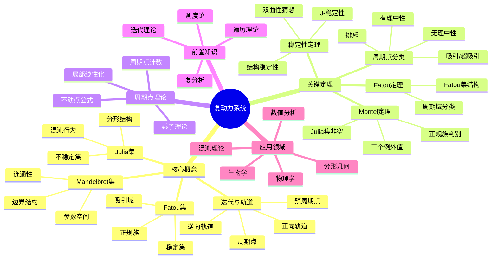

msc_primary: "00A99"
msc_secondary: ['00-00']
---

# 复动力系统思维导图

## 概述
复动力系统研究复解析映射的迭代行为，展现数学之美与复杂性。

## 核心要点

### Fatou集与Julia集
**Fatou集**: 正规点集合，动力学稳定
**Julia集**: 非正规点集合，动力学混沌

**性质**:
- Julia集非空、完美、完全不连通或连通
- Fatou集为开集，可数个连通分支

### Montel定理
**定理**: 解析函数族若避开三个值则为正规族。

**推论**: Julia集非空

### 周期点分类
设 λ = (fⁿ)'(z₀) 为乘子:

| 类型 | 条件 | 动力学行为 |
|------|------|------------|
| 吸引 | \|λ\|<1 | 附近点吸引 |
| 超吸引 | λ=0 | 临界周期点 |
| 排斥 | \|λ\|>1 | 附近点排斥 |
| 有理中性 | λⁿ=1 | 花瓣结构 |
| 无理中性 | \|λ\|=1, λⁿ≠1 | 线性化问题 |

### Mandelbrot集
$$M = \{c \in \mathbb{C} : J(f_c) \text{ 连通}\}$$
其中 f_c(z) = z² + c

## 参考
- 《复动力系统》Milnor
- 《复动力系统的几何学】Carleson
