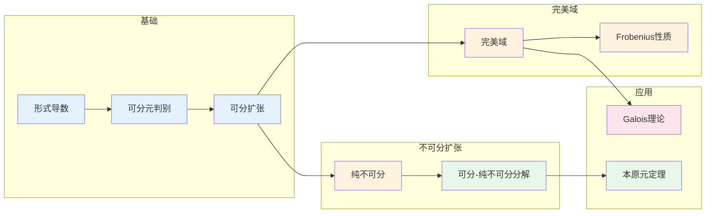

# 可分性 - 思维导图

## 概述

可分性是域扩张理论中的核心概念，它确保了代数扩张具有良好的性质——特别是保证了本原元定理和Galois理论的正常运作。在特征0的域中，所有代数扩张都是可分的；但在特征p的域中，不可分扩张的出现带来了额外的复杂性。可分性是连接代数闭包、Galois理论和完美域概念的关键纽带。

---

## 核心思维导图

```mermaid
mindmap
  root((可分性<br/>Separability))
    可分元
      定义
        极小多项式无重根
        可分多项式
      判别
        gcd(f, f') = 1
        形式导数
      不可分情形
        char = p
        f' = 0
        纯不可分
    可分扩张
      每个元可分
        代数可分扩张
      性质
        塔性质
        合成性质
      本原元定理
        有限可分扩张单生成
    完美域
      定义
        所有代数扩张可分
      例子
        char = 0域
        有限域
        代数闭域
      非完美例子
        𝔽ₚ(t)
        有理函数域
    纯不可分扩张
      定义
        极小多项式形如x^{pⁿ}-a
      性质
        高度
        完全交集
    可分闭包
      F^{sep}
        最大可分扩张
      Galois群
        绝对Galois群

```

---

## 可分性判别

```mermaid
graph TD
    subgraph 可分元判别
        Alpha[α ∈ K]
        MinPoly[m_α(x)]
        Derivative[m_α'(x)]
    end
    
    subgraph 判别条件
        Sep[gcd(m_α, m_α') = 1]<-->SepDef[可分]
        Insep[m_α' = 0]<-->InsepDef[不可分]
    end
    
    subgraph 特征影响
        Char0[char = 0]<-->AlwaysSep[总可分]
        CharP[char = p]<-->PossibleInsep[可能不可分]
    end
    
    subgraph 不可分结构
        Form[m_α(x) = g(x^{pⁿ})]
        PureInsep[α^{pⁿ} 可分]
        Exponent[不可分指数]
    end
    
    Alpha --> MinPoly
    MinPoly --> Derivative
    
    Derivative --> Sep
    Derivative --> Insep
    
    MinPoly --> Char0
    MinPoly --> CharP
    
    Insep --> Form
    Form --> PureInsep
    PureInsep --> Exponent
    
    style Alpha fill:#e3f2fd
    style Sep fill:#c8e6a7
    style Insep fill:#ffcdd2
    style Char0 fill:#e3f2fd
    style CharP fill:#fff3e0

```

---

## 完美域

```mermaid
graph TD
    subgraph 完美域定义
        Perfect[完美域 F]
        AllSep[所有代数扩张可分]
        FrobeniusSurj[Frobenius 双射]
    end
    
    subgraph 完美域例子
        Char0[char = 0域<br/>ℚ, ℝ, ℂ]
        Finite[有限域 𝔽ₚ]
        AlgClosed[代数闭域]
    end
    
    subgraph 非完美域
        NonPerfect[非完美域]
        Rational[𝔽ₚ(t)]
        Function[函数域]
        Imperfect[存在a, X^{pⁿ}-a不可约]
    end
    
    subgraph 完美化
        PerfectClosure[F^{perf}]
        Adjoin[添加pⁿ次根]
        Union[∪ F^{p⁻ⁿ}]
    end
    
    subgraph 重要性
        Primitive[本原元定理]
        GaloisTheory[Galois理论]
        Simple[简化结构]
    end
    
    Perfect --> AllSep
    Perfect --> FrobeniusSurj
    
    AllSep --> Char0
    AllSep --> Finite
    AllSep --> AlgClosed
    
    FrobeniusSurj --> NonPerfect
    NonPerfect --> Rational
    NonPerfect --> Function
    NonPerfect --> Imperfect
    
    NonPerfect --> PerfectClosure
    PerfectClosure --> Adjoin
    Adjoin --> Union
    
    AllSep --> Primitive
    AllSep --> GaloisTheory
    AllSep --> Simple
    
    style Perfect fill:#e3f2fd
    style Char0 fill:#c8e6c9
    style Finite fill:#c8e6c9
    style NonPerfect fill:#ffcdd2
    style Rational fill:#fff3e0
    style PerfectClosure fill:#e8f5e9

```

---

## 纯不可分扩张

```mermaid
graph TD
    subgraph 纯不可分元
        PureInsep[α 纯不可分]
        Def[α^{pⁿ} ∈ F]
        MinPolyForm[m_α(x) = x^{pⁿ} - a]
    end
    
    subgraph 纯不可分扩张
        PureExt[K/F 纯不可分]
        EveryPure[每个元纯不可分]
        Height[高度 ≤ n]
    end
    
    subgraph 性质
        Radical[x^{pⁿ} - a 分裂]
        UniqueRoot[唯一根]
        Normal[正规扩张]
        GaloisTriv[Galois群平凡]
    end
    
    subgraph 结构
        Tower[塔结构]
        EachStep[每步添加p次根]
        Degree[[K:F] = pⁿ]
    end
    
    subgraph 可分-纯不可分分解
        AnyExt[K/F 任意代数]
        SepPart[Kₛ/F 可分]
        PurePart[K/Kₛ 纯不可分]
        Decomp[K = Kₛ ⊗ Kₚ]
    end
    
    PureInsep --> Def
    PureInsep --> MinPolyForm
    
    Def --> PureExt
    PureExt --> EveryPure
    EveryPure --> Height
    
    PureExt --> Radical
    Radical --> UniqueRoot
    PureExt --> Normal
    PureExt --> GaloisTriv
    
    PureExt --> Tower
    Tower --> EachStep
    Tower --> Degree
    
    PureExt --> AnyExt
    AnyExt --> SepPart
    AnyExt --> PurePart
    SepPart --> Decomp
    PurePart --> Decomp
    
    style PureInsep fill:#e3f2fd
    style PureExt fill:#fff3e0
    style SepPart fill:#c8e6c9
    style PurePart fill:#ffcdd2

```

---

## 可分闭包

```mermaid
mindmap
  root((可分闭包))
    定义
      F^{sep}
        最大可分扩张
        F的代数闭包中
      性质
        可分扩张的并
        Galois对应
    绝对Galois群
      G_F = Gal(F^{sep}/F)
        profinite群
         Krull拓扑
      重要性
        算术几何
        类域论
    例子
      ℚ^{sep}
        代数数的可分闭包 = ℚ̄
      𝔽ₚ^{sep}
        所有有限域的并
    完美域情形
      F^{sep} = F̄
        可分 = 代数
      G_F = Gal(F̄/F)
        绝对Galois群

```

---

## 本原元定理

```mermaid
graph TD
    subgraph 本原元定理
        PMT[本原元定理]
    end
    
    subgraph 条件
        Finite[有限扩张]
        Separable[可分扩张]
        Char0[特征0自动满足]
    end
    
    subgraph 结论
        Simple[K = F(α)]
        SingleGen[单生成元]
    end
    
    subgraph 证明思路
        FiniteFields[有限域]<-->CyclicMul[乘法群循环]
        InfiniteFields[无限域]<-->DistinctEmb[不同嵌入]<-->LinearIndep[线性无关]<-->Exist[存在α使得<br/>σᵢ(α)不同]
    end
    
    subgraph 反例
        Inseparable[不可分扩张]<-->PMTFail[本原元定理失效]
        Example[𝔽ₚ(s,t)/𝔽ₚ(sᵖ,tᵖ)]
    end
    
    subgraph 计算
        Sum[α = α₁ + λα₂]<-->Find[找到λ使<br/>F(α₁,α₂) = F(α)]
    end
    
    PMT --> Finite
    PMT --> Separable
    Separable --> Char0
    
    PMT --> Simple
    
    Finite --> FiniteFields
    Finite --> InfiniteFields
    
    PMT --> Inseparable
    Inseparable --> PMFail[不满足]
    PMFail --> Example
    
    PMT --> Sum
    
    style PMT fill:#e3f2fd
    style Simple fill:#c8e6c9
    style Separable fill:#fff3e0
    style Finite fill:#e8f5e9
    style Inseparable fill:#ffcdd2

```

---

## 可分性与Galois理论

```mermaid
graph TD
    subgraph Galois扩张条件
        Galois[Galois扩张]
        Normal[正规]
        Sep[可分]
    end
    
    subgraph 可分闭包上的Galois理论
        SepClosure[F^{sep}/F]
        AbsoluteGalois[G_F = Gal(F^{sep}/F)]
        GaloisCorrespondence[中间扩张 ↔ 闭子群]
    end
    
    subgraph 不可分扩张的处理
        InseparableExt[不可分扩张]
        PureInsepPart[纯不可分部分]
        AutTriv[自同构平凡]
    end
    
    subgraph 重要性
        Fundamental[Galois理论基本定理]
        Dimension[度公式]
        Correspondence[一一对应]
    end
    
    Galois --> Normal
    Galois --> Sep
    
    Sep --> SepClosure
    SepClosure --> AbsoluteGalois
    AbsoluteGalois --> GaloisCorrespondence
    
    Normal --> InseparableExt
    InseparableExt --> PureInsepPart
    PureInsepPart --> AutTriv
    
    Sep --> Fundamental
    Fundamental --> Dimension
    Fundamental --> Correspondence
    
    style Galois fill:#e3f2fd
    style Sep fill:#c8e6c9
    style AbsoluteGalois fill:#fff3e0
    style InseparableExt fill:#ffcdd2
    style Fundamental fill:#e8f5e9

```

---

## 重要公式与定理

| 概念 | 陈述 | 应用 |
|------|------|------|
| **可分判别** | $\gcd(f, f') = 1$ | 可分性判定 |
| **可分次数** | $[K:F]_s = |\text{Hom}_F(K, \bar{F})|$ | 可分部分度 |
| **纯不可分次数** | $[K:F]_i = [K:F]/[K:F]_s$ | 不可分指数 |
| **塔公式** | $[K:F] = [K:F]_s [K:F]_i$ | 度分解 |
| **本原元定理** | 有限可分扩张单生成 | 简化结构 |
| **完美域判别** | $F^p = F$ ⇔ 完美 | 完美性判定 |

---

## 学习路径



---

## 与后续概念的联系

- **Galois上同调**: 可分闭包的上同调
- **平展上同调**: 特征p的几何
- **微分模**: Kähler微分、可分性
- **赋值论**: 可分扩张的赋值延拓
- **代数几何**: 可分态射、平展态射

---

*文档版本：1.0*
*创建时间：2026年4月*
*分类：代数学 / 域论 / 思维导图*
