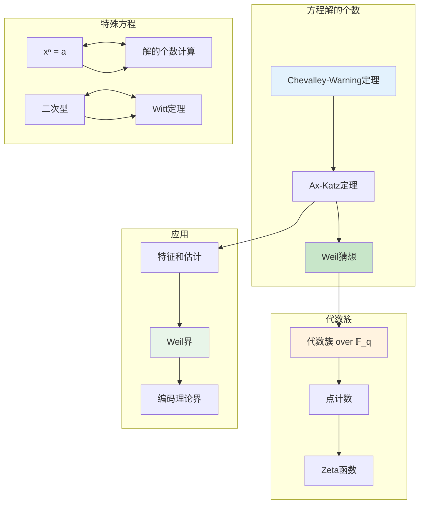
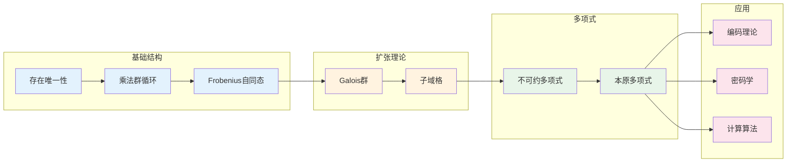

# 有限域 - 思维导图

## 概述

有限域（也称Galois域）是元素个数有限的域，是代数学中最优美、最有用的结构之一。有限域在编码理论、密码学、组合设计和计算机科学中有着广泛应用。其结构极其清晰：对任意素数幂q=pⁿ，存在唯一的q元域𝔽_q。有限域理论展示了抽象代数的力量，它将数论、代数几何和组合数学紧密联系在一起。

---

## 核心思维导图

```mermaid
mindmap
  root((有限域<br/>Finite Fields))
    存在唯一性
      阶为pⁿ
        p素数, n≥1
      存在性
        分裂域
        x^{pⁿ}-x
      唯一性
        同构唯一
        𝔽_{pⁿ}
    乘法群
      循环群
        𝔽_q* ≅ C_{q-1}
        本原元存在
      应用
        离散对数
        密码学
    Frobenius自同态
      φ: x ↦ x^p
        域自同构
        生成Galois群
      性质
        Freshman法则
        (a+b)^p = a^p+b^p
    扩张理论
      𝔽_{pⁿ}/𝔽ₚ
        度为n的扩张
        Galois群 Cₙ
      子域格
        对应n的因子
    应用
      编码理论
        Reed-Solomon码
        BCH码
      密码学
        AES
        椭圆曲线
      组合数学
        有限几何
        设计理论
```

---

## 有限域结构

```mermaid
graph TD
    subgraph 基本定理
        Main[有限域结构定理]
    end
    
    subgraph 存在性
        Exist[∀p素数, n≥1]<-->Field[∃ 𝔽_{pⁿ}]
        Splitting[x^{pⁿ}-x 的分裂域]
    end
    
    subgraph 唯一性
        Unique[在同构意义下唯一]
        Isomorphic[任意两个pⁿ元域同构]
    end
    
    subgraph 结构性质
        AddChar[特征p]
        Size[|𝔽_{pⁿ}| = pⁿ]
        PrimeField[素域 𝔽ₚ = ℤ/pℤ]
        VectorSpace[𝔽_{pⁿ}是𝔽ₚ上的n维空间]
    end
    
    subgraph 乘法结构
        Multiplicative[𝔽_{pⁿ}* 循环群]
        Order[阶 pⁿ-1]
        Primitive[本原元存在]
        Generator[𝔽_{pⁿ}* = ⟨α⟩]
    end
    
    Main --> Exist
    Main --> Unique
    
    Exist --> Field
    Exist --> Splitting
    
    Field --> AddChar
    Field --> Size
    Field --> PrimeField
    Field --> VectorSpace
    
    Field --> Multiplicative
    Multiplicative --> Order
    Multiplicative --> Primitive
    Primitive --> Generator
    
    style Main fill:#e3f2fd
    style Field fill:#c8e6c9
    style Unique fill:#fff3e0
    style Multiplicative fill:#e8f5e9
```

---

## Frobenius自同态

```mermaid
graph TD
    subgraph Frobenius映射
        Frobenius[φ: 𝔽_{pⁿ} → 𝔽_{pⁿ}]
        Def[φ(x) = x^p]
        Endomorphism[域自同态]
        Automorphism[自同构]
    end
    
    subgraph 性质
        Fixed[𝔽_{pⁿ}^{φ} = 𝔽ₚ]
        Freshman[(a+b)^p = a^p + b^p]
        Power[φ^k(x) = x^{p^k}]
    end
    
    subgraph Galois群
        Gal[Gal(𝔽_{pⁿ}/𝔽ₚ)]
        Cyclic[循环群 Cₙ]
        Generated[由φ生成]
        Order[|Gal| = n]
    end
    
    subgraph 子域对应
        Subgroup[子群 H ⊆ Gal]<-->Subfield[子域 𝔽_{pᵐ} ⊆ 𝔽_{pⁿ}]
        Index[[𝔽_{pⁿ}:𝔽_{pᵐ}] = m ↔ n/m]
    end
    
    Frobenius --> Def
    Def --> Endomorphism
    Endomorphism --> Automorphism
    
    Def --> Fixed
    Def --> Freshman
    Def --> Power
    
    Automorphism --> Gal
    Gal --> Cyclic
    Gal --> Generated
    Gal --> Order
    
    Gal --> Subgroup
    Subgroup --> Subfield
    Subfield --> Index
    
    style Frobenius fill:#e3f2fd
    style Def fill:#c8e6c9
    style Gal fill:#fff3e0
    style Subgroup fill:#e8f5e9
```

---

## 子域格

```mermaid
graph TD
    subgraph 子域格
        Fpn[𝔽_{p⁶}] --> Fp3[𝔽_{p³}]
        Fpn --> Fp2[𝔽_{p²}]
        Fp3 --> Fp[𝔽ₚ]
        Fp2 --> Fp
    end
    
    subgraph 对应n=6的因子
        Div6[6的因子: 1,2,3,6]
        F6[𝔽_{p⁶}] <---> D6[6]
        F3[𝔽_{p³}] <---> D3[3]
        F2[𝔽_{p²}] <---> D2[2]
        F1[𝔽ₚ] <---> D1[1]
    end
    
    subgraph 包含关系
        Inc[m|n ⇔ 𝔽_{pᵐ} ⊆ 𝔽_{pⁿ}]
        Unique[对每个m|n, 唯一子域]
    end
    
    Fpn --> Fp3
    Fpn --> Fp2
    Fp3 --> Fp
    Fp2 --> Fp
    
    F6 --> D6
    F3 --> D3
    F2 --> D2
    F1 --> D1
    
    D6 --> Inc
    D3 --> Inc
    D2 --> Inc
    
    Inc --> Unique
    
    style Fpn fill:#e3f2fd
    style Fp fill:#c8e6c9
    style D6 fill:#fff3e0
    style D3 fill:#fff3e0
    style D2 fill:#fff3e0
    style Inc fill:#e8f5e9
```

---

## 不可约多项式

```mermaid
mindmap
  root((有限域上不可约多项式))
    计数
      N_q(n)
        n次首一不可约多项式个数
        精确公式
      Möbius反演
        N_q(n) = (1/n) Σ μ(d) q^{n/d}
        d|n
    构造
      本原多项式
        极小多项式 of 本原元
        阶为qⁿ-1
      算法
        试除法
        Berlekamp算法
    性质
      x^{qⁿ}-x 分解
        所有首一不可约
        次数整除n
      共轭根
        α, α^q, α^{q²}, ...
        极小多项式根
    应用
      有限域表示
        𝔽_{qⁿ} ≅ 𝔽_q[x]/(f)
      编码理论
        BCH码构造
```

---

## 有限域上的方程



---

## 编码理论应用

```mermaid
graph TD
    subgraph 线性码
        Linear[线性码]
        VectorSpace[𝔽_q上的向量空间]
        Parameters[(n, k, d)码]
    end
    
    subgraph Reed-Solomon码
        RS[Reed-Solomon码]
        Evaluation[多项式求值码]
        MDS[最大距离可分码]
        Application[CD, DVD, QR码]
    end
    
    subgraph BCH码
        BCH[BCH码]
        Cyclic[循环码]
        Design[设计距离]
        Efficient[高效译码算法]
    end
    
    subgraph 其他应用
        Goppa[Goppa码]<-->AG[代数几何码]
        LDPC[LDPC码]<-->FiniteGeometry[有限几何]
    end
    
    Linear --> VectorSpace
    VectorSpace --> Parameters
    
    Linear --> RS
    RS --> Evaluation
    RS --> MDS
    RS --> Application
    
    Linear --> BCH
    BCH --> Cyclic
    BCH --> Design
    BCH --> Efficient
    
    Linear --> Goppa
    Linear --> LDPC
    
    style RS fill:#e3f2fd
    style BCH fill:#fff3e0
    style MDS fill:#c8e6c9
    style Application fill:#e8f5e9
```

---

## 密码学应用

```mermaid
graph TD
    subgraph 对称密码
        AES[AES]
        F256[𝔽_{2⁸}运算]
        SBox[S-Box设计]
        MDS[MDS矩阵]
    end
    
    subgraph 公钥密码
        DLOG[离散对数问题]
        DH[Diffie-Hellman]
        ElGamal[ElGamal加密]
        DSA[DSA签名]
    end
    
    subgraph 椭圆曲线
        ECC[椭圆曲线密码]
        ECOverFinite[E(𝔽_q)]
        Security[基于ECDLP]
        Efficient[高效实现]
    end
    
    subgraph 其他应用
        Stream[流密码]<-->LFSR[LFSR]
        Shamir[Shamir秘密共享]
    end
    
    AES --> F256
    F256 --> SBox
    F256 --> MDS
    
    DLOG --> DH
    DLOG --> ElGamal
    DLOG --> DSA
    
    ECC --> ECOverFinite
    ECOverFinite --> Security
    ECOverFinite --> Efficient
    
    style AES fill:#e3f2fd
    style F256 fill:#c8e6c9
    style ECC fill:#fff3e0
    style DLOG fill:#e8f5e9
```

---

## 计算与算法

```mermaid
graph TD
    subgraph 基本运算
        Add[加法]<-->XOR[XOR运算, char=2]
        Mul[乘法]<-->Table[查表/算法]
        Inv[求逆]<-->ExtendedEuclid[扩展欧几里得]
    end
    
    subgraph 多项式运算
        PolyMul[多项式乘法]
        PolyGCD[多项式GCD]
        Factorization[因式分解]<-->Berlekamp[Berlekamp算法]
    end
    
    subgraph 本原元
        FindPrimitive[找本原元]<-->TestOrder[阶测试]
        Density[密度 φ(q-1)/(q-1)]
    end
    
    subgraph 离散对数
        DLOG[离散对数]
        BabyStep[小步大步算法]
        IndexCalculus[指标计算]
        PohligHellman[Pohlig-Hellman]
    end
    
    Add --> XOR
    Mul --> Table
    Inv --> ExtendedEuclid
    
    PolyMul --> PolyGCD
    PolyGCD --> Factorization
    Factorization --> Berlekamp
    
    FindPrimitive --> TestOrder
    FindPrimitive --> Density
    
    DLOG --> BabyStep
    DLOG --> IndexCalculus
    DLOG --> PohligHellman
    
    style AES fill:#e3f2fd
    style Berlekamp fill:#c8e6c9
    style FindPrimitive fill:#fff3e0
    style DLOG fill:#e8f5e9
```

---

## 重要定理总结

| 定理 | 陈述 | 应用 |
|------|------|------|
| **存在唯一** | 对pⁿ存在唯一pⁿ元域 | 有限域理论基础 |
| **乘法群循环** | 𝔽_q* 是循环群 | 离散对数密码 |
| **Frobenius生成** | Gal(𝔽_{pⁿ}/𝔽ₚ) = ⟨φ⟩ ≅ Cₙ | Galois理论 |
| **子域对应** | m|n ⇔ 𝔽_{pᵐ} ⊆ 𝔽_{pⁿ} | 子域结构 |
| **本原元定理** | 有限域扩张单生成 | 简化表示 |
| **Wedderburn** | 有限除环是域 | 除环分类 |

---

## 学习路径



---

## 与后续概念的联系

- **代数几何**: 有限域上的代数簇、Weil猜想
- **数论**: 局部域、类域论的有限部分
- **组合设计**: 有限几何、区组设计
- **计算机科学**: 伪随机数生成、纠错码
- **密码学**: 后量子密码、基于编码的密码

---

*文档版本：1.0*
*创建时间：2026年4月*
*分类：代数学 / 域论 / 思维导图*
