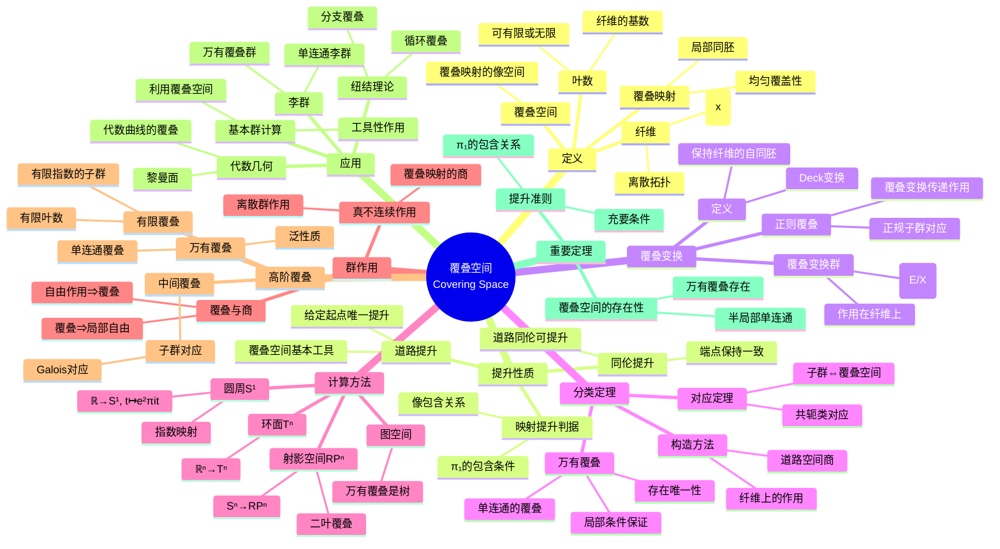

msc_primary: "00A99"
msc_secondary: ['00-XX']
---

# 覆叠空间思维导图

## 概述
覆叠空间是研究基本群和进行空间分类的有力工具，它建立了空间的"层状"结构与基本群的子群之间的一一对应。

## 思维导图



## 覆叠空间与基本群的对应

```

{覆叠空间p: E→X}/同构  ⟷  {π₁(X,x₀)的子群}/共轭

万有覆叠 ⟷ 平凡子群 {e}
正则覆叠 ⟷ 正规子群

```

## 典型覆叠空间

| 覆叠映射 | 底空间 | 覆叠空间 | 叶数 |
|---------|--------|---------|------|
| exp: ℝ→S¹ | S¹ | ℝ | 无限 |
| Sⁿ→RPⁿ (n≥2) | RPⁿ | Sⁿ | 2 |
| ℂ→ℂ* (exp) | ℂ* | ℂ | 无限 |
| z↦zⁿ: S¹→S¹ | S¹ | S¹ | n |

## 关联概念
- [基本群](./algebraic-fundamental-group.md)
- [纤维丛](./algebraic-fiber-bundle.md)
- [同伦论](./algebraic-homotopy.md)
