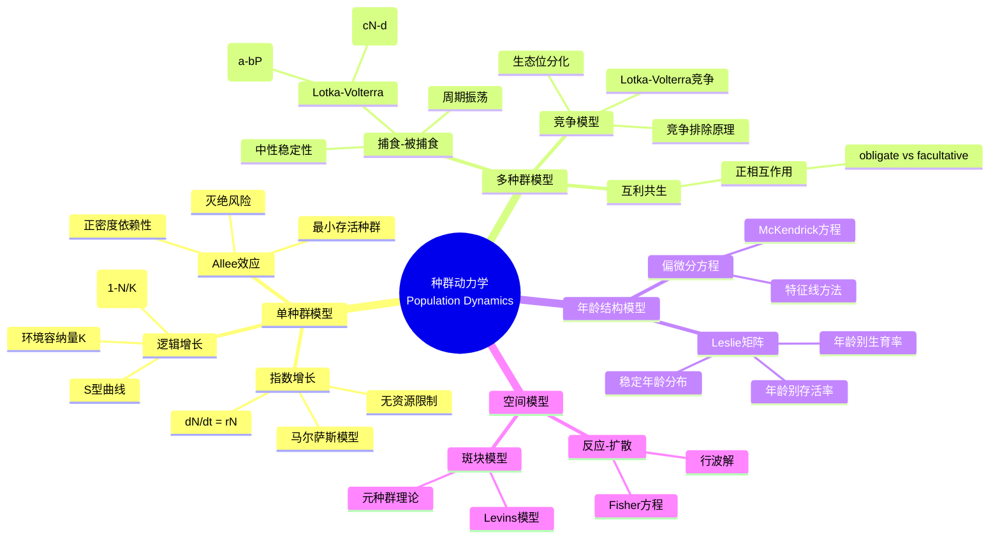

# 种群动力学 - 思维导图

## 概述

种群动力学研究生物种群数量随时间变化的规律，是数学生物学的核心分支。通过微分方程、差分方程和随机过程等数学工具，描述种群的出生、死亡、迁移等过程，预测种群演化趋势，为生态管理和资源保护提供理论依据。

---

## 核心思维导图



---

## 经典模型对比

```mermaid
graph TD
    subgraph 指数增长
        A[dN/dt = rN] --> B[解: N(t) = N₀eʳᵗ]
        B --> C[无限增长]
    end
    
    subgraph 逻辑增长
        D[dN/dt = rN(1-N/K)] --> E[解: S型曲线]
        E --> F[稳定平衡K]
    end
    
    subgraph Lotka-Volterra
        G[dN/dt = rN - aNP] --> H[周期振荡]
        I[dP/dt = caNP - dP] --> H
    end
    
    style A fill:#e3f2fd
    style D fill:#fff3e0
    style H fill:#e8f5e9

```

---

## Lotka-Volterra模型详解

```mermaid
mindmap
  root((捕食-被捕食模型))
    模型假设
      指数增长猎物
        无密度依赖
        无限资源
      捕食者依赖
        捕食率 ∝ NP
        转换效率c
      线性功能反应
        Type I响应
        无饱和
    平衡点分析
      零平衡点
        (0,0): 不稳定
      共存平衡点
        N* = d/ca
        P* = r/a
        中心型
    动力学性质
      保守系统
        首次积分
        H(N,P) = 常数
      周期轨道
        初始条件依赖
        中性稳定
    扩展模型
      Logistic猎物
        稳定焦点
      Holling功能反应
        Type II: 饱和
        Type III: S型
      时滞效应
        稳定性变化

```

---

## 模型分类表

| 模型类型 | 方程形式 | 关键参数 | 动力学特征 | 应用 |
|----------|----------|----------|------------|------|
| 指数增长 | dN/dt = rN | r:内禀增长率 | 无界增长 | 早期种群 |
| 逻辑增长 | dN/dt = rN(1-N/K) | K:环境容纳量 | 稳定平衡点 | 资源限制 |
| Allee模型 | dN/dt = rN(N/A-1)(1-N/K) | A:Allee阈值 | 双稳态 | 保护生物学 |
| LV捕食 | dN/dt = rN-aNP, dP/dt = caNP-dP | a,c:相互作用 | 周期振荡 | 生态预测 |
| 竞争模型 | dN₁/dt = r₁N₁(1-N₁/K₁-αN₂/K₁) | α:竞争系数 | 竞争排除/共存 | 物种竞争 |

---

## 离散模型与混沌

```mermaid
graph TD
    subgraph 逻辑映射
        A[Nₜ₊₁ = rNₜ(1-Nₜ/K)] --> B[倍周期分岔]
        B --> C[混沌区域]
    end
    
    subgraph 动力学行为
        D[r < 1] --> E[灭绝]
        F[1 < r < 3] --> G[稳定平衡点]
        H[3 < r < 3.57] --> I[周期振荡]
        J[r > 3.57] --> K[混沌]
    end
    
    subgraph 混沌特征
        L[对初值敏感]
        M[非周期轨道]
        N[奇异吸引子]
    end
    
    style C fill:#fff3e0
    style K fill:#ffcdd2

```

---

## 空间模型

```mermaid
mindmap
  root((空间动力学))
    反应-扩散方程
      Fisher方程
        ∂u/∂t = D∂²u/∂x² + ru(1-u)
        行波解
        传播速度
       Turing不稳定性
        扩散驱动不稳定
        模式形成
    元种群模型
      Levins模型
        dp/dt = cp(1-p) - ep
        p:被占据斑块比例
      救助效应
        局部灭绝-重定殖
        连通性重要性
    个体模型
      基于个体
        IBM模拟
        空间显式
      细胞自动机
        离散空间时间
        规则驱动

```

---

## 学习路径


---

## 关键公式速查

| 公式 | 说明 |
|------|------|
| $N(t) = N_0 e^{rt}$ | 指数增长解 |
| $N(t) = \frac{K}{1 + (\frac{K}{N_0}-1)e^{-rt}}$ | 逻辑增长解 |
| $F(N,P) = cN - d\ln N + aP - b\ln P$ | LV首次积分 |
| $\frac{\partial u}{\partial t} = D\frac{\partial^2 u}{\partial x^2} + f(u)$ | 反应-扩散方程 |
| $R_0 = \frac{\beta S_0}{\gamma}$ | 基本再生数 |
| $\frac{d\mathbf{n}}{dt} = L\mathbf{n}$ | Leslie矩阵模型 |

---

## 应用领域

- **渔业管理**: 最大可持续产量(MSY)计算
- **害虫控制**: 最优控制策略
- **物种保护**: 最小可存活种群(MVP)估计
- **流行病预测**: SIR模型扩展
- **生态系统管理**: 生物多样性维持

---

*文档版本：1.0*
*创建时间：2026年4月*
*分类：应用数学 / 生物数学 / 思维导图*
