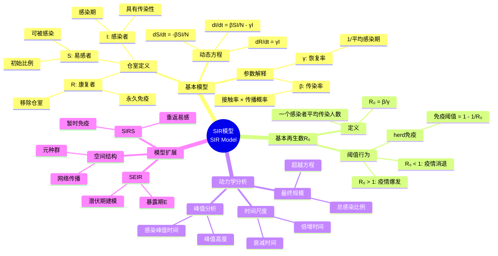
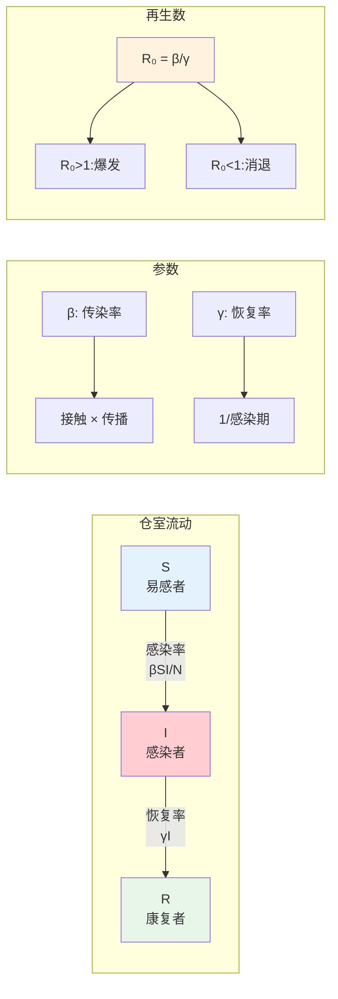
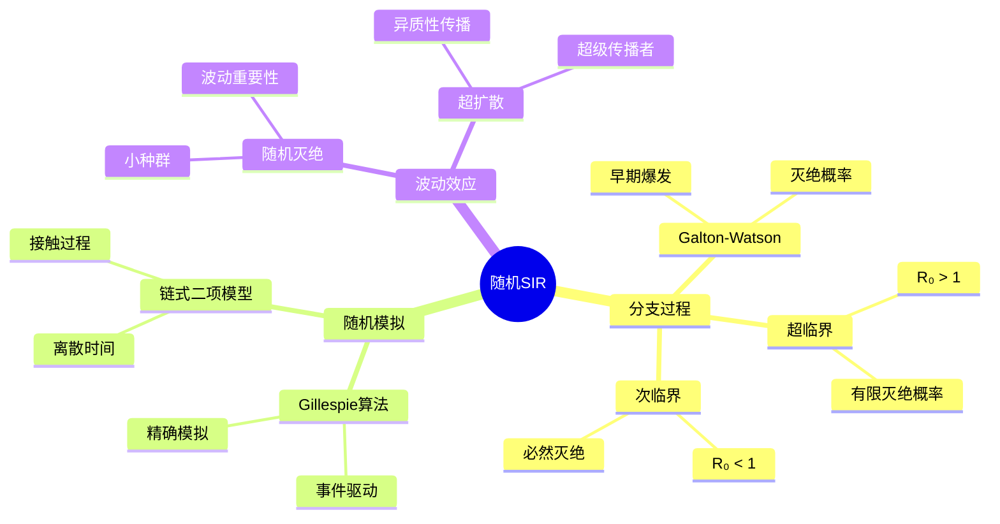

# SIR模型 - 思维导图

## 概述

SIR模型是流行病学中最经典的仓室模型，由Kermack和McKendrick于1927年提出。该模型将人群分为易感者(Susceptible)、感染者(Infected)和康复者(Recovered)三个仓室，通过常微分方程描述传染病的传播动力学，是公共卫生决策的重要理论工具。

---

## 核心思维导图



---

## SIR模型结构



---

## 动力学分析

```mermaid
mindmap
  root((SIR动力学))
    相平面分析
      S-I平面
        轨道结构
        单调性
      不变量
        S + I + R = N
        守恒关系
    最终规模方程
      形式
        R∞ = 1 - exp(-R₀·R∞)
      含义
        最终感染比例
        超越方程
      近似
        R∞ ≈ 2(R₀-1)/R₀
        小R₀-1展开
    感染峰值
      峰值条件
        dI/dt = 0
        S* = 1/R₀
      峰值高度
        Imax与R₀关系
      峰值时间
        数值计算
        近似公式
    时间演化
      早期指数增长
        I(t) ~ exp((R₀-1)γt)
      后期指数衰减
        I(t) ~ exp(-γt)

```

---

## 模型变体对比

| 模型 | 结构 | 适用疾病 | 特征 |
|------|------|----------|------|
| SI | S → I | 无免疫(如HIV慢性期) | 所有人终将被感染 |
| SIR | S → I → R | 永久免疫(如麻疹) | 经典模型 |
| SIRS | S → I → R → S | 暂时免疫(如流感) | 周期性流行 |
| SEIR | S → E → I → R | 有潜伏期(如新冠) | 暴露期延迟 |
| SEIRS | S → E → I → R → S | 复杂传播 | 最一般形式 |

---

## 干预措施建模

```mermaid
graph TD
    subgraph 非药物干预
        A[社交距离] --> B[降低β]
        C[隔离] --> D[加速γ]
        E[戴口罩] --> F[降低传播概率]
    end
    
    subgraph 疫苗接种
        G[接种率p] --> H[直接保护]
        G --> I[群体免疫]
        H --> J[有效R = R₀(1-p)]
    end
    
    subgraph 控制目标
        K[压平曲线] --> L[降低峰值]
        M[消灭疫情] --> N[R < 1]
    end
    
    style B fill:#e3f2fd
    style I fill:#fff3e0
    style N fill:#e8f5e9

```

---

## 随机扩展



---

## 学习路径


---

## 关键公式速查

| 公式 | 说明 |
|------|------|
| $\frac{dS}{dt} = -\frac{\beta SI}{N}$ | 易感者变化 |
| $\frac{dI}{dt} = \frac{\beta SI}{N} - \gamma I$ | 感染者变化 |
| $R_0 = \frac{\beta}{\gamma}$ | 基本再生数 |
| $S_c = \frac{\gamma}{\beta} = \frac{1}{R_0}$ | 临界易感比例 |
| $R_\infty = 1 - e^{-R_0 R_\infty}$ | 最终规模方程 |
| $I_{max} = 1 - \frac{1 + \ln R_0}{R_0}$ | 感染峰值近似 |
| $p_c = 1 - \frac{1}{R_0}$ | 临界接种比例 |

---

## 实际应用

- **COVID-19**: 基本再生数估计、封锁策略评估
- **流感**: 季节性预测、疫苗接种规划
- **HIV/AIDS**: 多群体传播模型、干预效果评估
- **麻疹**: 群体免疫阈值计算、疫苗覆盖率目标
- **埃博拉**: 紧急响应、隔离策略优化

---

*文档版本：1.0*
*创建时间：2026年4月*
*分类：应用数学 / 生物数学 / 思维导图*
