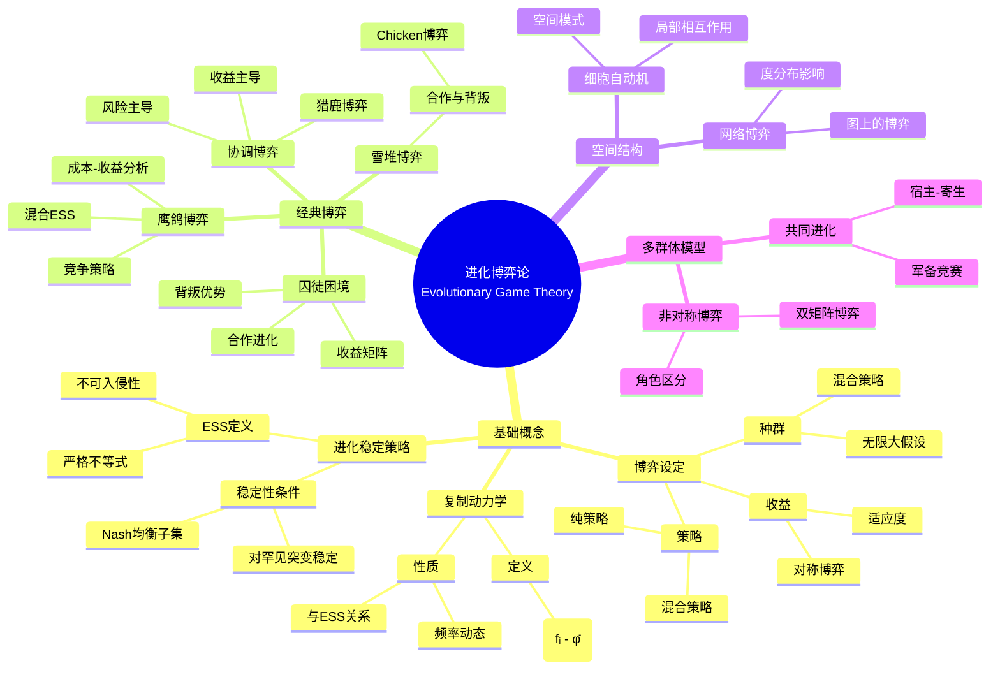
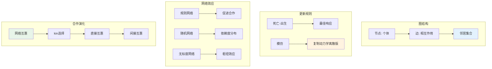

# 进化博弈论 - 思维导图

## 概述

进化博弈论是博弈论与进化生物学的交叉学科，由John Maynard Smith和George Price于1973年创立。它研究在进化压力下，策略频率如何随时间变化，核心是进化稳定策略(ESS)概念，为理解动物行为、社会进化和经济系统的演化提供了强大工具。

---

## 核心思维导图



---

## ESS概念详解

```mermaid
graph TD
    subgraph ESS定义
        A[策略X是ESS] --> B[对任意Y≠X]
        B --> C[E(X,X) > E(Y,X)]
        D[或E(X,X) = E(Y,X)时] --> E[E(X,Y) > E(Y,Y)]
    end
    
    subgraph 与Nash均衡关系
        F[所有ESS都是NE] --> G[但NE不一定是ESS]
        H[ESS是严格精炼] --> I[稳定性要求]
    end
    
    subgraph 稳定性含义
        J[小突变入侵] --> K[回复原策略]
        L[动态稳定] --> M[吸引域]
    end
    
    style A fill:#e3f2fd
    style F fill:#fff3e0
    style J fill:#e8f5e9

```

---

## 复制动力学方程

```mermaid
mindmap
  root((复制动力学))
    方程推导
      生物基础
        继承
        选择
      数学形式
        ẋᵢ = xᵢ(fᵢ - f̄)
        f̄ = ∑xⱼfⱼ
    性质分析
      平衡点
        内部平衡点
        边界平衡点
      稳定性
        Lyapunov函数
        演化势
      与ESS关系
        ESS是渐近稳定
        逆命题不成立
    两策略情形
      简化形式
        ẋ = x(1-x)(f_A - f_B)
      相位分析
        符号确定方向
        稳定不稳定点
    多策略情形
      纳什均衡
        平衡点对应
      极限环
        周期振荡
        Rock-Paper-Scissors

```

---

## 经典博弈矩阵

| 博弈 | 收益矩阵 | ESS | 生物学意义 |
|------|----------|-----|------------|
| 囚徒困境 | T>R>P>S | 背叛(D) | 自私行为占优 |
| 鹰鸽博弈 | V>C时混合 | p=V/C | 攻击性平衡 |
| 猎鹿博弈 | R>T>P>S | 协调问题 | 合作vs安全 |
| 雪堆博弈 | T>R>S>P | 合作 | 有条件合作 |
| RPS | 循环 | 无纯ESS | 多样性维持 |

---

## 空间进化博弈



---

## 学习路径


---

## 关键公式速查

| 公式 | 说明 |
|------|------|
| $E(X,X) > E(Y,X)$ | ESS第一条件 |
| $\dot{x}_i = x_i(f_i - \bar{f})$ | 复制动力学 |
| $\bar{f} = \sum_j x_j f_j$ | 平均适应度 |
| $f_i = \sum_j x_j a_{ij}$ | 策略i的期望收益 |
| $p^* = \frac{V}{C}$ | 鹰鸽博弈ESS |
| $r > \frac{c}{b}$ | Hamilton规则 |

---

## 应用领域

- **动物行为**: 竞争行为、交配策略、觅食选择
- **微生物学**: 细菌策略、抗生素耐药性
- **癌症进化**: 肿瘤细胞竞争、治疗策略
- **经济学**: 市场演化、行为经济学
- **社会科学**: 规范演化、语言演化

---

*文档版本：1.0*
*创建时间：2026年4月*
*分类：应用数学 / 生物数学 / 思维导图*
