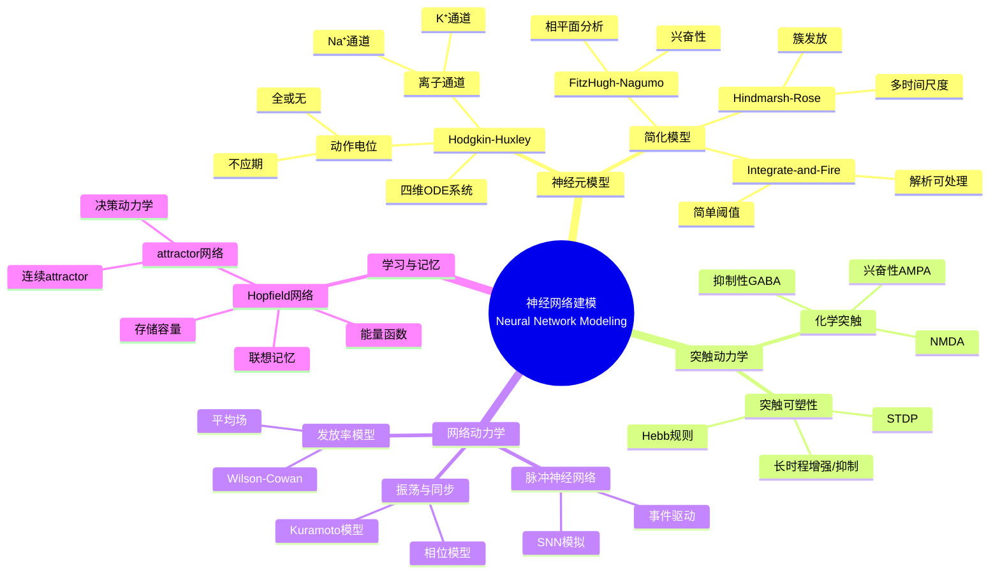
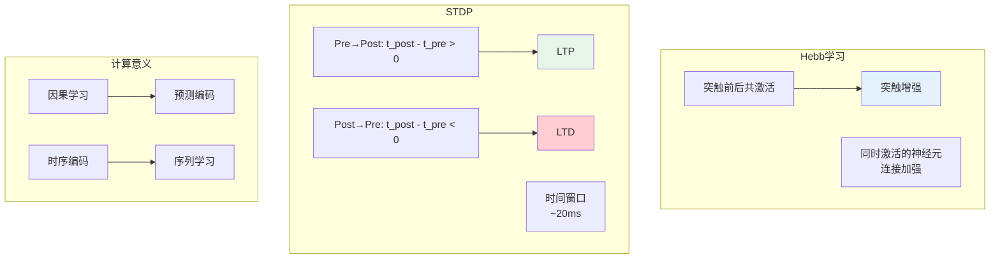
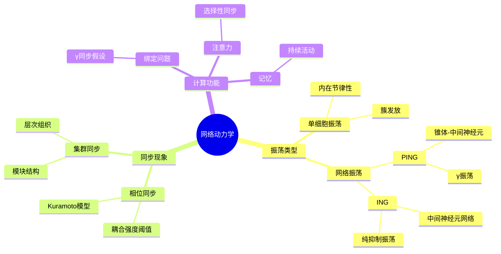
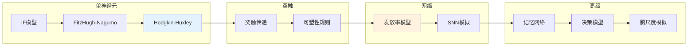

# 神经网络建模 - 思维导图

## 概述

神经网络建模是生物数学和计算神经科学的核心领域，研究生物神经系统的数学描述。从单个神经元的电生理特性到大规模神经网络的集体动力学，数学模型帮助我们理解大脑的信息处理机制，同时启发了现代人工智能的发展。

---

## 核心思维导图



---

## Hodgkin-Huxley模型

```mermaid
graph TD
    subgraph 离子通道
        A[Na⁺通道<br/>激活m, 失活h] --> B[快速去极化]
        C[K⁺通道<br/>激活n] --> D[复极化]
    end
    
    subgraph 膜电位方程
        E[C dV/dt = -ḡ_Na m³h(V-E_Na) - ḡ_K n⁴(V-E_K) - g_L(V-E_L) + I]
        F[门变量: dm/dt = α_m(1-m) - β_m m]
    end
    
    subgraph 动力学特性
        G[阈值行为] --> H[动作电位]
        I[不应期] --> J[频率编码]
    end
    
    style B fill:#e3f2fd
    style H fill:#fff3e0
    style E fill:#e8f5e9

```

---

## 神经元模型层次

```mermaid
mindmap
  root((模型层次))
    生物物理精确
      Hodgkin-Huxley
        4维ODE
        离子通道
        计算密集
      多仓室模型
        树突结构
        空间特性
    现象学模型
      FitzHugh-Nagumo
        2维简化
        相平面分析
        可解释性强
      Hindmarsh-Rose
        3维
        簇发放
    整合发放
      Leaky IF
        dV/dt = -V/τ + I
        阈值发放
        解析可解
      Adaptive IF
        自适应电流
        发放率适应
    发放率模型
      连续变量
        平均活动
        网络分析
      线性阈值
        [x]⁺ = max(0,x)

```

---

## 模型对比表

| 模型 | 维度 | 机制 | 适用场景 | 计算成本 |
|------|------|------|----------|----------|
| Hodgkin-Huxley | 4 | 离子通道 | 详细电生理 | 高 |
| Morris-Lecar | 2 | 钙+钾通道 | 簇发放分析 | 中 |
| FitzHugh-Nagumo | 2 | 恢复变量 | 相平面分析 | 低 |
| Izhikevich | 2 | 二次+重置 | 多种发放模式 | 低 |
| Leaky IF | 1 | 阈值+重置 | 大网络模拟 | 很低 |
| Wilson-Cowan | N | 发放率 | 群体动力学 | 低 |

---

## 突触可塑性



---

## 网络振荡与同步



---

## 学习路径



---

## 关键公式速查

| 公式 | 说明 |
|------|------|
| $C\frac{dV}{dt} = -\sum_k g_k(V-E_k) + I_{ext}$ | 膜电位方程 |
| $\frac{dx}{dt} = \frac{x_\infty(V) - x}{\tau_x(V)}$ | 门变量动力学 |
| $\tau \frac{dV}{dt} = -(V-V_{rest}) + RI$ | Leaky IF |
| $\Delta w_{ij} \propto x_i x_j$ | Hebb规则 |
| $\Delta w = A_+ e^{-\Delta t/\tau_+}$ (Δt>0) | STDP增强 |
| $\tau \frac{dr}{dt} = -r + F(I)$ | 发放率模型 |

---

## 应用领域

- **神经疾病**: 癫痫、帕金森病的机制研究
- **脑机接口**: 神经信号解码
- **人工智能**: 脉冲神经网络、神经形态计算
- **认知科学**: 决策、记忆、注意的机制
- **药物设计**: 离子通道药物靶点

---

*文档版本：1.0*
*创建时间：2026年4月*
*分类：应用数学 / 生物数学 / 思维导图*
