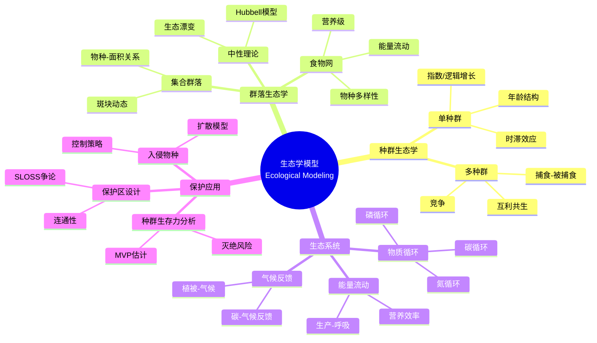
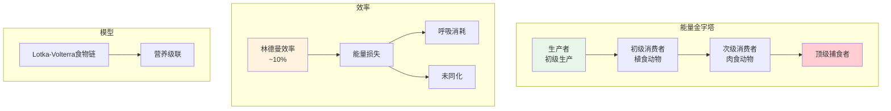
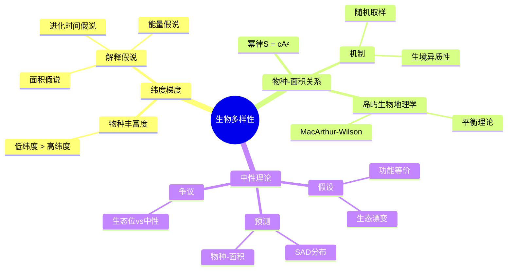
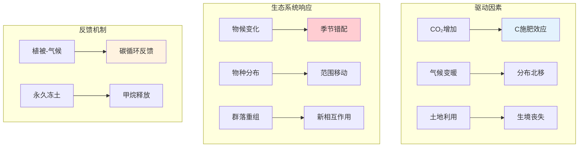

# 生态学模型 - 思维导图

## 概述

生态学模型用数学方法描述生物与环境、生物与生物之间的相互作用，从种群、群落到生态系统多个层次研究生态过程。这些模型为生物多样性保护、生态系统管理和可持续发展提供了科学依据，是生物数学的重要应用领域。

---

## 核心思维导图

---

## 生态系统能量流动

---

## 生物多样性格局

---

## 保护生态学模型

| 模型/概念 | 描述 | 应用 |
|----------|------|------|
| 种群生存力分析(PVA) | 随机模拟种群动态 | 濒危物种评估 |
| MVP | 最小可存活种群 | 保护目标设定 |
| 集合种群 | 斑块占用模型 | 保护区网络设计 |
| 扩散模型 | 入侵前沿速度 | 入侵物种管理 |
| 系统保护规划 | 优化算法 | 保护区选址 |

---

## 全球变化生态学

---

## 学习路径

---

## 关键公式速查

| 公式 | 说明 |
|------|------|
| $S = cA^z$ | 物种-面积关系 |
| $\frac{dP}{dt} = cP(1-P) - eP$ | Levins集合种群 |
| $N_e = \frac{4N_m N_f}{N_m + N_f}$ | 有效种群大小 |
| $\lambda = e^{r} + \frac{\sigma^2}{2}$ | 随机增长率 |
| $R_0 = \frac{\pi R^2 D}{\ln(c)}$ | 入侵范围 |
| $R I = \frac{\sum_{i,j} S_{ij} \cdot V_j}{\sum_j V_j}$ | 保护优先指数 |

---

## 应用领域

- **自然保护区**: 选址、大小、连通性设计
- **渔业管理**: 最大可持续产量
- **入侵防控**: 早期预警、控制策略
- **气候变化**: 物种分布预测、适应策略
- **生态系统服务**: 价值评估、权衡分析

---

*文档版本：1.0*
*创建时间：2026年4月*
*分类：应用数学 / 生物数学 / 思维导图*
