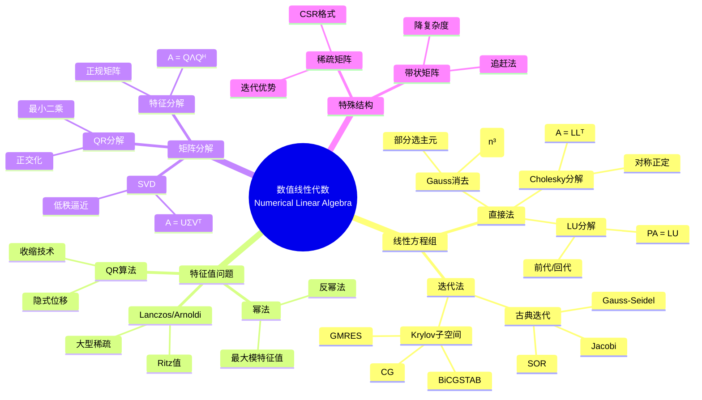
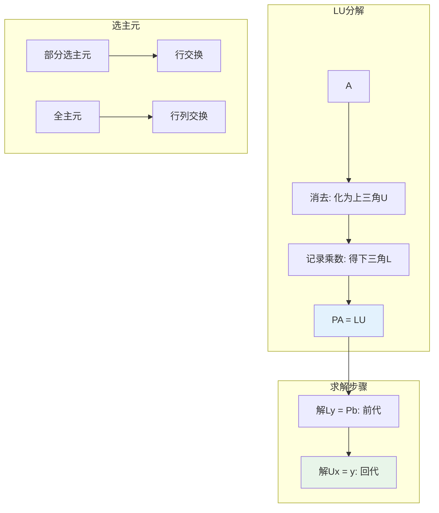
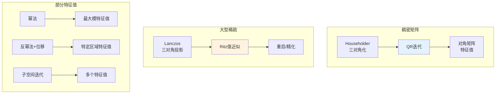
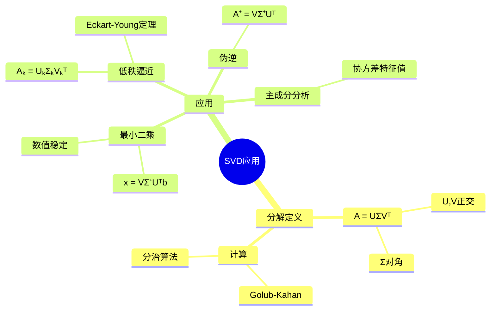
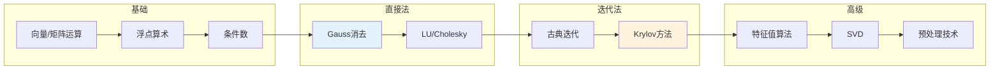

# 数值线性代数 - 思维导图

## 概述

数值线性代数是科学计算的核心基础，研究矩阵和向量的高效、稳定计算方法。从线性方程组求解、特征值计算到矩阵分解，这些算法支撑着现代科学、工程和金融的几乎所有数值计算任务。

---

## 核心思维导图



---

## 直接法求解



---

## 迭代法对比

| 方法 | 适用矩阵 | 收敛条件 | 计算/步 | 特点 |
|------|----------|----------|---------|------|
| Jacobi | 一般 | 严格对角占优 | O(n²) | 并行友好 |
| Gauss-Seidel | 一般 | 严格对角占优/HPD | O(n²) | 串行更快 |
| SOR | 一般 | 最优ω | O(n²) | 加速GS |
| CG | 对称正定 | - | O(n²) | 最优迭代 |
| GMRES | 一般 | - | O(kn²) | 非对称首选 |
| BiCGSTAB | 一般 | - | O(n²) | 短递推 |

---

## Krylov子空间方法

```mermaid
mindmap
  root((Krylov方法))
    子空间定义
      Kₘ(A,b)
        span{b, Ab, ..., Aᵐ⁻¹b}
        维数m
      投影原理
         Galerkin条件
        Petrov-Galerkin
    共轭梯度CG
      适用
        对称正定
      性质
        有限步收敛
        最优能量范数
      预处理
        不完全Cholesky
        多重网格
    GMRES
      最小残差

        ||Ax-b||₂最小

      Arnoldi过程
        正交化
        Hessenberg矩阵
      重启
        GMRES(k)
        内存限制
    其他方法
      MINRES
        对称不定
      BiCGSTAB
        非对称短递推
      QMR
        光滑收敛

```

---

## 特征值算法



---

## SVD与最小二乘



---

## 学习路径



---

## 关键公式速查

| 公式 | 说明 |
|------|------|
| $\kappa(A) = \|A\|\|A^{-1}\|$ | 条件数 |
| $PA = LU$ | LU分解带选主元 |
| $A = LL^T$ | Cholesky分解 |
| $x_{k+1} = x_k + \alpha_k r_k$ | 最速下降 |
| $||Ax-b||_2$最小化 | 最小二乘 |
| $A = U\Sigma V^T$ | SVD分解 |
| $A = QR$ | QR分解 |

---

## 应用领域

- **科学计算**: 有限元、有限差分求解
- **数据科学**: 主成分分析、推荐系统
- **机器学习**: 优化算法、神经网络
- **图形学**: 物理模拟、几何处理
- **金融工程**: 协方差矩阵、风险模型

---

*文档版本：1.0*
*创建时间：2026年4月*
*分类：应用数学 / 计算数学 / 思维导图*
