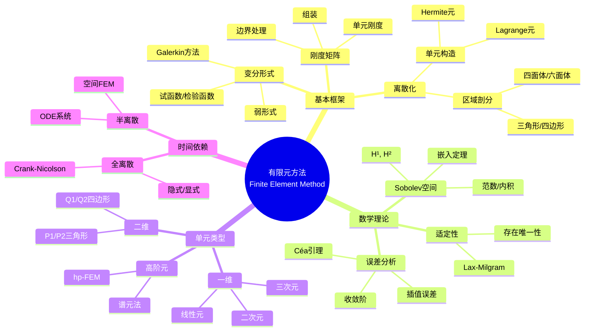
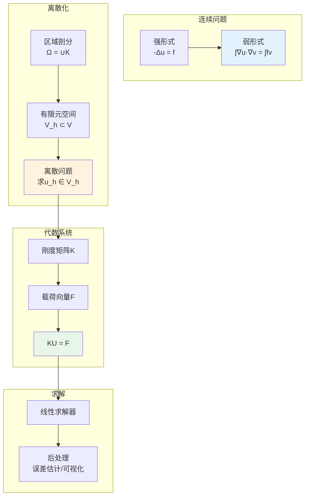
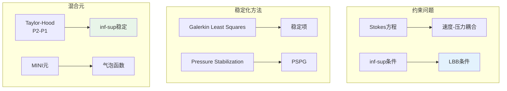

# 有限元方法 - 思维导图

## 概述

有限元方法(FEM)是求解偏微分方程的数值方法，通过将连续区域离散为有限个单元，用分片多项式逼近未知函数。FEM在结构力学、流体力学、电磁学等工程领域有广泛应用，是现代工程仿真的核心技术。

---

## 核心思维导图



---

## FEM流程



---

## 单元对比

| 单元 | 维数 | 节点数 | 多项式次数 | 连续性 | 应用 |
|------|------|--------|------------|--------|------|
| P1 | 2D | 3 | 1 | C⁰ | 泊松方程 |
| P2 | 2D | 6 | 2 | C⁰ | 高精度解 |
| Q1 | 2D | 4 | 双线性 | C⁰ | 四边形网格 |
| Q2 | 2D | 9 | 双二次 | C⁰ | 曲面边界 |
| P1-P0 | 2D | - | - | - | Stokes混合元 |
| MINI | 2D | - | - | inf-sup | Stokes稳定 |

---

## 误差分析

```mermaid
mindmap
  root((误差理论))
    误差类型
      截断误差
        离散化误差
        有限维逼近
      舍入误差
        浮点运算
        条件数影响
    a priori估计
      Céa引理

        ||u-u_h|| ≤ C inf||u-v_h||

      插值误差

        ||u-I_hu||_m ≤ Ch^{k+1-m}|u|_{k+1}

      收敛阶
        网格细化
        多项式提升
    a posteriori估计
      残差型
        η_K = h_K||f+Δu_h|| + ...

      对偶加权
        目标导向
        自适应
    自适应FEM
      标记策略
        最大策略
        等分布
      细化
        红绿细化
        悬挂节点

```

---

## 混合与稳定方法



---

## 学习路径


---

## 关键公式速查

| 公式 | 说明 |
|------|------|
| $a(u,v) = \int_\Omega \nabla u \cdot \nabla v$ | 双线性形式 |
| $||u-u_h||_1 \leq C h |u|_2$ | H¹误差估计 |
| $K_{ij} = \int_\Omega \nabla \phi_i \cdot \nabla \phi_j$ | 刚度矩阵元 |
| $\inf_{q_h} \sup_{v_h} \frac{b(v_h,q_h)}{||v_h||\,||q_h||} \geq \beta$ | inf-sup条件 |
| $\eta_K^2 = h_K^2||f+\Delta u_h||_{L^2(K)}^2$ | 后验误差指示子 |

---

## 应用领域

- **结构力学**: 应力分析、振动模态
- **流体力学**: CFD、多相流
- **热传导**: 温度场分布
- **电磁学**: 电磁场仿真
- **地球科学**: 地下水流动、地震波传播

---

*文档版本：1.0*
*创建时间：2026年4月*
*分类：应用数学 / 计算数学 / 思维导图*
