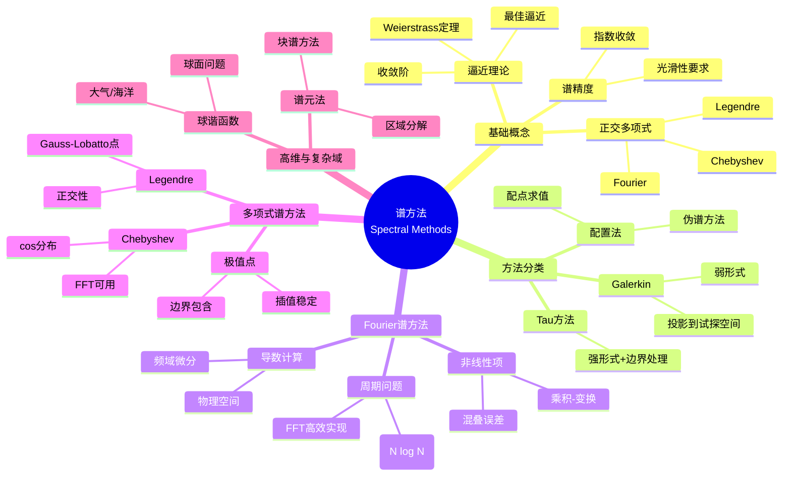
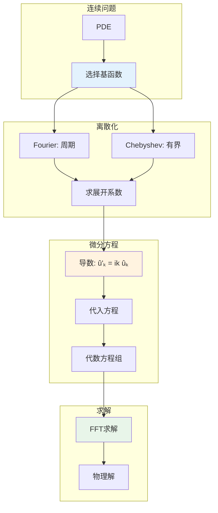

# 谱方法 - 思维导图

## 概述

谱方法是利用全局光滑函数(如三角函数、正交多项式)逼近解的数值方法，具有指数收敛的精度。与有限差分、有限元等局部方法不同，谱方法利用整个计算域的信息，特别适合光滑问题的计算，在流体力学、量子力学、气候模拟等领域有重要应用。

---

## 核心思维导图



---

## 谱方法流程



---

## 方法对比

| 方法 | 基函数 | 适用问题 | 收敛阶 | 计算成本 | 边界处理 |
|------|--------|----------|--------|----------|----------|
| Fourier | e^{ikx} | 周期 | 指数 | O(N log N) | 自然 |
| Chebyshev | T_n(x) | 有界域 | 指数 | O(N log N) | 配点 |
| Legendre | P_n(x) | 有界域 | 指数 | O(N²) | 配点 |
| 有限差分 | δ(x-x_i) | 通用 | 代数 | O(N) | 方便 |
| 有限元 | 分片多项式 | 复杂几何 | 代数 | O(N) | 灵活 |

---

## Fourier与Chebyshev

```mermaid
mindmap
  root((基函数选择))
    Fourier级数
      性质
        正交: ∫e^{ikx}e^{-ilx} = δ_{kl}
        周期: φ(x+2π) = φ(x)
      导数
        d/dx e^{ikx} = ik e^{ikx}
        频域对角化
      FFT
        O(N log N)
        快速变换
      混叠
        非线性项
        3/2规则
    Chebyshev
      定义
        T_n(cos θ) = cos(nθ)
        x ∈ [-1,1]
      极值点
        x_j = cos(jπ/N)
        CGL点
      优势
        非周期可用
        边界精度
        FFT适用
      权重
        (1-x²)^{-1/2}
        积分公式

```

---

## 伪谱方法

```mermaid
graph TD
    subgraph 配置法
        A[选择配点{x_j}] --> B[插值: u(x) ≈ ∑u_j l_j(x)]
        B --> C[微分矩阵D]
        C --> D[u' = Du]
    end
    
    subgraph 微分矩阵
        E[D_{ij} = l'_j(x_i)] --> F[稠密矩阵]
        F --> G[非局部]
    end
    
    subgraph 计算
        H[矩阵-向量乘] --> I[直接O(N²)]
        J[FFT] --> K[快速O(N log N)]
    end
    
    style D fill:#e3f2fd
    style G fill:#fff3e0

```

---

## 学习路径


---

## 关键公式速查

| 公式 | 说明 |
|------|------|
| $u(x) = \sum_{k=-N/2}^{N/2} \hat{u}_k e^{ikx}$ | Fourier展开 |
| $\hat{u}_k = \frac{1}{2\pi}\int_0^{2\pi} u(x)e^{-ikx}dx$ | Fourier系数 |
| $T_n(x) = \cos(n \arccos x)$ | Chebyshev多项式 |
| $u'_j = \sum_k D_{jk} u_k$ | 伪谱微分 |
| $||u-u_N|| \leq C e^{-cN}$ | 指数收敛 |

---

## 应用领域

- **湍流模拟**: DNS大涡模拟
- **气候模式**: 球谐函数展开
- **量子力学**: 电子结构计算
- **计算电磁学**: 麦克斯韦方程组
- **金融工程**: 快速期权定价

---

*文档版本：1.0*
*创建时间：2026年4月*
*分类：应用数学 / 计算数学 / 思维导图*
