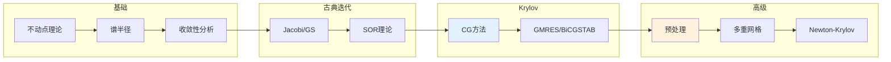

# 迭代法 - 思维导图

## 概述

迭代法是求解线性方程组、非线性方程和优化问题的基本数值方法。与直接法不同，迭代法通过逐步逼近的方式求解，特别适合大规模稀疏问题。从古典的Jacobi、Gauss-Seidel方法到现代的Krylov子空间方法，迭代法的发展推动了科学计算能力的飞跃。

---

## 核心思维导图

```mermaid
mindmap
  root((迭代法<br/>Iterative Methods))
    线性方程组
      古典迭代
        Jacobi
          并行性
          简单实现
        Gauss-Seidel
          串行收敛快
          SOR加速
        Richardson
          预处理形式
      收敛分析
        谱半径
          ρ(G) < 1
        收敛速度
          -ln ρ
        对角占优
          充分条件
      Krylov方法
        CG
          SPD矩阵
          最优性
        GMRES
          一般矩阵
          最小残差
        BiCGSTAB
          短递推
          非对称
    非线性方程
      不动点迭代
        x = g(x)
        压缩映射
      Newton法
        二次收敛
        雅可比矩阵
      拟Newton
        BFGS
        DFP
      延拓法
        同伦方法
        全局收敛
    优化方法
      梯度下降
        最速下降
        收敛慢
      共轭梯度
        二次函数最优
        非线性扩展
      Newton优化
        二阶信息
        局部二次收敛
    预处理
      目的
        改善谱分布
        加速收敛
      方法
        Jacobi
        ILU
        多重网格
        区域分解
```

---

## 古典迭代框架

```mermaid
graph TD
    subgraph 分裂
        A[A = M - N] --> B[等价于 Mx = Nx + b]
        B --> C[迭代: Mx^{k+1} = Nx^k + b]
    end
    
    subgraph 具体方法
        D[Jacobi: M = D] --> E[并行更新]
        F[GS: M = D+L] --> G[串行更新]
        H[SOR: M = (D+ωL)/ω] --> I[外推加速]
    end
    
    subgraph 收敛
        J[误差: e^{k+1} = Ge^k] --> K[G = M⁻¹N]
        K --> L[ρ(G) < 1 ⇔ 收敛]
    end
    
    style B fill:#e3f2fd
    style C fill:#fff3e0
    style L fill:#e8f5e9
```

---

## 迭代方法对比

| 方法 | 适用矩阵 | 存储 | 收敛条件 | 每步成本 | 特点 |
|------|----------|------|----------|----------|------|
| Jacobi | 一般 | A+3向量 | 严格对角占优 | O(nnz) | 并行友好 |
| Gauss-Seidel | 一般 | A+2向量 | 严格对角占优/HPD | O(nnz) | 内存省 |
| SOR | 一般 | A+2向量 | 0<ω<2(对称正定) | O(nnz) | 需调参 |
| CG | 对称正定 | A+4向量 | - | O(nnz) | 最优Krylov |
| GMRES | 一般 | A+(k+1)向量 | - | O(k·nnz) | 通用但费存 |
| BiCGSTAB | 一般 | A+6向量 | - | O(nnz) | 短递推 |

---

## Newton法详解

```mermaid
mindmap
  root((Newton法))
    基本形式
      方程求根
        F(x) = 0
        x_{k+1} = x_k - F'(x_k)⁻¹F(x_k)
      优化
        min f(x)
        x_{k+1} = x_k - H_k⁻¹∇f_k
    收敛性
      局部二次
        充分接近解
        F'非奇异
      收敛域
        吸引盆
        全局化技巧
    变体
      不精确Newton
        近似解Newton方程
        内迭代
      阻尼Newton
        线搜索
        全局收敛
      拟Newton
        近似Hessian
        BFGS更新
    实现
      求解Newton方程
        直接法
        迭代法
      Jacobian计算
        解析导数
        有限差分
```

---

## Krylov子空间方法

```mermaid
graph TD
    subgraph 子空间
        A[K_m = span{r₀, Ar₀, ..., A^{m-1}r₀}] --> B[递推构造]
        B --> C[Arnoldi/Lanczos]
    end
    
    subgraph CG (SPD)
        D[ Galerkin: r_k ⊥ K_k] --> E[三递推]
        E --> F[有限步收敛]
    end
    
    subgraph GMRES
        G[最小残差] --> H[完整正交化]
        H --> I[Hessenberg最小二乘]
        I --> J[重启GMRES(m)]
    end
    
    style C fill:#e3f2fd
    style F fill:#e8f5e9
    style I fill:#fff3e0
```

---

## 预处理技术

```mermaid
mindmap
  root((预处理))
    思想
      变换系统
        M⁻¹Ax = M⁻¹b
        AM⁻¹y = b
      目标
        改善特征值分布
        聚类特征值
    方法
      代数预处理
        Jacobi
          M = diag(A)
        ILU
          不完全LU
          填充控制
        稀疏近似逆
      几何预处理
        多重网格
          平滑+粗网格
          V/W循环
        区域分解
          子域问题
          粗空间
    分析
      条件数
        κ(M⁻¹A) << κ(A)
      谱分布
        聚类改善收敛
```

---

## 学习路径



---

## 关键公式速查

| 公式 | 说明 |
|------|------|
| $x^{k+1} = x^k + M^{-1}(b - Ax^k)$ | 预处理迭代 |
| $||e_k||_A \leq 2\left(\frac{\sqrt{\kappa}-1}{\sqrt{\kappa}+1}\right)^k ||e_0||_A$ | CG收敛界 |
| $x_{k+1} = x_k - J_F^{-1}F(x_k)$ | Newton迭代 |
| $B_{k+1} = B_k + \frac{y_k y_k^T}{y_k^T s_k} - \frac{B_k s_k s_k^T B_k}{s_k^T B_k s_k}$ | BFGS更新 |
| $\kappa(M^{-1}A) = \frac{\lambda_{max}}{\lambda_{min}}$ | 预处理条件数 |

---

## 应用领域

- **大规模模拟**: CFD、结构力学
- **数据科学**: 机器学习优化
- **图像处理**: 反问题求解
- **地球物理**: 地震波反演
- **金融工程**: 大规模风险评估

---

*文档版本：1.0*
*创建时间：2026年4月*
*分类：应用数学 / 计算数学 / 思维导图*
