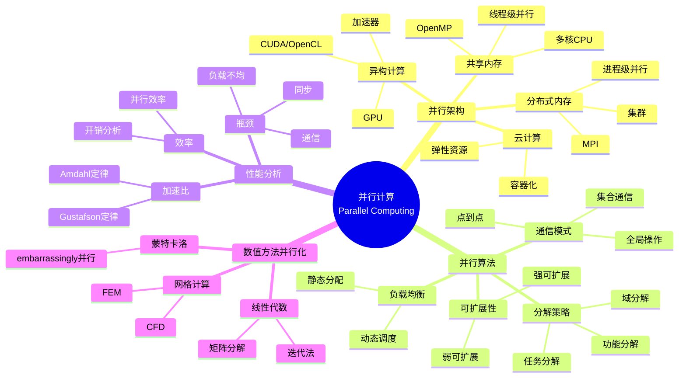
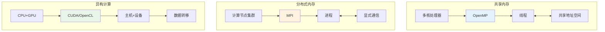
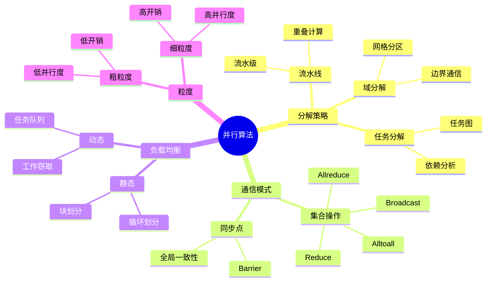
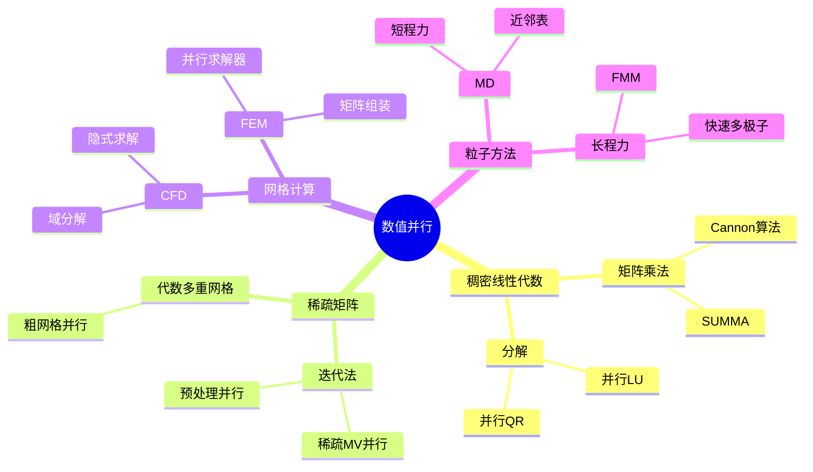

# 并行计算 - 思维导图

## 概述

并行计算是利用多个处理单元同时执行任务以加速计算的技术。随着单核性能提升放缓和大数据、人工智能应用的兴起，并行计算已成为现代科学计算和工程仿真的必需技术，涵盖从多核CPU到GPU、从集群到云计算的多种计算模式。

---

## 核心思维导图



---

## 并行架构对比



---

## 编程模型对比

| 模型 | 内存 | 编程复杂度 | 适用规模 | 典型应用 |
|------|------|------------|----------|----------|
| OpenMP | 共享 | 低 | 多核(10-100) | 循环并行 |
| MPI | 分布式 | 高 | 大规模(1K-1M) | 集群计算 |
| CUDA | 异构 | 中 | GPU加速 | 数据并行 |
| OpenACC | 异构 | 低 | GPU加速 | 指令加速 |
| PGAS | 混合 | 中 | 大规模 | 全局地址 |

---

## 并行算法设计



---

## 性能定律

```mermaid
graph TD
    subgraph Amdahl定律
        A[固定问题规模] --> B[加速比 ≤ 1/(s + p/N)]
        B --> C[s:串行比例<br/>p:并行比例]
        C --> D[极限加速: 1/s]
    end
    
    subgraph Gustafson定律
        E[可扩展问题] --> F[加速比 ≈ N - s(N-1)]
        F --> G[随N线性增长]
    end
    
    subgraph 实际因素
        H[通信开销] --> I[延迟+带宽]
        J[负载不均衡] --> K[等待时间]
        L[同步开销] --> M[Barrier等待]
    end
    
    style B fill:#e3f2fd
    style F fill:#fff3e0

```

---

## 数值算法并行化



---

## 学习路径


---

## 关键公式速查

| 公式 | 说明 |
|------|------|
| $S(N) = \frac{T_1}{T_N} \leq \frac{1}{s + \frac{1-s}{N}}$ | Amdahl加速比 |
| $S(N) = N - s(N-1)$ | Gustafson加速比 |
| $E(N) = \frac{S(N)}{N}$ | 并行效率 |
| $T_{total} = T_{comp} + T_{comm} + T_{sync}$ | 总时间分解 |
| $T_{comm} = \alpha + \beta \cdot M$ | 通信时间模型 |

---

## 应用领域

- **气候模拟**: 全球气候模型(GCM)
- **分子动力学**: 材料科学、药物设计
- **人工智能**: 深度学习训练
- **计算流体力学**: 飞机设计、气象预测
- **天体物理**: 宇宙学模拟
- **基因组学**: 序列比对、变异检测

---

*文档版本：1.0*
*创建时间：2026年4月*
*分类：应用数学 / 计算数学 / 思维导图*
