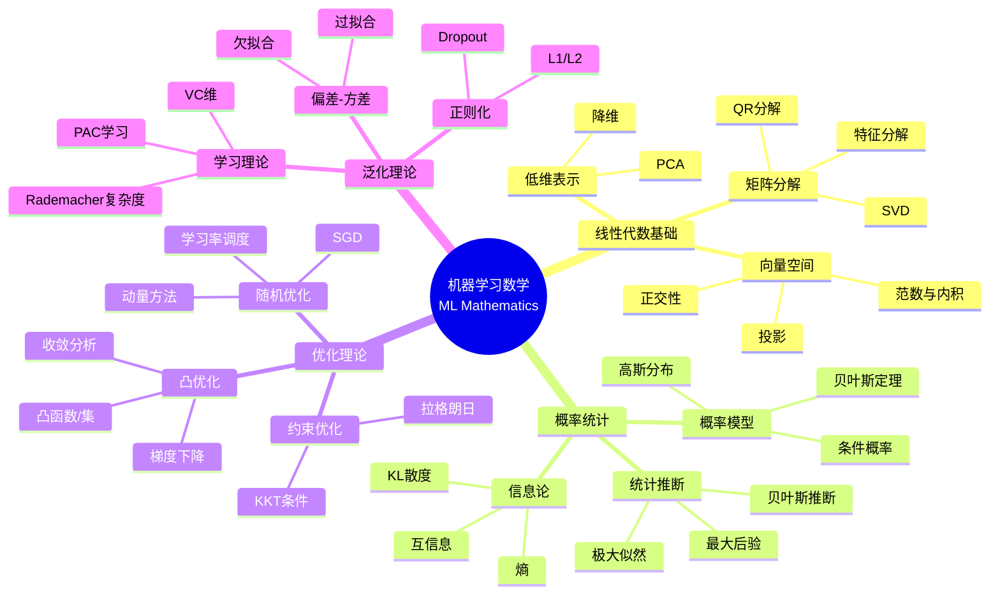

# 机器学习数学 - 思维导图

## 概述

机器学习数学是支撑现代人工智能的理论基础，融合了线性代数、概率统计、优化理论和泛函分析等多个数学分支。从监督学习的模型训练到无监督学习的数据发现，数学为算法设计提供了严格的框架和收敛保证，是理解和创新机器学习技术的必备知识。

---

## 核心思维导图



---

## 监督学习框架

```mermaid
graph TD
    subgraph 数据
        A[训练集{(xᵢ,yᵢ)}] --> B[输入空间X]
        A --> C[输出空间Y]
    end
    
    subgraph 假设空间
        D[模型族{f_w}] --> E[参数w∈ℝ^d]
        E --> F[损失函数L(y,f(x))]
    end
    
    subgraph 训练
        F --> G[经验风险最小化]
        G --> H[min (1/n)∑L(yᵢ,f_w(xᵢ))]
    end
    
    subgraph 泛化
        H --> I[测试误差]
        I --> J[泛化界]
    end
    
    style G fill:#e3f2fd
    style H fill:#fff3e0
    style J fill:#e8f5e9

```

---

## 核心算法数学

```mermaid
mindmap
  root((算法数学))
    线性回归
      最小二乘
        min ||Xw-y||²

        解析解: w = (XᵀX)⁻¹Xᵀy
      正则化
        Ridge: L2
        Lasso: L1
    逻辑回归
      对数几率
        p = σ(wᵀx)
        σ(z) = 1/(1+e⁻ᶻ)
      损失
        交叉熵
        凸优化
    支持向量机
      间隔最大化
        几何间隔
        函数间隔
      对偶问题
        核技巧
        稀疏性
    核方法
      核函数
        正定核
        再生核Hilbert空间
      常见核
        多项式
        高斯RBF

```

---

## 优化方法对比

| 方法 | 更新规则 | 收敛速度 | 适用 | 特点 |
|------|----------|----------|------|------|
| 梯度下降 | w = w - η∇f | O(1/k) | 凸 | 批量计算 |
| SGD | w = w - η∇fᵢ | O(1/√k) | 大数据 | 随机梯度 |
| Momentum | v = βv + ∇f | 加速 | 非凸 | 惯性加速 |
| Adam | m,v自适应 | 实用 | 深度学习 | 自适应学习率 |
| L-BFGS | 拟牛顿 | 超线性 | 中小规模 | 二阶信息 |

---

## 泛化与学习理论

```mermaid
graph TD
    subgraph 泛化误差
        A[真实风险R(f)] --> B[经验风险R̂(f)]
        B --> C[泛化误差 = R - R̂]
    end
    
    subgraph 复杂度度量
        D[VC维] --> E[分类能力]
        F[Rademacher复杂度] --> G[富集程度]
        H[覆盖数] --> I[度量熵]
    end
    
    subgraph 泛化界
        J[以高概率] --> K[R(f) ≤ R̂(f) + O(√(d/n))]
        K --> L[样本复杂度]
    end
    
    style C fill:#e3f2fd
    style G fill:#fff3e0
    style K fill:#e8f5e9

```

---

## 学习路径


---

## 关键公式速查

| 公式 | 说明 |
|------|------|
| $\hat{w} = \arg\min_w \frac{1}{n}\sum_{i=1}^n L(f_w(x_i), y_i) + \lambda R(w)$ | 正则化经验风险 |
| $\sigma(z) = \frac{1}{1+e^{-z}}$ | Sigmoid函数 |
| $K(x,x') = \langle \phi(x), \phi(x') \rangle$ | 核技巧 |
| $w_{t+1} = w_t - \eta \nabla f(w_t)$ | 梯度下降 |
| $R(f) \leq \hat{R}(f) + O\left(\sqrt{\frac{d}{n}}\right)$ | 泛化界 |
| $I(X;Y) = D_{KL}(P_{XY}||P_X \otimes P_Y)$ | 互信息 |

---

## 应用领域

- **计算机视觉**: 图像分类、目标检测
- **自然语言处理**: 文本分类、机器翻译
- **推荐系统**: 协同过滤、内容推荐
- **生物信息学**: 基因表达分析
- **金融风控**: 信用评分、欺诈检测

---

*文档版本：1.0*
*创建时间：2026年4月*
*分类：应用数学 / 数据科学 / 思维导图*
