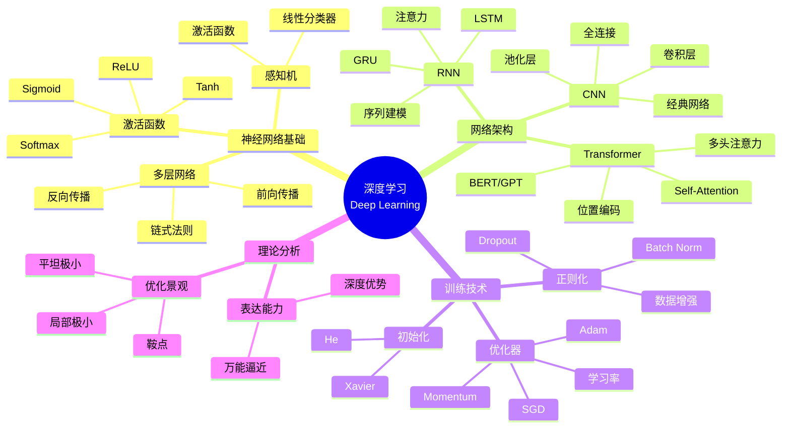
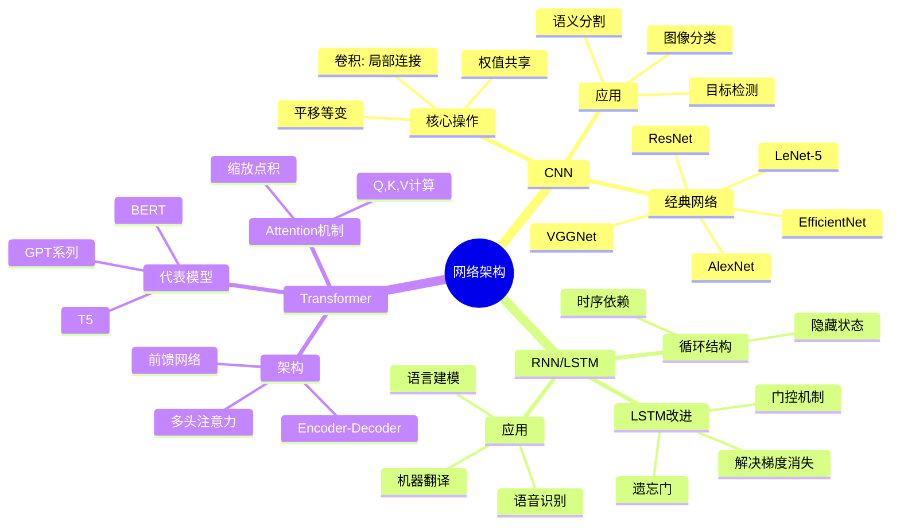
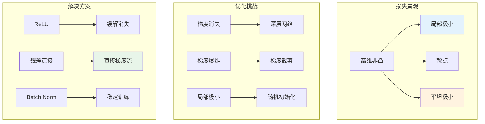
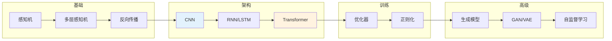

# 深度学习 - 思维导图

## 概述

深度学习是机器学习的重要分支，通过多层神经网络学习数据的层次化表示。从多层感知机到卷积神经网络、循环神经网络，再到Transformer架构，深度学习在计算机视觉、自然语言处理等领域取得了突破性进展，其数学基础涉及优化理论、线性代数和概率图模型。

---

## 核心思维导图



---

## 神经网络前向与反向传播

```mermaid
graph TD
    subgraph 前向传播
        A[x] --> B[z¹ = W¹x + b¹]
        B --> C[a¹ = σ(z¹)]
        C --> D[z² = W²a¹ + b²]
        D --> E[ŷ = σ(z²)]
        E --> F[L(ŷ,y)]
    end
    
    subgraph 反向传播
        F --> G[∂L/∂z²]
        G --> H[∂L/∂W² = ∂L/∂z² · a¹ᵀ]
        G --> I[∂L/∂a¹ = W²ᵀ∂L/∂z²]
        I --> J[∂L/∂z¹ = ∂L/∂a¹ ⊙ σ'(z¹)]
        J --> K[∂L/∂W¹ = ∂L/∂z¹ · xᵀ]
    end
    
    style F fill:#e3f2fd
    style H fill:#fff3e0
    style J fill:#e8f5e9

```

---

## 主要架构对比



---

## 优化技术对比

| 技术 | 目的 | 方法 | 效果 |
|------|------|------|------|
| Dropout | 防止过拟合 | 随机失活神经元 | 正则化 |
| Batch Norm | 加速训练 | 层归一化 | 稳定分布 |
| Layer Norm | 稳定训练 | 特征归一化 | Transformer必备 |
| 残差连接 | 训练深层 | Skip connection | 解决退化 |
| 数据增强 | 扩充数据 | 变换样本 | 提高泛化 |
| 早停 | 防止过拟合 | 验证集监控 | 节省计算 |

---

## 训练动力学



---

## 学习路径



---

## 关键公式速查

| 公式 | 说明 |
|------|------|
| $z^{[l]} = W^{[l]}a^{[l-1]} + b^{[l]}$ | 线性变换 |
| $a^{[l]} = g(z^{[l]})$ | 激活函数 |
| $\delta^{[l]} = (W^{[l+1]})^T\delta^{[l+1]} \odot g'(z^{[l]})$ | 误差反向传播 |
| $\text{Attention}(Q,K,V) = \text{softmax}(\frac{QK^T}{\sqrt{d_k}})V$ | 缩放点积注意力 |
| $\hat{x} = \frac{x-\mu_B}{\sqrt{\sigma_B^2+\epsilon}}$ | Batch Normalization |

---

## 应用领域

- **计算机视觉**: 图像生成、风格迁移
- **自然语言处理**: 大语言模型、对话系统
- **自动驾驶**: 感知、决策
- **医疗影像**: 疾病诊断、分割
- **游戏AI**: AlphaGo、强化学习

---

*文档版本：1.0*
*创建时间：2026年4月*
*分类：应用数学 / 数据科学 / 思维导图*
