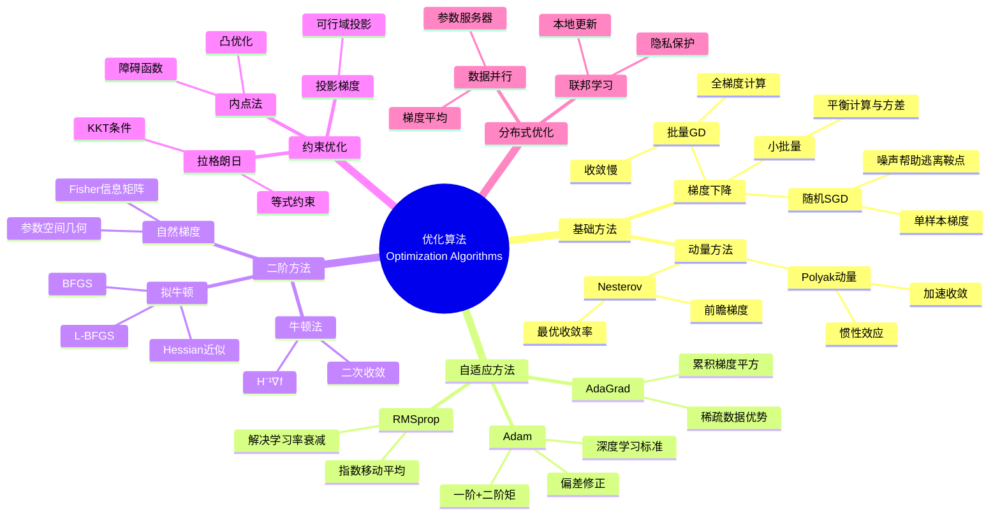

# 优化算法 - 思维导图

## 概述

优化算法是机器学习和数据科学的核心计算工具，研究如何在可行域内寻找目标函数的最小值（或最大值）。从经典的一阶方法到随机优化、分布式优化，再到现代的自适应优化器和二阶方法，优化算法的进步直接推动了深度学习和大规模数据分析的发展。

---

## 核心思维导图



---

## 梯度下降变体

```mermaid
graph TD
    subgraph 批量GD
        A[计算全梯度∇f(w)] --> B[w = w - η∇f(w)]
        B --> C[收敛: O(1/k)]
    end
    
    subgraph SGD
        D[随机梯度∇fᵢ(w)] --> E[w = w - η∇fᵢ(w)]
        E --> F[收敛: O(1/√k)]
    end
    
    subgraph Mini-batch
        G[小批量梯度] --> H[方差-计算权衡]
        H --> I[实际最常用]
    end
    
    style B fill:#e3f2fd
    style E fill:#fff3e0
    style H fill:#e8f5e9

```

---

## 自适应优化器对比

```mermaid
mindmap
  root((自适应优化器))
    AdaGrad
      更新
        Gₜ = Gₜ₋₁ + gₜ²
        θₜ = θₜ₋₁ - η/√(Gₜ+ε) · gₜ
      特点
        稀疏梯度优势
        学习率单调递减
      问题
        后期学习率过小
    RMSprop
      更新
        E[g²]ₜ = βE[g²]ₜ₋₁ + (1-β)gₜ²
        θₜ = θₜ₋₁ - η/√(E[g²]ₜ+ε) · gₜ
      改进
        指数平均
        解决AdaGrad问题
    Adam
      更新
        mₜ = β₁mₜ₋₁ + (1-β₁)gₜ
        vₜ = β₂vₜ₋₁ + (1-β₂)gₜ²
        m̂ₜ = mₜ/(1-β₁ᵗ)
        v̂ₜ = vₜ/(1-β₂ᵗ)
        θₜ = θₜ₋₁ - η·m̂ₜ/(√v̂ₜ+ε)
      优势
        动量+自适应
        偏差修正
        深度学习首选

```

---

## 优化器对比

| 优化器 | 更新规则 | 内存 | 收敛 | 适用场景 |
|--------|----------|------|------|----------|
| SGD | w - ηg | O(d) | O(1/√k) | 大规模、泛化好 |
| Momentum | v = βv + g, w - ηv | O(d) | 加速 | 非凸优化 |
| AdaGrad | w - ηg/√(∑g²) | O(d) | - | 稀疏特征 |
| RMSprop | w - ηg/√(E[g²]) | O(2d) | - | RNN稳定 |
| Adam | 见上 | O(3d) | - | 深度学习默认 |
| L-BFGS | 拟牛顿方向 | O(md) | 超线性 | 中小规模 |

---

## 约束优化

```mermaid
graph TD
    subgraph 等式约束
        A[min f(x)] --> B[s.t. h(x) = 0]
        B --> C[L(x,λ) = f(x) + λᵀh(x)]
        C --> D[∇L = 0]
    end
    
    subgraph 不等式约束
        E[min f(x)] --> F[s.t. g(x) ≤ 0]
        F --> G[KKT条件]
        G --> H[互补松弛]
    end
    
    subgraph 投影方法
        I[梯度步] --> J[投影到可行域]
        J --> K[x = Proj(x - η∇f)]
    end
    
    style C fill:#e3f2fd
    style G fill:#fff3e0
    style K fill:#e8f5e9

```

---

## 学习路径


---

## 关键公式速查

| 公式 | 说明 |
|------|------|
| $w_{t+1} = w_t - \eta \nabla f(w_t)$ | 梯度下降 |
| $v_{t+1} = \beta v_t + \nabla f(w_t)$ | 动量累积 |
| $w_{t+1} = w_t - \frac{\eta}{\sqrt{v_t} + \epsilon} m_t$ | Adam更新 |
| $w_{t+1} = w_t - \eta H^{-1}\nabla f(w_t)$ | 牛顿法 |
| $\mathcal{L}(x,\lambda) = f(x) + \lambda^T h(x)$ | 拉格朗日函数 |
| $x_{t+1} = \Pi_{\mathcal{C}}(x_t - \eta \nabla f(x_t))$ | 投影梯度 |

---

## 应用领域

- **深度学习**: 神经网络训练
- **参数估计**: 极大似然、MAP
- **信号处理**: 压缩感知、稀疏优化
- **运筹学**: 资源分配、调度
- **控制理论**: 最优控制、MPC

---

*文档版本：1.0*
*创建时间：2026年4月*
*分类：应用数学 / 数据科学 / 思维导图*
