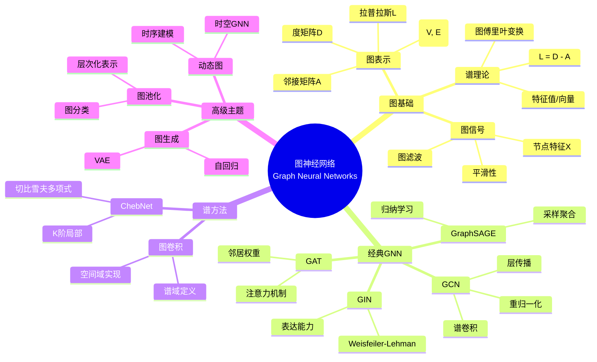
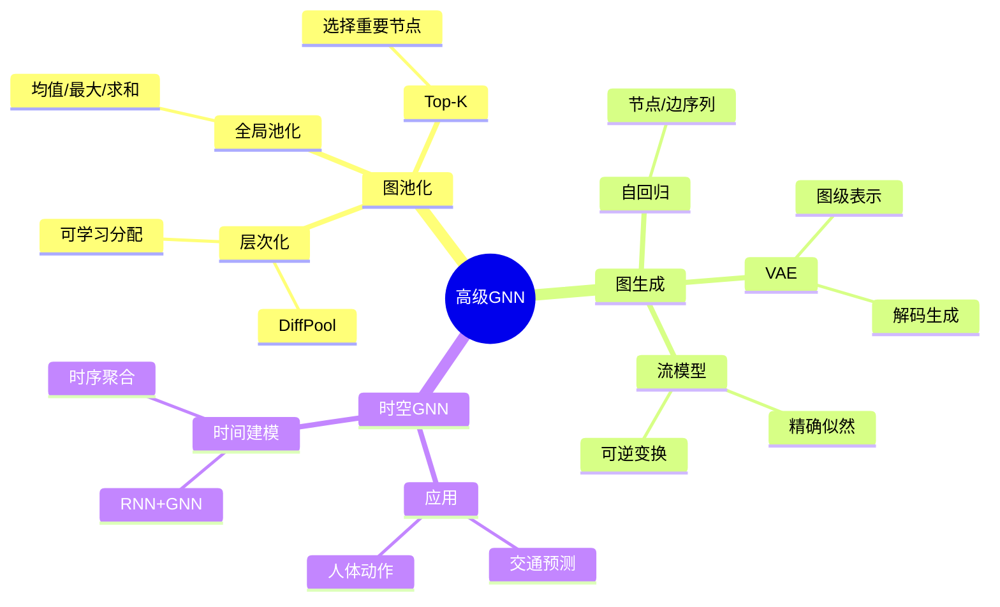
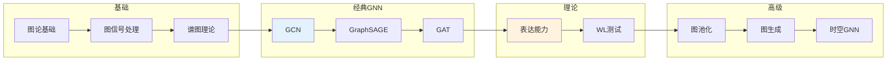

# 图神经网络 - 思维导图

## 概述

图神经网络(GNN)是处理图结构数据的深度学习架构，将神经网络扩展到非欧几里得数据域。从社交网络分析到分子性质预测，从推荐系统到知识图谱推理，GNN能够学习节点、边和全图的表示，是关系推理和结构化学习的重要工具。

---

## 核心思维导图



---

## GNN通用框架

```mermaid
graph TD
    subgraph 消息传递
        A[聚合邻居信息] --> B[AGGREGATE^{(k)}]
        B --> C[更新节点表示]
        C --> D[UPDATE^{(k)}]
    end
    
    subgraph 一般形式
        D --> E[h_v^{(k)} = UPDATE(h_v^{(k-1)}, AGG({h_u^{(k-1)}: u∈N(v)}))]
    end
    
    subgraph 读出
        E --> F[READOUT({h_v^{(K)}})]
        F --> G[图级表示]
    end
    
    style B fill:#e3f2fd
    style E fill:#fff3e0
    style G fill:#e8f5e9

```

---

## GNN架构对比

```mermaid
mindmap
  root((GNN架构))
    GCN
      传播规则
        H^{l+1} = σ(D̃^{-1/2}ÃD̃^{-1/2}H^lW^l)
      特点
        谱卷积一阶近似
        transductive
        半监督学习
    GraphSAGE
      聚合函数
        Mean/Pool/LSTM
      特点
        采样邻居
        归纳学习
        大规模图
    GAT
      注意力
        e_ij = LeakyReLU(aᵀ[Whᵢ||Whⱼ])

        α_ij = softmax(e_ij)
      特点
        多头注意力
        邻居权重不同
        可解释性
    GIN
      更新
        h_v^{(k)} = MLP((1+ε)h_v^{(k-1)} + ∑h_u^{(k-1)})
      特点
        WL-test等价
        表达能力最强
        图分类

```

---

## 模型对比

| 模型 | 聚合方式 | 权重学习 | 表达能力 | 计算复杂度 | 适用场景 |
|------|----------|----------|----------|------------|----------|
| GCN | 均值 | 固定 | 中等 | O(E) | 半监督节点分类 |
| GraphSAGE | 采样聚合 | 可学习 | 中等 | O(V·S·K) | 大规模归纳学习 |
| GAT | 注意力 | 自适应 | 高 | O(E·K) | 异构图 |
| GIN | 求和 | MLP | 最高(WL) | O(E) | 图分类 |
| ChebNet | 切比雪夫 | 可学习 | 高 | O(KE) | 谱方法基础 |

---

## 谱图理论

```mermaid
graph TD
    subgraph 拉普拉斯
        A[L = D - A] --> B[对称半正定]
        B --> C[特征值0=连通分支数]
    end
    
    subgraph 谱卷积
        D[x *G g = U(Uᵀx ⊙ Uᵀg)] --> E[图傅里叶变换]
        E --> F[频域乘法]
    end
    
    subgraph 简化
        G[Chebyshev近似] --> H[K阶局部化]
        H --> I[GCN: K=1]
    end
    
    style A fill:#e3f2fd
    style E fill:#fff3e0
    style H fill:#e8f5e9

```

---

## 高级主题



---

## 学习路径



---

## 关键公式速查

| 公式 | 说明 |
|------|------|
| $L = D - A$ | 未归一化拉普拉斯 |
| $L_{sym} = I - D^{-1/2}AD^{-1/2}$ | 对称归一化拉普拉斯 |
| $H^{(l+1)} = \sigma(\tilde{D}^{-1/2}\tilde{A}\tilde{D}^{-1/2}H^{(l)}W^{(l)})$ | GCN传播 |
| $\alpha_{ij} = \frac{\exp(\text{LeakyReLU}(a^T[Wh_i\|\|Wh_j]))}{\sum_k \exp(\cdots)}$ | GAT注意力系数 |
| $h_i^{(l+1)} = \text{MLP}((1+\epsilon)h_i^{(l)} + \sum_{j\in\mathcal{N}(i)}h_j^{(l)})$ | GIN更新 |

---

## 应用领域

- **分子化学**: 性质预测、药物发现
- **推荐系统**: 社交推荐、知识图谱
- **知识图谱**: 推理、补全
- **计算机视觉**: 场景图、点云
- **自然语言处理**: 语义解析、关系抽取
- **交通预测**: 道路网络、时序预测

---

*文档版本：1.0*
*创建时间：2026年4月*
*分类：应用数学 / 数据科学 / 思维导图*
