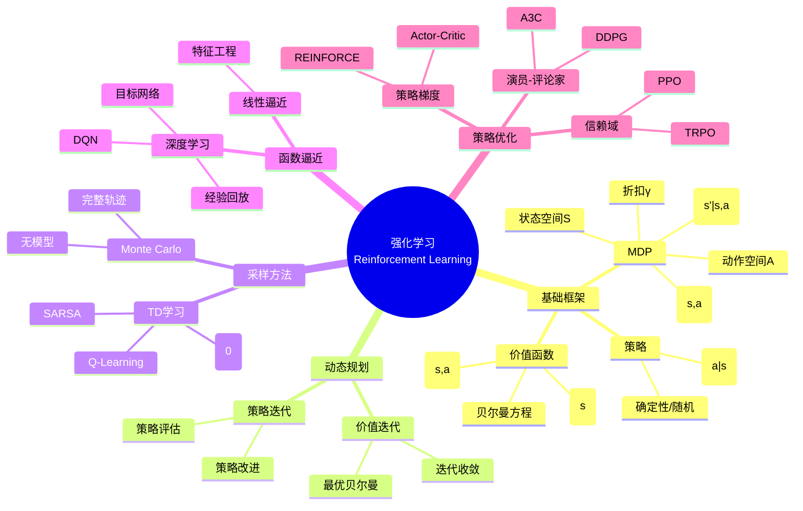
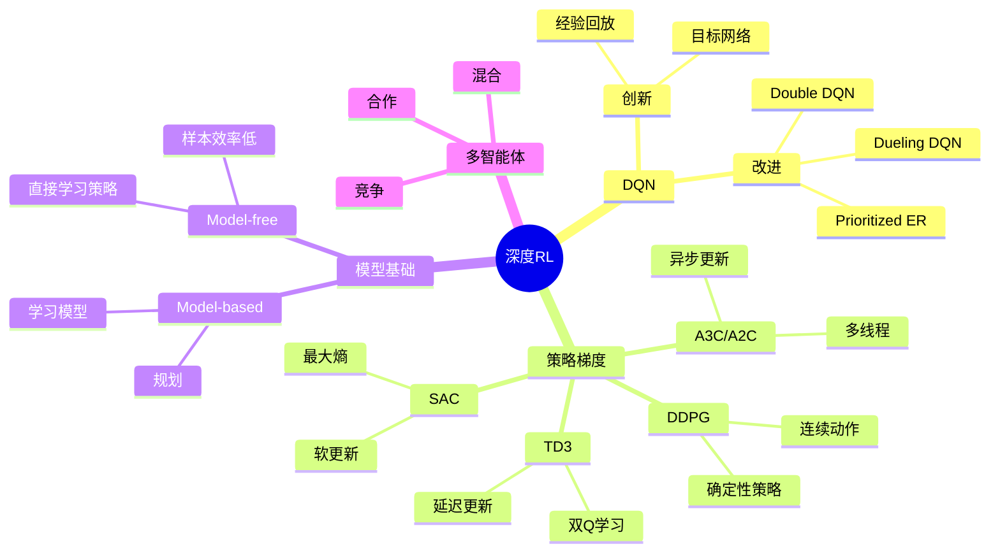
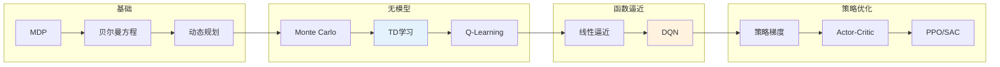

# 强化学习 - 思维导图

## 概述

强化学习研究智能体如何通过与环境的交互学习最优行为策略，以最大化长期累积奖励。作为机器学习的重要范式，强化学习结合了动态规划、统计推断和函数逼近等方法，在游戏AI、机器人控制、自动驾驶等领域展现出强大能力，是通向通用人工智能的重要路径之一。

---

## 核心思维导图



---

## MDP框架

```mermaid
graph TD
    subgraph 环境
        A[状态s] --> B[动作a]
        B --> C[奖励r]
        C --> D[下一状态s']
    end

    subgraph 策略
        E[π(a|s)] --> F[状态价值V^π(s)]

        E --> G[动作价值Q^π(s,a)]
    end

    subgraph 目标
        H[最大化期望回报] --> I[E[∑γᵗrₜ]]
    end

    style A fill:#e3f2fd
    style E fill:#fff3e0
    style H fill:#e8f5e9

```

---

## 价值函数方法

```mermaid
mindmap
  root((价值学习))
    贝尔曼方程
      状态价值
        V^π(s) = E[r + γV^π(s')]
      动作价值
        Q^π(s,a) = E[r + γQ^π(s',a')]
      最优
        Q*(s,a) = E[r + γmax_a' Q*(s',a')]
    算法
      策略迭代
        评估: 迭代V
        改进: 贪心策略
        收敛到最优
      价值迭代
        V_{k+1}(s) = max_a E[r + γV_k(s')]
        直接优化
      SARSA
        On-policy
        Q(s,a) += α[r + γQ(s',a') - Q(s,a)]
      Q-Learning
        Off-policy
        Q(s,a) += α[r + γmax_a' Q(s',a') - Q(s,a)]
    探索-利用
      ε-贪心
      上置信界
      汤普森采样

```

---

## 算法对比

| 算法 | 类型 | 采样 | 策略 | 特点 |
|------|------|------|------|------|
| 策略迭代 | DP | 模型已知 | On-policy | 收敛保证 |
| 价值迭代 | DP | 模型已知 | Off-policy | 直接优化 |
| Monte Carlo | 采样 | 完整轨迹 | Both | 无偏但方差大 |
| SARSA | TD | 单步 | On-policy | 保守 |
| Q-Learning | TD | 单步 | Off-policy | 最大Q值 |
| DQN | 深度 | 经验回放 | Off-policy | 非线性逼近 |

---

## 策略梯度方法

```mermaid
graph TD
    subgraph 策略梯度定理
        A[∇J(θ)] --> B[E[∇log π(a|s) · Q^π(s,a)]]

        B --> C[REINFORCE算法]
    end

    subgraph Actor-Critic
        D[Actor: π_θ(a|s)] --> E[更新策略]

        F[Critic: V_w(s)] --> G[估计优势]
        E --> H[减小方差]
    end

    subgraph 信赖域
        I[TRPO] --> J[KL约束]
        K[PPO] --> L[裁剪目标]
        L --> M[更简洁高效]
    end

    style B fill:#e3f2fd
    style G fill:#fff3e0
    style L fill:#e8f5e9

```

---

## 深度强化学习



---

## 学习路径



---

## 关键公式速查

| 公式 | 说明 |
|------|------|
| $V^\pi(s) = \mathbb{E}_\pi[\sum_{t=0}^\infty \gamma^t r_t \| s_0 = s]$ | 状态价值 |
| $Q^\pi(s,a) = \mathbb{E}_\pi[\sum_{t=0}^\infty \gamma^t r_t \| s_0=s, a_0=a]$ | 动作价值 |
| $Q^*(s,a) = \mathbb{E}[r + \gamma \max_{a'} Q^*(s',a')]$ | 最优Q方程 |
| $Q(s,a) \leftarrow Q(s,a) + \alpha[r + \gamma \max_{a'}Q(s',a') - Q(s,a)]$ | Q-Learning更新 |
| $\nabla_\theta J(\theta) = \mathbb{E}[\nabla_\theta \log \pi_\theta(a\|s) \cdot G_t]$ | 策略梯度 |
| $L^{CLIP}(\theta) = \mathbb{E}[\min(r_t(\theta)\hat{A}_t, \text{clip}(r_t,1-\epsilon,1+\epsilon)\hat{A}_t)]$ | PPO损失 |

---

## 应用领域

- **游戏AI**: AlphaGo、Atari、星际争霸
- **机器人**: 运动控制、操作学习
- **自动驾驶**: 路径规划、决策控制
- **推荐系统**: 序列推荐、交互学习
- **资源调度**: 数据中心、网络流量
- **金融交易**: 算法交易、投资组合

---

*文档版本：1.0*
*创建时间：2026年4月*
*分类：应用数学 / 数据科学 / 思维导图*
