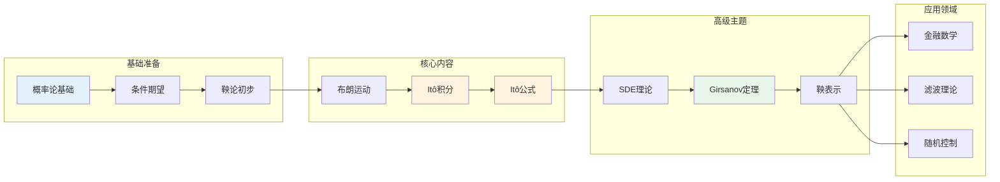

# 随机微积分 - 思维导图

## 概述

随机微积分是研究随机过程的微积分理论，是现代金融数学、统计物理和随机控制的基础。它突破了经典微积分对光滑路径的要求，建立了Itô积分和随机微分方程的理论框架。

---

## 核心思维导图

```mermaid
mindmap
  root((随机微积分<br/>Stochastic Calculus))
    基础理论
      概率空间
        样本空间 Ω
        σ-代数 ℱ
        概率测度 P
      随机过程
        定义: X: Ω×[0,∞) → ℝ
        样本路径
        有限维分布
      布朗运动
        定义与存在性
        Wiener测度
        性质: 独立增量、马尔可夫性
        路径性质: 连续但几乎处处不可微
    Itô积分
      定义
        简单过程积分
        L²极限扩展
        Itô等距
      性质
        鞅性质
        二次变差
        局部鞅
      Itô公式
        一维情形
        多维情形
        应用: 金融衍生品定价
    随机微分方程
      SDE定义
        dXₜ = μ(Xₜ,t)dt + σ(Xₜ,t)dWₜ
        强解与弱解
      存在唯一性
        Lipschitz条件
        线性增长条件
        Yamada-Watanabe定理
      经典SDE
        几何布朗运动
        Ornstein-Uhlenbeck过程
        CIR模型
    鞅论
      鞅的定义
        条件期望
        鞅变换
      停时
        可选停时定理
        局部化技巧
      鞅表示定理
        布朗运动表示
        可料表示性
    Girsanov定理
      测度变换
        Radon-Nikodym导数
        Girsanov公式
      应用
        风险中性测度
        等价鞅测度
```

---

## Itô积分构造

```mermaid
graph TD
    subgraph 准备阶段
        A[概率空间<br/>(Ω,ℱ,P)] --> B[布朗运动 Wₜ]
        B --> C[滤子 ℱₜ]
    end
    
    subgraph 简单过程
        C --> D[阶梯过程<br/>∑Hᵢ1_{(tᵢ,tᵢ₊₁]}]
        D --> E[简单过程积分<br/>∫HdW = ∑Hᵢ(W_{tᵢ₊₁}-W_{tᵢ})]
    end
    
    subgraph 扩展过程
        E --> F[Itô等距<br/>E[(∫HdW)²] = E[∫H²dt]]
        F --> G[L²完备化<br/>H ∈ L²(W)]
        G --> H[Itô积分<br/>∫₀ᵗ HₛdWₛ]
    end
    
    subgraph 重要性质
        H --> I[鞅性质<br/>E[∫₀ᵗ HdW|ℱₛ] = ∫₀ˢ HdW]
        H --> J[二次变差<br/>⟨∫HdW⟩ₜ = ∫₀ᵗ H²ds]
        H --> K[Itô等距<br/>保持L²结构]
    end
    
    style A fill:#e3f2fd
    style H fill:#fff3e0
    style I fill:#e8f5e9
    style J fill:#e8f5e9
```

---

## Itô公式详解

```mermaid
mindmap
  root((Itô公式<br/>Itô's Formula))
    一维Itô公式
      形式
        df(Xₜ) = f'(Xₜ)dXₜ + ½f''(Xₜ)d⟨X⟩ₜ
      关键项
        一阶项: Itô项
        二阶项: Itô修正项
      与经典微积分区别
        二阶项不可忽略
        二次变差非零
    多维Itô公式
      形式
        df(Xₜ) = ∇f·dX + ½tr(∇²f d⟨X⟩)
      交叉变差项
        d⟨Xⁱ,Xʲ⟩ₜ
        协二次变差
    应用
      几何布朗运动
        dSₜ = μSₜdt + σSₜdWₜ
        解: Sₜ = S₀exp((μ-σ²/2)t + σWₜ)
      Feynman-Kac公式
        PDE与SDE联系
        期权定价
      Girsanov定理
        测度变换的显式公式
```

---

## 随机微分方程分类

| SDE类型 | 方程形式 | 典型应用 | 解析解 |
|---------|----------|----------|--------|
| 几何布朗运动 | dS = μSdt + σSdW | 股票价格 | ✓ 显式解 |
| Ornstein-Uhlenbeck | dX = θ(μ-X)dt + σdW | 利率均值回归 | ✓ 显式解 |
| CIR模型 | dr = θ(μ-r)dt + σ√rdW | 利率建模 | ✗ 需数值解 |
| Heston模型 | dV = κ(θ-V)dt + ξ√VdW | 随机波动率 | ✗ 需数值解 |
| Langevin方程 | dX = -∇V(X)dt + σdW | 统计物理 | 视势函数而定 |

---

## Girsanov定理与测度变换

```mermaid
graph LR
    subgraph 原测度P
        A[布朗运动 Wₜ] --> B[漂移 μ]
        B --> C[过程 Xₜ = μt + Wₜ]
    end
    
    subgraph Radon-Nikodym导数
        D[dQ/dP = exp(-∫θdW - ½∫θ²dt)]
    end
    
    subgraph 新测度Q
        E[新布朗运动 Ŵₜ = Wₜ + ∫θds] --> F[漂移 0]
        F --> G[过程 Xₜ = Ŵₜ]
    end
    
    C --> D
    D --> E
    
    style A fill:#e3f2fd
    style E fill:#fff3e0
    style D fill:#e8f5e9
```

---

## 学习路径



---

## 关键公式速查

| 公式 | 说明 |
|------|------|
| $E[\int_0^t H_s dW_s] = 0$ | Itô积分期望为零 |
| $E[(\int_0^t H_s dW_s)^2] = E[\int_0^t H_s^2 ds]$ | Itô等距 |
| $d(W_t^2) = 2W_t dW_t + dt$ | Itô公式示例 |
| $df(X_t) = f'(X_t)dX_t + \frac{1}{2}f''(X_t)d\langle X \rangle_t$ | Itô公式(一维) |
| $dS_t = \mu S_t dt + \sigma S_t dW_t$ | 几何布朗运动 |
| $S_t = S_0 \exp((\mu - \frac{\sigma^2}{2})t + \sigma W_t)$ | GBM显式解 |

---

## 应用领域

- **金融数学**: Black-Scholes模型、期权定价、风险中性定价
- **统计物理**: Langevin方程、扩散过程、平衡态统计
- **滤波理论**: Kalman滤波、非线性滤波
- **随机控制**: Hamilton-Jacobi-Bellman方程、最优停止
- **生物数学**: 种群随机模型、基因扩散

---

*文档版本：1.0*
*创建时间：2026年4月*
*分类：应用数学 / 金融数学 / 思维导图*
