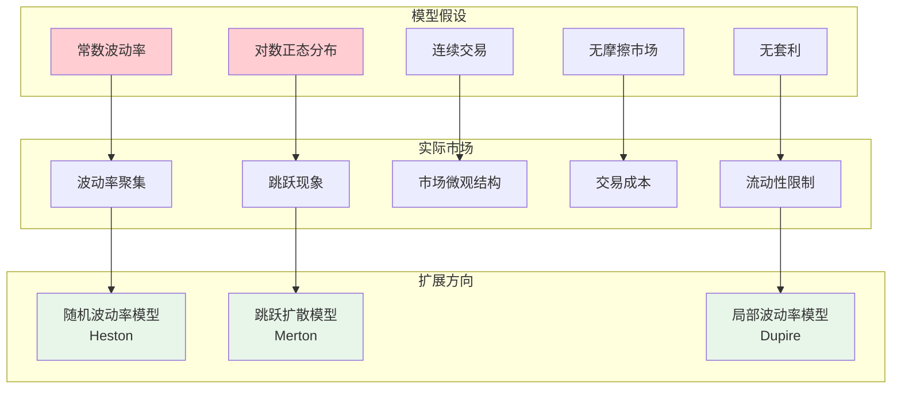
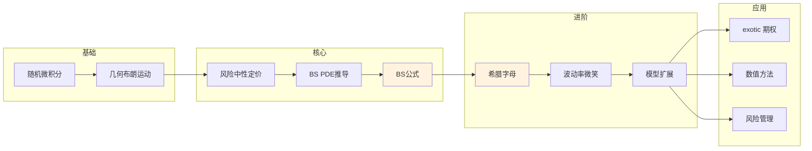

# Black-Scholes模型 - 思维导图

## 概述

Black-Scholes模型是期权定价的奠基性理论，由Fischer Black和Myron Scholes于1973年提出，Robert Merton做出了重要贡献。该模型假设标的资产价格服从几何布朗运动，在无套利条件下推导出欧式期权的解析定价公式。

---

## 核心思维导图

```mermaid
mindmap
  root((Black-Scholes模型<br/>Black-Scholes Model))
    模型假设
      市场假设
        无摩擦市场
        无套利机会
        允许卖空
      资产假设
        标的资产价格服从GBM
        波动率σ恒定
        无红利(基础模型)
      利率假设
        无风险利率r恒定
        可无限借贷
    资产价格动态
      几何布朗运动
        dSₜ = μSₜdt + σSₜdWₜ
      解的形式
        Sₜ = S₀exp((μ-σ²/2)t + σWₜ)
      对数正态分布
        ln(Sₜ/S₀) ~ N((μ-σ²/2)t, σ²t)
    期权定价
      风险中性定价
        在Q测度下: dSₜ = rSₜdt + σSₜdW̃ₜ
        折现价格e⁻ʳᵗSₜ是鞅
      定价公式
        看涨期权: C = S₀N(d₁) - Ke⁻ʳᵀN(d₂)
        看跌期权: P = Ke⁻ʳᵀN(-d₂) - S₀N(-d₁)
      d₁, d₂定义
        d₁ = [ln(S₀/K)+(r+σ²/2)T]/(σ√T)
        d₂ = d₁ - σ√T
    模型推导
      自融资组合
        构建Δ对冲组合
        Π = C - ΔS
      无套利条件
        dΠ = rΠdt
        Black-Scholes PDE
      PDE求解
        热方程变换
        边界条件处理
    模型扩展
      红利调整
        连续红利: C = S₀e⁻qᵀN(d₁) - Ke⁻ʳᵀN(d₂)
      外汇期权
        Garman-Kohlhagen模型
      期货期权
        Black模型

```

---

## Black-Scholes PDE推导

```mermaid
graph TD
    subgraph 组合构造
        A[期权价格 C(S,t)] --> B[构建组合 Π = C - ∂C/∂S·S]
        B --> C[Δ对冲: 消除随机项]
    end
    
    subgraph Itô展开
        D[Itô公式应用<br/>dC = ∂C/∂t dt + ∂C/∂S dS + ½σ²S²∂²C/∂S² dt]
        E[代入dS = μSdt + σSdW]
    end
    
    subgraph 无套利条件
        F[组合变化 dΠ = dC - ΔdS]
        G[风险中性: dΠ = rΠdt]
    end
    
    subgraph PDE
        H[Black-Scholes PDE<br/>∂C/∂t + ½σ²S²∂²C/∂S² + rS∂C/∂S - rC = 0]
        I[边界条件<br/>C(S,T) = max(S-K, 0)]
    end
    
    C --> D
    D --> E
    E --> F
    F --> G
    G --> H
    H --> I
    
    style B fill:#e3f2fd
    style H fill:#fff3e0
    style I fill:#e8f5e9

```

---

## 定价公式详解

```mermaid
mindmap
  root((BS定价公式))
    看涨期权
      公式
        C = S₀N(d₁) - Ke⁻ʳᵀN(d₂)
      经济含义
        S₀N(d₁): 资产期望价值
        Ke⁻ʳᵀN(d₂): 执行价现值
      风险中性解释
        N(d₂): 风险中性测度下执行概率
        S₀N(d₁): 资产价格条件期望
    看跌期权
      公式
        P = Ke⁻ʳᵀN(-d₂) - S₀N(-d₁)
      看跌-看涨平价
        C - P = S₀ - Ke⁻ʳᵀ
    参数影响
      S₀: 正相关
      K: 负相关
      T: 通常正相关
      r: 看涨正相关,看跌负相关
      σ: 正相关
    隐含波动率
      定义
        由市场价格反解的σ
      波动率微笑
        不同执行价的隐含波动率差异
      波动率偏斜
        市场 crashed 恐惧

```

---

## 希腊字母关系

| 希腊字母 | 定义 | 公式 | 含义 | 对冲应用 |
|----------|------|------|------|----------|
| Delta (Δ) | ∂C/∂S | N(d₁) | 股价敏感性 | Delta对冲 |
| Gamma (Γ) | ∂²C/∂S² | N'(d₁)/(Sσ√T) | Delta变化率 | Gamma对冲 |
| Vega | ∂C/∂σ | SN'(d₁)√T | 波动率敏感性 | Vega对冲 |
| Theta (Θ) | ∂C/∂t | -SN'(d₁)σ/(2√T) - rKe⁻ʳᵀN(d₂) | 时间衰减 | Theta交易 |
| Rho (ρ) | ∂C/∂r | KTe⁻ʳᵀN(d₂) | 利率敏感性 | Rho对冲 |

---

## 风险中性定价框架

```mermaid
graph LR
    subgraph 实际测度P
        A[实际概率] --> B[实际漂移μ]
        B --> C[风险溢价]
    end
    
    subgraph 风险中性测度Q
        D[风险中性概率] --> E[漂移=r]
        E --> F[无风险利率]
    end
    
    subgraph 定价原理
        G[期权价格 = E^Q[e⁻ʳᵀ payoff]]
    end
    
    C --> G
    F --> G
    
    style B fill:#e3f2fd
    style E fill:#fff3e0
    style G fill:#e8f5e9

```

---

## 模型假设与局限性



---

## 学习路径



---

## 关键公式速查

| 公式 | 说明 |
|------|------|
| $C = S_0 N(d_1) - Ke^{-rT} N(d_2)$ | 看涨期权价格 |
| $P = Ke^{-rT} N(-d_2) - S_0 N(-d_1)$ | 看跌期权价格 |
| $d_1 = \frac{\ln(S_0/K) + (r + \sigma^2/2)T}{\sigma\sqrt{T}}$ | d₁公式 |
| $d_2 = d_1 - \sigma\sqrt{T}$ | d₂公式 |
| $C - P = S_0 - Ke^{-rT}$ | 看跌-看涨平价 |
| $\Delta = N(d_1)$ | Delta公式 |

---

*文档版本：1.0*
*创建时间：2026年4月*
*分类：应用数学 / 金融数学 / 思维导图*
