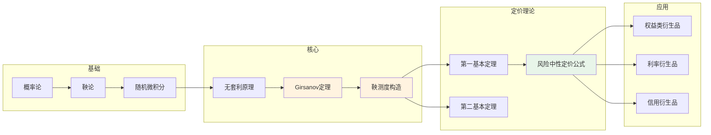

# 风险中性定价 - 思维导图

## 概述

风险中性定价是现代金融衍生品定价的核心理论框架。该理论表明，在无套利市场中，衍生品的公平价格等于其在风险中性测度下收益的贴现期望值。这一革命性思想将复杂的定价问题转化为概率计算问题。

---

## 核心思维导图

```mermaid
mindmap
  root((风险中性定价<br/>Risk-Neutral Pricing))
    理论基础
      无套利原理
        一价定律
        套利机会定义
        无套利与存在等价鞅测度
      等价鞅测度
        定义: Q ~ P
        Radon-Nikodym导数
        Girsanov定理
      完全市场
        可复制 claim
        唯一等价鞅测度
        完备市场的特征
    第一基本定理
      内容
        无套利 ⇔ 存在等价鞅测度Q
      意义
        保证风险中性定价的有效性
      证明思路
        分离超平面定理
        资产定价基本定理
    第二基本定理
      内容
        市场完备 ⇔ 等价鞅测度唯一
      完备性判据
        波动率矩阵满秩
        可交易资产数量 = 风险源数量
      不完全市场
        多个鞅测度
        超对冲与次对冲
    定价公式
      一般形式
        V₀ = E^Q[e^(-∫₀ᵀrₛds) · H]
      常数利率
        V₀ = e^(-rT) E^Q[H]
      多期模型
        Vₜ = e^(-r(T-t)) E^Q[H|ℱₜ]

    应用实例
      股票期权
        Black-Scholes框架
      利率衍生品
        短期利率模型
        远期测度
      信用衍生品
        违约风险建模
        生存概率

```

---

## 无套利与鞅测度关系

```mermaid
graph TD
    subgraph 市场模型
        A[(Ω,ℱ,P)] --> B[资产价格 Sₜ]
        B --> C[折现价格 S̃ₜ = e^(-rt)Sₜ]
    end
    
    subgraph 无套利条件
        D[不存在套利策略] --> E[第一基本定理]
    end
    
    subgraph 鞅测度存在
        E --> F[存在Q ~ P]
        F --> G[S̃ₜ是Q-鞅]
        G --> H[E^Q[S̃ₜ] = S₀]
    end
    
    subgraph 定价应用
        H --> I[衍生品价格 = E^Q[e^(-rT)H]]
    end
    
    C --> D
    E --> F
    H --> I
    
    style D fill:#e3f2fd
    style G fill:#fff3e0
    style I fill:#e8f5e9

```

---

## 等价鞅测度变换

```mermaid
mindmap
  root((测度变换<br/>Measure Change))
    Girsanov定理
      定理陈述
        Wₜ^P → Wₜ^Q = Wₜ + ∫θₛds
        θ: 市场风险价格
      Radon-Nikodym导数
        dQ/dP|ℱₜ = Zₜ

        Zₜ = exp(-∫θdW - ½∫θ²ds)
      应用步骤
        1. 确定市场风险价格
        2. 构造Radon-Nikodym导数
        3. 验证新测度下无漂移
    风险市场价格
      定义
        单位风险补偿
        超额收益/风险
      Sharpe比率
        (μ-r)/σ
        最优投资组合
      多资产情形
        风险价格向量
        波动率矩阵求逆
    鞅表示定理
      内容
        任何鞅可表示为随机积分
      应用
        对冲策略构造
        可复制性证明

```

---

## 完全市场vs不完全市场

| 特征 | 完全市场 | 不完全市场 |
|------|----------|------------|
| 鞅测度 | 唯一 | 多个 |
| 可复制性 | 所有claim可复制 | 仅部分claim可复制 |
| 对冲 | 完美对冲存在 | 仅存在超对冲/次对冲 |
| 定价 | 唯一价格 | 价格区间 |
| 典型模型 | Black-Scholes | 随机波动率、跳跃模型 |
| 对冲成本 | 确定 | 随机 |

---

## 测度变换技术

```mermaid
graph LR
    subgraph 原始测度P
        A[漂移μ] --> B[布朗运动Wₜ]
        B --> C[资产dS = μSdt + σSdW]
    end
    
    subgraph 风险中性化
        D[市场风险价格<br/>θ = (μ-r)/σ] --> E[Radon-Nikodym导数]
        E --> F[Zₜ = exp(-θWₜ - ½θ²t)]
    end
    
    subgraph 风险中性测度Q
        G[漂移r] --> H[新布朗运动Ŵₜ = Wₜ + θt]
        H --> I[资产dS = rSdt + σSdŴ]
    end
    
    C --> D
    F --> G
    
    style A fill:#ffcdd2
    style G fill:#e8f5e9
    style H fill:#fff3e0

```

---

## 各类衍生品定价

```mermaid
mindmap
  root((衍生品定价))
    股票期权
      欧式期权
        BS公式
      美式期权
        最优停止
        自由边界问题
    利率衍生品
      零息债券
        P(0,T) = E^Q[e^(-∫₀ᵀrₛds)]
      远期测度
        T-远期测度
        年金测度
      互换期权
        Black公式
    信用衍生品
      CDS定价
        违约概率
        回收率
      CDO
        相关违约
        Copula方法
    外汇衍生品
      外汇期权
        Garman-Kohlhagen
      Quanto期权
        汇率风险对冲

```

---

## 学习路径



---

## 关键公式速查

| 公式 | 说明 |
|------|------|
| $V_0 = E^Q[e^{-\int_0^T r_s ds} H]$ | 一般定价公式 |
| $V_0 = e^{-rT} E^Q[H]$ | 常数利率定价 |
| $Z_t = \exp(-\int_0^t \theta_s dW_s - \frac{1}{2}\int_0^t \theta_s^2 ds)$ | Radon-Nikodym导数 |
| $\theta = (\mu - r)/\sigma$ | 风险市场价格 |
| $\tilde{W}_t = W_t + \int_0^t \theta_s ds$ | Q-布朗运动 |
| $dQ/dP|_{\mathcal{F}_t} = Z_t$ | 测度变换定义 |

---

## 与其他概念的联系

- **Black-Scholes模型**: BS公式是风险中性定价的经典应用
- **随机微积分**: Girsanov定理是测度变换的数学基础
- **鞅论**: 鞅表示定理保证对冲策略存在性
- **偏微分方程**: Feynman-Kac联系SDE与PDE
- **数值方法**: Monte Carlo是风险中性定价的数值实现

---

*文档版本：1.0*
*创建时间：2026年4月*
*分类：应用数学 / 金融数学 / 思维导图*
