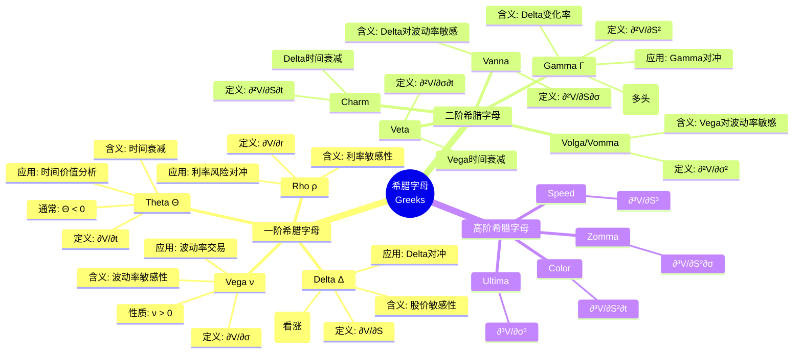
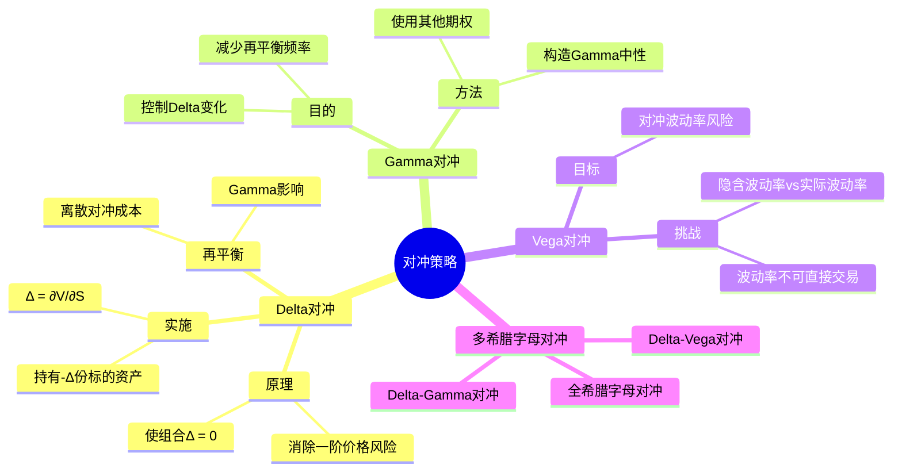
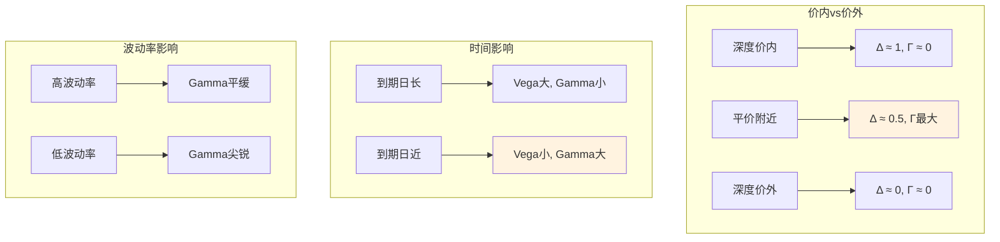
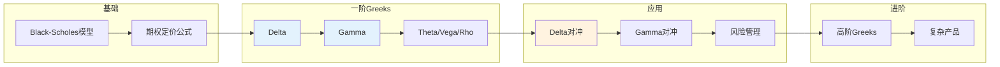

# 希腊字母 - 思维导图

## 概述

希腊字母(Greeks)是期权价格对各种参数的敏感性度量，是金融衍生品风险管理和对冲策略的核心工具。它们分别度量期权价格对标的资产价格、时间、波动率、利率等因素的变化率，帮助交易员理解和控制投资组合的风险暴露。

---

## 核心思维导图



---

## BS模型希腊字母公式

```mermaid
graph TD
    subgraph 一阶Greeks
        A[Delta Δ = N(d₁)] --> B[看涨: 0→1, 看跌: -1→0]
        C[Theta Θ = -SN'(d₁)σ/(2√T) - rKe⁻ʳᵀN(d₂)] --> D[时间衰减]
        E[Vega ν = SN'(d₁)√T] --> F[波动率敏感]
        G[Rho ρ = KTe⁻ʳᵀN(d₂)] --> H[利率敏感]
    end
    
    subgraph 二阶Greeks
        I[Gamma Γ = N'(d₁)/(Sσ√T)] --> J[Delta凸性]
        K[Vanna = ν(1-d₁/σ√T)/S] --> L[Skew暴露]
        M[Volga = ν·d₁·d₂/σ] --> N[Vol convexity]
    end
    
    subgraph 符号说明
        O[N(·): 标准正态CDF] --> P[N'(·): 标准正态PDF]
    end
    
    style A fill:#e3f2fd
    style E fill:#e3f2fd
    style I fill:#fff3e0

```

---

## 希腊字母特性表

| 希腊字母 | 定义 | 看涨期权BS公式 | 看跌期权BS公式 | 符号 | 风险暴露 |
|----------|------|----------------|----------------|------|----------|
| Delta (Δ) | ∂V/∂S | N(d₁) | N(d₁) - 1 | + (看涨) | 方向风险 |
| Gamma (Γ) | ∂²V/∂S² | N'(d₁)/(Sσ√T) | 相同 | + | 凸性风险 |
| Theta (Θ) | ∂V/∂t | 公式复杂 | 公式复杂 | - (多头) | 时间衰减 |
| Vega (ν) | ∂V/∂σ | SN'(d₁)√T | 相同 | + | 波动率风险 |
| Rho (ρ) | ∂V/∂r | KTe⁻ʳᵀN(d₂) | -KTe⁻ʳᵀN(-d₂) | + (看涨) | 利率风险 |

---

## 对冲策略



---

## 希腊字母的动态行为



---

## 风险度量与监控

```mermaid
mindmap
  root((风险管理))
    希腊字母限额
      Delta限额
        方向风险上限
      Gamma限额
        凸性风险上限
      Vega限额
        波动率风险上限
    情景分析
      价格情景
        股价大幅变动
        Delta和Gamma影响
      波动率情景
        波动率跳变
        Vega和Volga影响
      时间情景
        临近到期
        Theta和Charm影响
    P&L解释
      P&L = Δ·ΔS + ½Γ·(ΔS)² + ν·Δσ + Θ·Δt + ...
      希腊字母归因
      对冲效率评估

```

---

## 学习路径



---

## 关键公式速查

| 公式 | 说明 |
|------|------|
| $\Delta_{call} = N(d_1)$ | 看涨Delta |
| $\Delta_{put} = N(d_1) - 1$ | 看跌Delta |
| $\Gamma = \frac{N'(d_1)}{S\sigma\sqrt{T}}$ | Gamma |
| $\nu = S N'(d_1) \sqrt{T}$ | Vega |
| $\Theta_{call} = -\frac{S N'(d_1) \sigma}{2\sqrt{T}} - rKe^{-rT}N(d_2)$ | 看涨Theta |
| $\rho_{call} = K T e^{-rT} N(d_2)$ | 看涨Rho |
| $\text{Vanna} = \frac{\nu}{S}(1 - \frac{d_1}{\sigma\sqrt{T}})$ | Vanna |
| $\text{Volga} = \frac{\nu \cdot d_1 \cdot d_2}{\sigma}$ | Volga |

---

## 应用领域

- **期权做市**: 管理库存风险，设定买卖报价
- **结构化产品**: 设计和对冲复杂衍生品
- **风险管理**: 风险限额设置，VaR计算
- **波动率交易**: Vega/Volga策略，波动率套利
- **算法交易**: 自动化对冲策略

---

*文档版本：1.0*
*创建时间：2026年4月*
*分类：应用数学 / 金融数学 / 思维导图*
