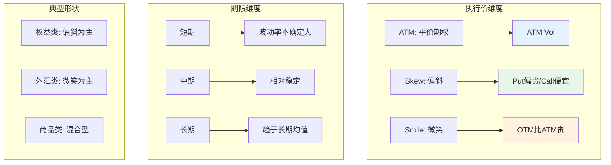
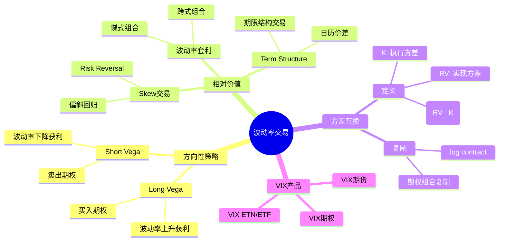
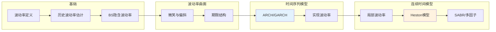

# 波动率建模 - 思维导图

## 概述

波动率是金融资产收益率的标准差，是衡量风险的核心指标，也是衍生品定价的关键输入参数。波动率建模旨在描述和预测波动率的动态变化，包括历史波动率、隐含波动率和实现波动率等多个维度。

---

## 核心思维导图

```mermaid
mindmap
  root((波动率建模<br/>Volatility Modeling))
    波动率类型
      历史波动率
        基于历史数据
        标准差估计
        窗口选择问题
      隐含波动率
        从期权价格反解
        市场前瞻性
        波动率微笑/偏斜
      实现波动率
        实际观测到的波动
        高频数据估计
        方差互换定价
    建模方法
      确定性波动率
        局部波动率模型
          Dupire公式
          隐含树
        隐含波动率曲面
          参数化方法
          无套利插值
      随机波动率
        Heston模型
          dV = κ(θ-V)dt + ξ√VdW
          均值回归
          半解析解
        SABR模型
          CEV + 随机波动率
          渐近展开
        Bergomi模型
          远期方差曲线
          随机微分方程
      GARCH类模型
        ARCH
        GARCH(1,1)
        EGARCH, GJR-GARCH
    波动率曲面
      维度
        执行价维度
        到期日维度
      形状特征
        微笑
        偏斜
        期限结构
    应用
      期权定价
      风险管理
      波动率交易
      投资组合优化

```

---

## 波动率类型对比

```mermaid
graph TD
    subgraph 历史波动率
        A[历史价格数据] --> B[收益率计算]
        B --> C[标准差估计]
        C --> D[σ̂ = √(1/n ∑(rᵢ-r̄)²)]
    end
    
    subgraph 隐含波动率
        E[期权市场价格] --> F[反解BS公式]
        F --> G[σᵢₘₚₗ = BS⁻¹(Price)]
        G --> H[市场前瞻性预期]
    end
    
    subgraph 实现波动率
        I[高频价格数据] --> J[实现方差]
        J --> K[RV = ∑(ln(Pᵢ/Pᵢ₋₁))²]
    end
    
    style D fill:#e3f2fd
    style G fill:#fff3e0
    style K fill:#e8f5e9

```

---

## 随机波动率模型: Heston

```mermaid
mindmap
  root((Heston模型))
    模型方程
      资产价格
        dSₜ = μSₜdt + √VₜSₜdW₁ₜ
      方差过程
        dVₜ = κ(θ-Vₜ)dt + ξ√VₜdW₂ₜ
      相关性
        dW₁dW₂ = ρdt
    参数解释
      κ (kappa)
        均值回归速度
        方差回归快/慢
      θ (theta)
        长期方差水平
        Vₜ → θ
      ξ (xi)
        波动率的波动率
        VIX of VIX
      ρ (rho)
        杠杆效应
        通常为负
    模型特性
      均值回归
        方差不会发散
        稳定分布
      非负性
        平方根过程
        Feller条件: 2κθ > ξ²
      半解析解
        特征函数
        FFT定价
    扩展
      随机利率
      跳跃扩散
      多因子Heston

```

---

## GARCH模型族

| 模型 | 方差方程 | 特点 | 应用场景 |
|------|----------|------|----------|
| ARCH(p) | σ²ₜ = ω + ∑αᵢr²ₜ₋ᵢ | 短期记忆 | 简单波动率预测 |
| GARCH(1,1) | σ²ₜ = ω + αr²ₜ₋₁ + βσ²ₜ₋₁ | 指数衰减 | 最常用基准模型 |
| EGARCH | lnσ²ₜ = ... | 非对称效应 | 杠杆效应建模 |
| GJR-GARCH | σ²ₜ = ω + (α+γIₜ₋₁)r²ₜ₋₁ + βσ²ₜ₋₁ | 非对称响应 | 坏消息影响更大 |
| FIGARCH | 长记忆扩展 | 超慢衰减 | 波动率聚集 |

---

## 波动率曲面结构



---

## 波动率交易策略



---

## 学习路径



---

## 关键公式速查

| 公式 | 说明 |
|------|------|
| $\hat{\sigma} = \sqrt{\frac{1}{n-1}\sum_{i=1}^n (r_i - \bar{r})^2}$ | 历史波动率估计 |
| $\sigma_{impl} = BS^{-1}(C_{market}; S, K, T, r)$ | 隐含波动率 |
| $RV = \sum_{i=1}^n (\ln(P_i/P_{i-1}))^2$ | 实现波动率 |
| $dV_t = \kappa(\theta - V_t)dt + \xi\sqrt{V_t}dW_t$ | Heston方差过程 |
| $\sigma_t^2 = \omega + \alpha r_{t-1}^2 + \beta \sigma_{t-1}^2$ | GARCH(1,1) |
| $\frac{\partial C}{\partial \sigma} = SN'(d_1)\sqrt{T}$ | Vega |

---

*文档版本：1.0*
*创建时间：2026年4月*
*分类：应用数学 / 金融数学 / 思维导图*
