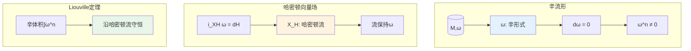
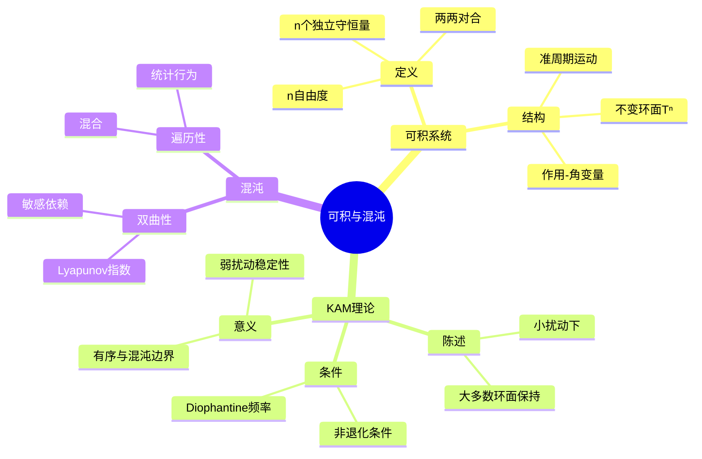

# 哈密顿力学 - 思维导图

## 概述

哈密顿力学是经典力学的优雅表述形式，由William Rowan Hamilton于1833年提出。通过将拉格朗日量转化为哈密顿量，力学系统被描述在相空间中，运动方程呈现为对称的正则方程形式。哈密顿力学不仅是统计力学和量子力学的基石，也是现代动力系统理论和辛几何的重要来源。

---

## 核心思维导图

```mermaid
mindmap
  root((哈密顿力学<br/>Hamiltonian Mechanics))
    基本构造
      Legendre变换
        L(q,q̇) → H(q,p)
        p = ∂L/∂q̇
        H = p·q̇ - L
      哈密顿量
        广义坐标q
        广义动量p
        能量函数
    正则方程
      哈密顿方程
        q̇ = ∂H/∂p
        ṗ = -∂H/∂q
      相空间
        2n维流形
        辛结构
    守恒定律
      能量守恒
        dH/dt = 0
      Noether定理
        对称性→守恒量
      Poisson括号
        {f,H} = df/dt
    辛几何
      辛形式
        ω = dp∧dq
        非退化
        闭形式
      辛变换
        正则变换
        生成函数
      Liouville定理
        相体积守恒
    可积系统
      作用-角变量
        I, θ
        周期运动
      完全可积
        n个守恒量
        Liouville定理
      KAM理论
        扰动可积
        不变环面

```

---

## 从拉格朗日到哈密顿

```mermaid
graph TD
    subgraph 拉格朗日
        A[L(q,q̇,t)] --> B[Euler-Lagrange方程]
        B --> C[d/dt(∂L/∂q̇) = ∂L/∂q]
    end
    
    subgraph Legendre变换
        D[定义动量 p = ∂L/∂q̇] --> E[H(q,p,t) = p·q̇ - L]
        E --> F[反解q̇ = f(q,p)]
    end
    
    subgraph 哈密顿
        F --> G[q̇ = ∂H/∂p]
        F --> H[ṗ = -∂H/∂q]
    end
    
    style C fill:#e3f2fd
    style E fill:#fff3e0
    style G fill:#e8f5e9

```

---

## Poisson括号结构

```mermaid
mindmap
  root((Poisson括号))
    定义
      {f,g} = ∑(∂f/∂qᵢ ∂g/∂pᵢ - ∂f/∂pᵢ ∂g/∂qᵢ)
      反对称
      双线性
    性质
      Jacobi恒等式
        {f,{g,h}} + 轮换 = 0
      Leibniz法则
        {fg,h} = f{g,h} + {f,h}g
    动力学
      df/dt = {f,H} + ∂f/∂t
      q̇ = {q,H}
      ṗ = {p,H}
    守恒量
      {f,H} = 0 ⇔ f守恒
      对合
        {f,g} = 0

```

---

## 正则变换

| 生成函数 | 关系 | 应用 |
|----------|------|------|
| F₁(q,Q,t) | p = ∂F₁/∂q, P = -∂F₁/∂Q | 坐标变换 |
| F₂(q,P,t) | p = ∂F₂/∂q, Q = ∂F₂/∂P | 常用形式 |
| F₃(p,Q,t) | q = -∂F₃/∂p, P = -∂F₃/∂Q | 动量变换 |
| F₄(p,P,t) | q = -∂F₄/∂p, Q = ∂F₄/∂P | 完全变换 |

---

## 辛几何基础



---

## 可积系统与混沌



---

## 学习路径

```mermaid
flowchart LR
    subgraph L1[基础]
        A[牛顿力学] --> B[拉格朗日力学]
        B --> C[变分原理]
    end
    
    subgraph L2[哈密顿形式]
        C --> D[Legendre变换]
        D --> E[正则方程]
        E --> F[Poisson括号]
    end
    
    subgraph L3[几何]
        F --> G[正则变换]
        G --> H[辛几何]
    end
    
    subplot L4[高级]
        H --> I[可积系统]
        I --> J[KAM理论]
        J --> K[混沌理论]
    end
    
    style E fill:#e3f2fd
    style H fill:#fff3e0

```

---

## 关键公式速查

| 公式 | 说明 |
|------|------|
| $H = \sum p_i \dot{q}_i - L$ | 哈密顿量定义 |
| $\dot{q}_i = \frac{\partial H}{\partial p_i}$ | 哈密顿方程(位置) |
| $\dot{p}_i = -\frac{\partial H}{\partial q_i}$ | 哈密顿方程(动量) |
| $\{f,g\} = \sum_i \left(\frac{\partial f}{\partial q_i}\frac{\partial g}{\partial p_i} - \frac{\partial f}{\partial p_i}\frac{\partial g}{\partial q_i}\right)$ | Poisson括号 |
| $\frac{df}{dt} = \{f,H\} + \frac{\partial f}{\partial t}$ | 时间演化 |
| $\omega = \sum_i dp_i \wedge dq_i$ | 辛形式 |

---

## 应用领域

- **天体力学**: 行星运动、三体问题
- **统计力学**: 系综理论、遍历假设
- **量子力学**: 正则量子化、路径积分
- **加速器物理**: 束流动力学
- **等离子体物理**: 带电粒子运动
- **分子动力学**: 经典模拟

---

*文档版本：1.0*
*创建时间：2026年4月*
*分类：应用数学 / 物理数学 / 思维导图*
