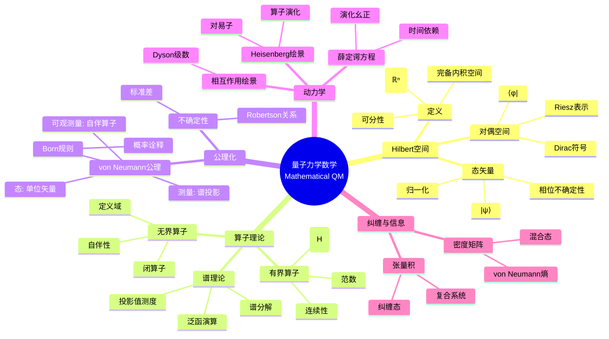

# 量子力学数学 - 思维导图

## 概述

量子力学数学为量子物理提供严格的数学基础，融合了泛函分析、算子理论和谱理论等现代数学分支。从Hilbert空间到自伴算子，从谱分解到散射理论，数学框架不仅保证了量子理论的严格性，也推动了算子代数和量子信息等领域的发展。

---

## 核心思维导图



---

## 算子分类与谱

```mermaid
graph TD
    subgraph 有界算子
        A[||A|| < ∞] --> B[全空间定义]
        B --> C[连续性]
    end
    
    subgraph 无界算子
        D[定义域D(A)] --> E[稠密定义]
        E --> F[对称: A ⊂ A†]
        F --> G[自伴: A = A†]
    end
    
    subgraph 谱理论
        H[谱σ(A)] --> I[点谱<br/>本征值]
        H --> J[连续谱]
        H --> K[剩余谱]
    end
    
    subgraph 物理解释
        L[本征值: 测量结果] --> M[本征态: 确定态]
        N[连续谱: 散射态]
    end
    
    style G fill:#e3f2fd
    style H fill:#fff3e0
    style L fill:#e8f5e9
```

---

## 自伴性与物理可观测量

```mermaid
mindmap
  root((自伴算子))
    对称算子
      定义
        ⟨Aψ,φ⟩ = ⟨ψ,Aφ⟩
        ∀ψ,φ∈D(A)
      问题
        可能不自伴
        定义域问题
    自伴延拓
      亏指数
        n₊, n₋
        延拓存在条件
      边界条件
        微分算子
        自伴域选择
    谱定理
      乘法算子形式
        么正等价
      投影值测度
        E(Δ)
        谱分解
      泛函演算
        f(A) = ∫f(λ)dE(λ)
    物理意义
      实谱
        测量实数值
      演化么正
        e^{-iAt}保范数
```

---

## 动力学绘景

| 绘景 | 态演化 | 算子演化 | 物理量 |
|------|--------|----------|--------|
| 薛定谔 | i∂ψ/∂t = Hψ | A固定 | 态随时间变 |
| Heisenberg | ψ固定 | i dA/dt = [A,H] | 算子随时间变 |
| 相互作用 | H = H₀ + V | A_I(t) = e^{iH₀t}Ae^{-iH₀t} | 相互作用项 |

---

## 测量理论与不确定性

```mermaid
graph TD
    subgraph 测量公设
        A[可观测量A] --> B[谱分解A = ∫λdE(λ)]
        B --> C[测量结果λ∈σ(A)]
        C --> D[概率P(λ∈Δ) = ||E(Δ)ψ||²]
        D --> E[坍缩: ψ → E(Δ)ψ/||·||]
    end
    
    subgraph 不确定性
        F[ΔA = √(⟨A²⟩-⟨A⟩²)] --> G[Robertson不等式]
        G --> H[ΔA·ΔB ≥ ½|⟨[A,B]⟩|]
    end
    
    style B fill:#e3f2fd
    style G fill:#fff3e0
    style D fill:#e8f5e9
```

---

## 纠缠与量子信息

```mermaid
mindmap
  root((量子信息基础))
    复合系统
      张量积
        H = H₁ ⊗ H₂
        维数相乘
      可分态
        |ψ⟩ = |ψ₁⟩ ⊗ |ψ₂⟩
      纠缠态
        不可分
        Bell态
    密度矩阵
      定义
        ρ = |ψ⟩⟨ψ|
        混合态推广
      性质
        ρ ≥ 0
        Tr ρ = 1
      演化
        么正: ρ → UρU†
        Lindblad: 开放系统
    熵
      von Neumann
        S(ρ) = -Tr(ρ ln ρ)
      纠缠熵
        约化密度矩阵
        S(ρ_A)
```

---

## 学习路径


---

## 关键公式速查

| 公式 | 说明 |
|------|------|
| $\langle \psi | \phi \rangle = \int \psi^*(x)\phi(x)dx$ | 内积 |
| $\langle A \rangle = \langle \psi | A | \psi \rangle$ | 期望值 |
| $i\hbar\frac{\partial \psi}{\partial t} = H\psi$ | 薛定谔方程 |
| $[A,B] = AB - BA$ | 对易子 |
| $\Delta A \cdot \Delta B \geq \frac{1}{2}|\langle [A,B] \rangle|$ | 不确定性 |
| $S(\rho) = -\text{Tr}(\rho \ln \rho)$ | von Neumann熵 |

---

## 应用领域

- **原子分子物理**: 能谱计算、跃迁概率
- **凝聚态物理**: 能带理论、多体问题
- **量子信息**: 量子计算、量子密码
- **量子场论**: 公理化构造、代数QFT
- **数学物理**: 逆散射、可积系统

---

*文档版本：1.0*
*创建时间：2026年4月*
*分类：应用数学 / 物理数学 / 思维导图*
