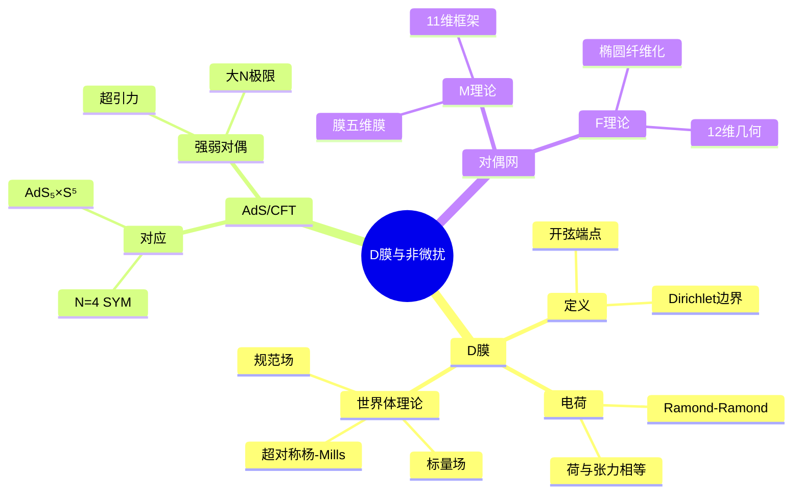
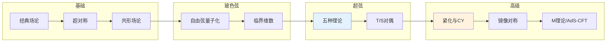

# 弦理论数学 - 思维导图

## 概述

弦理论是试图统一量子力学与广义相对论的理论框架，将基本粒子视为一维弦的振动模式。其数学涉及复几何、代数几何、拓扑学和表示论等前沿领域。虽然弦理论尚未得到实验验证，但其数学结构深刻影响了现代数学的发展，推动了镜像对称、Calabi-Yau流形等数学分支的突破。

---

## 核心思维导图

```mermaid
mindmap
  root((弦理论数学<br/>String Theory Math))
    基本弦论
      弦作用量
        Nambu-Goto
          面积最小化
          世界面度规
        Polyakov
          共形对称
          辅助度规
      振动模式
        开弦
          端点: D膜
          规范场
        闭弦
          引力子
          无质量自旋2
      临界维数
        D=26 (玻色)
        D=10 (超弦)
    超弦理论
      世界面超对称
        NSR形式
          Neveu-Schwarz
          Ramond
        GS形式
          Green-Schwarz
          时空超对称
      五种理论
        I型
          非定向开闭弦
        IIA/IIB
          II型超弦
          手征性差异
        杂化
          E₈×E₈, SO(32)
      T对偶
        R ↔ α'/R
        大/小圆对偶
    紧化与几何
      Calabi-Yau
        Ricci平坦
        Kähler流形
        平凡典则丛
        维度约化
      镜像对称
        CY对(X,Y)
        H^{p,q} ↔ H^{n-p,q}
        物理等价
    M理论
      11维起源
        D=11超引力
        强耦合极限
      对偶网
        各种极限联系
        统一框架
```

---

## 弦作用量与对称性

```mermaid
graph TD
    subgraph Nambu-Goto
        A[S = -T∫dτdσ√(-det(∂_αX^μ∂_βX_μ))] --> B[几何:世界面面积]
    end
    
    subgraph Polyakov
        C[S = -T/2∫dτdσ√(-γ)γ^{αβ}∂_αX^μ∂_βX_μ] --> D[辅助度规γ_{αβ}]
        D --> E[共形对称性]
    end
    
    subgraph 对称性
        E --> F[重参数化]
        E --> G[Weyl对称]
        G --> H[度规共形类]
    end
    
    style A fill:#e3f2fd
    style C fill:#fff3e0
    style H fill:#e8f5e9
```

---

## 超弦理论分类

```mermaid
mindmap
  root((超弦理论))
    五种理论
      非定向
        I型
          SO(32)规范
          开弦+闭弦
      定向I型
        IIA
          非手征
          无反常
        IIB
          手征
          自对偶5形式
      杂化
        HO
          SO(32)
        HE
          E₈×E₈
    对偶关系
      S对偶
        强弱对偶
        I ↔ HO
      T对偶
        紧化半径
        IIA ↔ IIB
      U对偶
        非微扰
        M理论统一
    紧致化
      9+1 → 3+1
        Calabi-Yau
        6维紧化
      4维物理
        超对称
        规范群
        粒子谱
```

---

## 超弦理论对比

| 理论 | 定向 | 手征性 | 超对称 | 规范群 | 特点 |
|------|------|--------|--------|--------|------|
| I型 | 否 | 手征 | N=1 | SO(32) | 含开弦 |
| IIA | 是 | 非手征 | N=2 | U(1) | 无反常 |
| IIB | 是 | 手征 | N=2 | - | 自对偶场 |
| HO | 是 | 手征 | N=1 | SO(32) | 玻色+费米 |
| HE | 是 | 手征 | N=1 | E₈×E₈ | 标准模型契合 |

---

## Calabi-Yau紧化

```mermaid
graph TD
    subgraph Calabi-Yau流形
        A[复3维Kähler流形] --> B[第一陈类c₁ = 0]
        B --> C[Ricci平坦度规]
        C --> D[超对称背景]
    end
    
    subgraph Hodge数
        E[h^{p,q}] --> F[h^{1,1}: Kähler模]
        E --> G[h^{2,1}: 复结构模]
        F --> H[4维标量场数]
    end
    
    subgraph 镜像对称
        I[镜面对(X,Y)] --> J[h^{p,q}(X) = h^{n-p,q}(Y)]
        J --> K[A模型 ↔ B模型]
        K --> L[数学等价性证明]
    end
    
    style C fill:#e3f2fd
    style H fill:#fff3e0
    style J fill:#e8f5e9
```

---

## D膜与对偶



---

## 学习路径



---

## 关键公式速查

| 公式 | 说明 |
|------|------|
| $S = -\frac{1}{4\pi\alpha'}\int d^2\sigma\sqrt{-h}h^{ab}\partial_a X^\mu\partial_b X_\mu$ | Polyakov作用量 |
| $[L_m, L_n] = (m-n)L_{m+n} + \frac{c}{12}(m^3-m)\delta_{m+n,0}$ | Virasoro代数 |
| $T_+^a T_+^b = if^{abc}T_+^c$ | Kac-Moody代数 |
| $R_{\mu\nu} = 0$ | Ricci平坦(CY) |
| $h^{p,q}(X) = h^{3-p,q}(Y)$ | 镜像对称(Hodge) |

---

## 数学影响

- **镜像对称**: 辛几何↔代数几何等价
- **Donaldson理论**: 4维拓扑不变量
- **顶点算子代数**: Moonshine现象
- **枚举几何**: Gromov-Witten理论
- **Langlands纲领**: 几何Langlands

---

*文档版本：1.0*
*创建时间：2026年4月*
*分类：应用数学 / 物理数学 / 思维导图*
