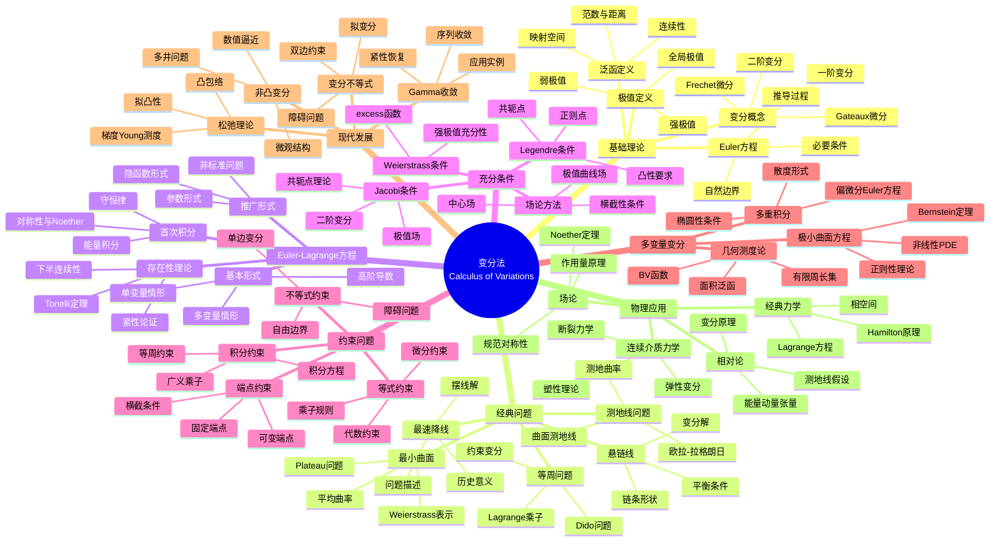

msc_primary: "00A99"
msc_secondary: ['00-00']
---

# 变分法思维导图

## 概述

变分法是研究泛函极值的数学分支，起源于最速降线问题等经典问题。它为最优控制理论、理论物理和工程优化提供了数学基础，是连接微积分与无穷维优化的桥梁。

## 核心概念详解

### 1. Euler-Lagrange方程

**标准形式**：
对于泛函 $J[y] = \int_a^b F(x, y, y') dx$

$$\frac{\partial F}{\partial y} - \frac{d}{dx}\frac{\partial F}{\partial y'} = 0$$

**高阶推广**：
$$\sum_{k=0}^n (-1)^k \frac{d^k}{dx^k}\frac{\partial F}{\partial y^{(k)}} = 0$$

**多变量情形**：
$$\frac{\partial F}{\partial u} - \sum_{i=1}^n \frac{\partial}{\partial x_i}\frac{\partial F}{\partial u_{x_i}} = 0$$

### 2. 充分条件体系

| 条件 | 形式 | 含义 |
|------|------|------|
| Legendre | $F_{y'y'} > 0$ | 局部凸性 |
| Jacobi | 无共轭点 | 二阶变分正定 |
| Weierstrass | $E \geq 0$ | 全局极值 |

**Jacobi方程**：
$$-\frac{d}{dx}(Pu') + Qu = 0$$
其中 $P = F_{y'y'}$, $Q = F_{yy} - \frac{d}{dx}F_{yy'}$

### 3. Noether定理

若 Lagrangian 在单参数变换群下不变：
$$F(x, y, y') = F(x^*, y^*, y'^*)$$

则存在守恒量：
$$\sum_i p_i \xi_i - \eta F = \text{const}$$

其中 $p_i = \partial F / \partial \dot{q}_i$ 为广义动量

### 4. 直接法（Tonelli方法）

**步骤**：
1. 证明极小化序列存在
2. 证明序列相对紧
3. 证明下半连续
4. 得到极限为解

**关键条件**：
- 强制性：$F(x,y,z) \geq c|z|^p - C$

- 凸性：$F$ 对 $z$ 凸

## 相关主题

- [最优控制](./optimal-control.md)
- [变分法与PDE](./calculus-of-variations.md)
- [应用数学思维导图索引](./00-应用数学思维导图索引.md)

## 参考资源

- Gelfand & Fomin: "Calculus of Variations"
- Dacorogna: "Introduction to the Calculus of Variations"
- Giaquinta & Hildebrandt: "Calculus of Variations"
- Struwe: "Variational Methods"
