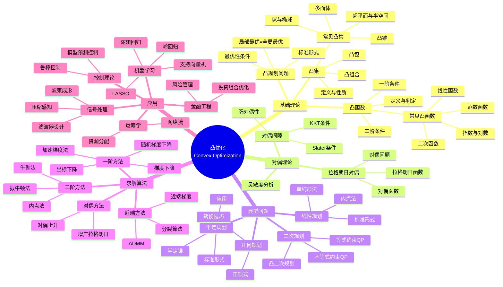

msc_primary: "00A99"
msc_secondary: ['00-XX']
---

# 凸优化思维导图

## 概述

凸优化是数学优化的核心分支，研究凸集上的凸（或凹）函数极值问题。由于局部最优即全局最优的特性，凸优化具有优良的理论性质和高效的求解算法。

## 核心概念详解

### 1. 凸集与凸函数

**凸集**：集合 C 是凸的，如果 ∀x,y∈C, θ∈[0,1]，有 θx+(1-θ)y∈C

**凸函数**：f 是凸函数，如果 ∀x,y∈dom(f), θ∈[0,1]：
$$f(\theta x + (1-\theta)y) \leq \theta f(x) + (1-\theta)f(y)$$

**判定方法**：
- 一阶条件：f(y) ≥ f(x) + ∇f(x)ᵀ(y-x)
- 二阶条件：∇²f(x) ⪰ 0（Hessian半正定）

### 2. 对偶理论

**拉格朗日函数**：
$$L(x, \lambda, \nu) = f_0(x) + \sum_{i=1}^m \lambda_i f_i(x) + \sum_{j=1}^p \nu_j h_j(x)$$

**KKT条件**（强对偶成立时）：
- 原始可行性
- 对偶可行性
- 互补松弛性
- 梯度条件

### 3. 重要算法

| 算法 | 收敛速度 | 适用场景 |
|------|----------|----------|
| 梯度下降 | O(1/k) | 大规模问题 |
| 加速梯度法 | O(1/k²) | 光滑强凸 |
| 牛顿法 | 二次收敛 | 中小规模 |
| 内点法 | 多项式时间 | 约束问题 |

## 相关主题

- [线性规划](./linear-programming.md)
- [非线性规划](./nonlinear-programming.md)
- [应用数学思维导图索引](./00-应用数学思维导图索引.md)

## 参考资源

- Boyd & Vandenberghe: "Convex Optimization"
- Nesterov: "Introductory Lectures on Convex Optimization"
- Bertsekas: "Convex Optimization Theory"
