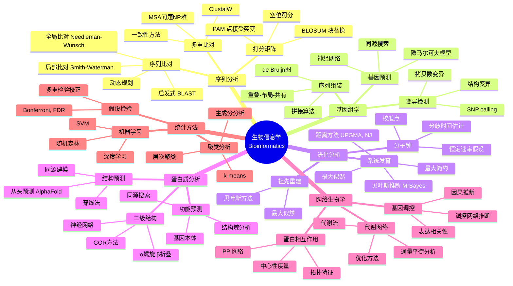
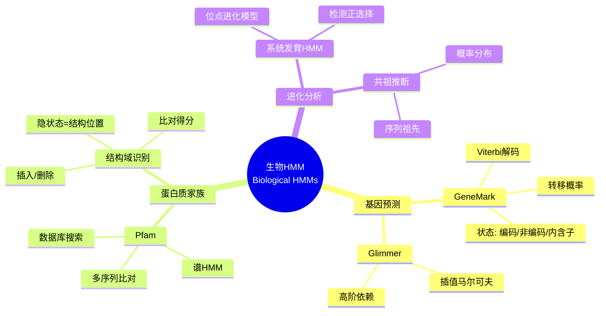

# 数学×生物学：生物信息学的组合统计

## 概述

生物信息学是生物学与计算机科学、统计学和数学的交叉领域，致力于从大规模生物数据中提取知识。从序列比对到系统发育重建，从基因组组装到蛋白质结构预测，数学算法是分析生物信息的核心工具。

---

## 核心思维导图



---

## 序列比对的动态规划

```mermaid
graph TD
    subgraph DP递推
        M[匹配得分] --> D[删除/插入]
        D --> S[最优得分矩阵]
    end
    
    subgraph 回溯
        S --> T[回溯路径]
        T --> A[最优比对]
    end
    
    subgraph 复杂度
        O[O(mn)时间] --> O1[O(mn)空间]
        O1 --> H[Hirschberg线性空间]
    end
```

---

## 常用算法复杂度

| 问题 | 算法 | 时间复杂度 | 空间复杂度 |
|------|------|------------|------------|
| 全局序列比对 | Needleman-Wunsch | O(mn) | O(mn) |
| 局部序列比对 | Smith-Waterman | O(mn) | O(mn) |
| 数据库搜索 | BLAST | O(n) 启发式 | O(1) |
| 多重比对 | MSA | NP-hard | - |
| 系统发育树 | 朴素 | O(n!) | - |
| 系统发育树 | NJ | O(n³) | O(n²) |

---

## 隐马尔可夫模型在生物信息学中的应用



---

## 网络拓扑分析方法

| 度量 | 定义 | 生物学意义 |
|------|------|------------|
| 度分布 | P(k) ~ k^(-γ) | 网络类型(无标度?) |
| 聚类系数 | C = 2E/(k(k-1)) | 模块化程度 |
| 最短路径 | 平均距离 | 信息传递效率 |
| 介数中心性 | 经过某节点的最短路径比例 | 网络枢纽 |
| 模块度 | Q = Σ(e_ii - a_i²) | 社区结构强度 |

---

## 前沿方向

- **单细胞测序**: 细胞异质性、发育轨迹推断
- **空间转录组**: 空间统计、图像分析
- **宏基因组学**: 群落组成、功能预测
- **结构生物学**: AI预测、分子动力学
- **合成生物学**: 设计空间、优化算法

---

*文档版本：1.0*
*创建时间：2026年4月*
*分类：数学×生物学 / 交叉学科*
