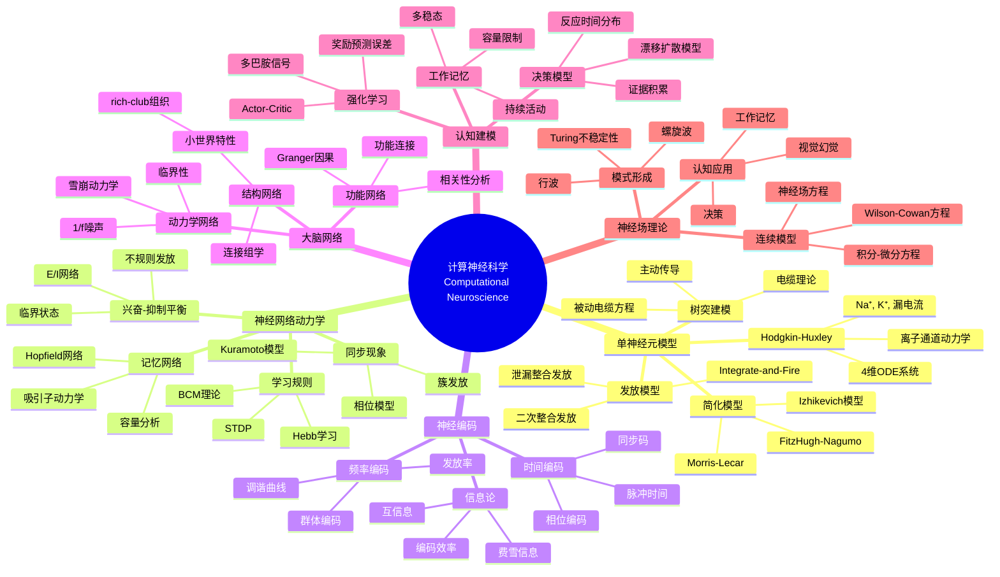
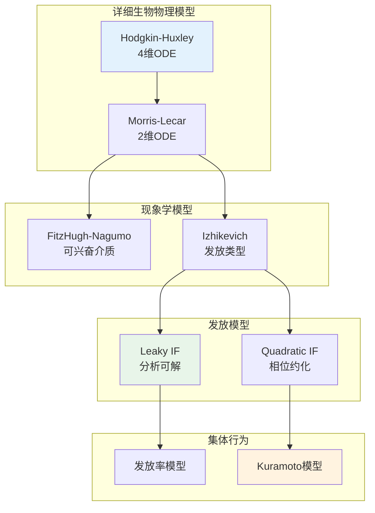

# 数学×生物学：计算神经科学的动力系统

## 概述

计算神经科学运用数学建模和计算方法来理解神经系统的功能。从单个神经元的电生理特性到大规模神经网络的集体行为，动力系统理论、随机过程和网络科学提供了描述大脑功能的数学语言。

---

## 核心思维导图



---

## 神经元模型的层次



---

## 典型神经元发放模式

| 模式 | 特征 | 对应模型 | 生物学实例 |
|------|------|----------|------------|
| 规则发放 | 恒定频率 | HH, LIF | 常规兴奋性神经元 |
| 快速发放 | 高频无适应 | 某些抑制性 | PV中间神经元 |
| 簇发放 | 脉冲簇 | ML, Izhikevich | 丘脑中继细胞 |
| 爆发 | 平台电位 | HH变体 | 内分泌细胞 |
| 混沌 | 不规则 | 某些参数 | 特定条件 |

---

## 学习规则的数学形式

```mermaid
mindmap
  root((突触可塑性<br/>Synaptic Plasticity))
    Hebb学习
      基本形式
        Δw_ij = η x_i x_j
        一起发放一起连接
      协方差规则
        Δw_ij = η (x_i - ⟨x_i⟩)(x_j - ⟨x_j⟩)
        减法归一化
    STDP
      非对称窗口
        Δt = t_post - t_pre
        长时程增强 LTP
        长时程抑制 LTD
      指数窗口
        A₊ exp(-Δt/τ₊), Δt>0
        -A₋ exp(Δt/τ₋), Δt<0
      平衡STDP
        稳态发放率
        权重稳定性
    BCM理论
      滑动阈值
        θ_M = E[x_post²]
        稳态调节
      权重更新
        dw/dt = η x_pre x_post(x_post - θ_M)
        相关性依赖
    稳态可塑性
      突触缩放
        乘法归一化
        维护兴奋性
      异突触可塑性
        竞争机制
        结构可塑性

```

---

## 神经编码的数学框架

- **发放率编码**: r = n/T，泊松过程
- **时间编码**: 精确脉冲时间，高时间精度
- **群体编码**: 向量表征，贝叶斯解码
- **预测编码**: 层级推断，误差最小化
- **高效编码**: 信息最大化，冗余最小化

---

## 前沿研究方向

- **全脑建模**: 大规模神经网络仿真
- **神经形态计算**: 类脑芯片设计
- **脑机接口**: 解码算法、神经假肢
- **意识理论**: 整合信息论(IIT)、全局工作空间
- **精神疾病**: 计算精神病学模型

---

*文档版本：1.0*
*创建时间：2026年4月*
*分类：数学×生物学 / 交叉学科*
