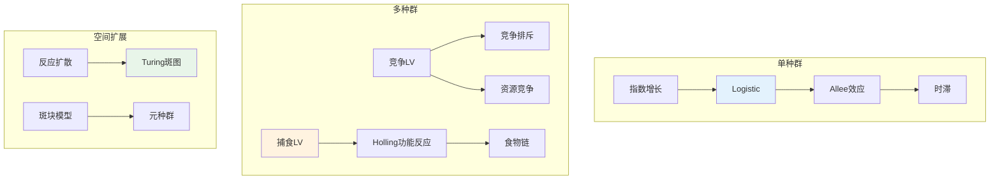

# 数学×生物学：种群动力学的微分方程

## 概述

种群动力学运用微分方程和差分方程来描述生物种群随时间的演化规律。从最简单的指数增长到复杂的生态系统相互作用，数学模型帮助我们理解物种竞争、捕食关系以及种群波动的内在机制。

---

## 核心思维导图

```mermaid
mindmap
  root((种群动力学<br/>Population Dynamics))
    单种群模型
      指数增长
        dN/dt = rN
        马尔萨斯模型
        无环境限制
      Logistic增长
        dN/dt = rN(1-N/K)
        环境容纳量K
        S型增长曲线
      Allee效应
        正密度依赖
        最小存活种群
        临界阈值
      时滞模型
        dN/dt = rN(t-τ)(1-N/K)
        离散时滞
        分布时滞
        振荡行为
    种间竞争
      Lotka-Volterra竞争
        dN₁/dt = r₁N₁(1-N₁/K₁-αN₂/K₁)
        竞争系数α, β
        种内/种间竞争
      竞争排斥原理
        Gause原理
        生态位分化
        共存条件
      资源竞争
        Tilman模型
        R*法则
        资源消耗率
    捕食-被捕食
      Lotka-Volterra捕食
        dN/dt = aN - bNP
        dP/dt = cbNP - dP
        中性循环
      Rosenzweig-MacArthur
        功能反应
          Holling I/II/III型
        稳定性分析
        悖论 of enrichment
      食物链
        三物种模型
        营养级联
        顶端控制
    传染病模型
      SIR模型
        dS/dt = -βSI
        dI/dt = βSI - γI
        dR/dt = γI
        基本再生数R₀
      SEIR模型
        潜伏期E
        更复杂动力学
      网络传播
        复杂网络
        度分布效应
        传播阈值
    空间结构
      反应-扩散方程
        ∂u/∂t = D∇²u + f(u)
        扩散系数D
        Turing不稳定性
      斑块模型
        集合种群
        迁移-灭绝
        Levins模型
      元胞自动机
        离散空间
        局部规则
        涌现模式
    随机模型
      分支过程
        Galton-Watson
        灭绝概率
        超临界/亚临界
      随机微分方程
        环境噪声
        人口波动
        准灭绝风险

```

---

## 经典模型数学结构



---

## 模型行为分析

| 模型 | 平衡点 | 稳定性 | 特殊行为 |
|------|--------|--------|----------|
| 指数增长 | N=0 (不稳定) | 指数发散 | J型增长 |
| Logistic | N=0, N=K | K稳定 | S型曲线 |
| LV竞争 | 4个可能 | 取决于α,β | 竞争排斥或共存 |
| LV捕食 | 非零平衡点 | 中性循环 | 周期振荡 |
| SIR | 无病/地方病 | R₀<1无病稳定 | 流行波 |
| 反应-扩散 | 均匀态 | Turing不稳定 | 空间斑图 |

---

## 稳定性分析方法

```mermaid
mindmap
  root((稳定性分析<br/>Stability Analysis))
    线性稳定性
      Jacobian矩阵
        J_ij = ∂f_i/∂x_j|*

        平衡点处求值
      特征值分析
        Re(λ) < 0 稳定
        Re(λ) > 0 不稳定
        Re(λ) = 0 临界
      Lyapunov函数
        V(x) > 0
        dV/dt < 0
        全局稳定性
    分岔理论
      鞍结分岔
        平衡点产生/湮灭
      跨临界分岔
        稳定性交换
      Hopf分岔
        周期解产生
        稳定性极限环
      分支图
        参数变化
        双稳态
    数值方法
      数值积分
        Runge-Kutta
        自适应步长
      分岔分析
        延续算法
        AUTO软件

```

---

## 生态学原理的数学表达

- **竞争排斥原理**: αβ > 1 时只有一种群存活
- **R*法则**: 竞争胜出者是维持最低资源水平的物种
- ** paradox of enrichment**: 高资源承载力导致捕食者-猎物不稳定
- **传播阈值**: R₀ = βS₀/γ，R₀>1时流行病发生

---

*文档版本：1.0*
*创建时间：2026年4月*
*分类：数学×生物学 / 交叉学科*

---

## 参考文献

- Timothy Gowers (ed.), *The Princeton Companion to Mathematics*, 1st ed., Princeton University Press, 2008, ISBN: 9780691118802 / MR2467561
- Daniel J. Velleman, *How to Prove It: A Structured Approach*, 2nd ed., Cambridge University Press, 2006, ISBN: 9780521675994 / MR2448845