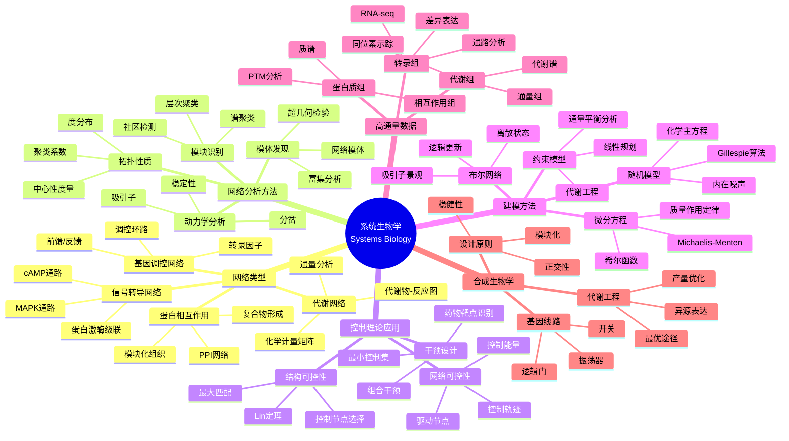
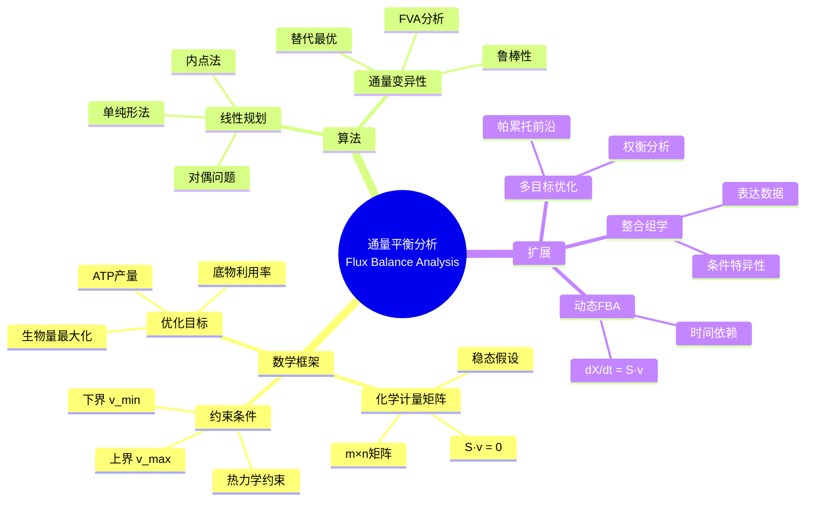

# 数学×生物学：系统生物学的网络控制

## 概述

系统生物学从整体论角度研究生物系统，将细胞视为复杂的分子网络。控制理论、图论和动力系统理论被用来理解基因调控、信号转导和代谢网络的 emergent 行为，以及设计干预策略。

---

## 核心思维导图



---

## 网络可控性的数学基础

```mermaid
graph TD
    subgraph 控制理论
        L[线性系统<br/>dx/dt = Ax + Bu] --> R[能控性矩阵]
        R --> C[rank(C) = n 完全可控]
        G[图论] --> M[最大匹配]
    end
    
    subgraph 网络应用
        N[生物网络] --> S[结构可控性]
        S --> D[最小驱动节点集]
        M -.-> D
        D --> I[干预靶点识别]
    end
    
    C -.-> S
    
    style L fill:#e3f2fd
    style G fill:#e8f5e9
    style D fill:#fff3e0
```

---

## 生物网络特征对比

| 网络类型 | 节点 | 边 | 典型拓扑 | 分析方法 |
|----------|------|-----|----------|----------|
| 基因调控 | 基因 | 调控关系 | 稀疏、有向 | Boolean/ODE |
| 信号转导 | 蛋白 | 磷酸化 | 层级结构 | ODE/Petri网 |
| 代谢网络 | 代谢物 | 反应 | 高度连接、模块化 | FBA/约束优化 |
| PPI网络 | 蛋白 | 物理作用 | 无标度、小世界 | 图论/统计 |

---

## 通量平衡分析(FBA)



---

## 合成生物学的数学设计

- **基因线路设计**: 动力学分析、参数优化
- **正交性设计**: 序列空间、密码子优化
- **代谢途径设计**: 通量优化、热力学可行性
- **稳健性工程**: 进化稳定性分析

---

*文档版本：1.0*
*创建时间：2026年4月*
*分类：数学×生物学 / 交叉学科*
