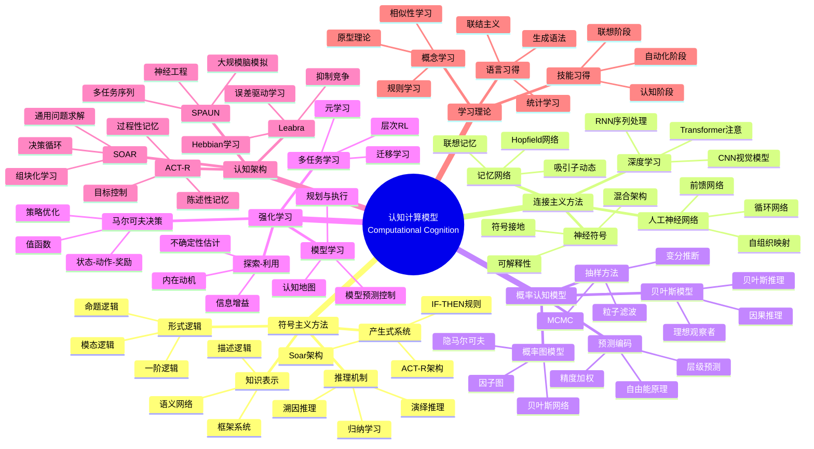
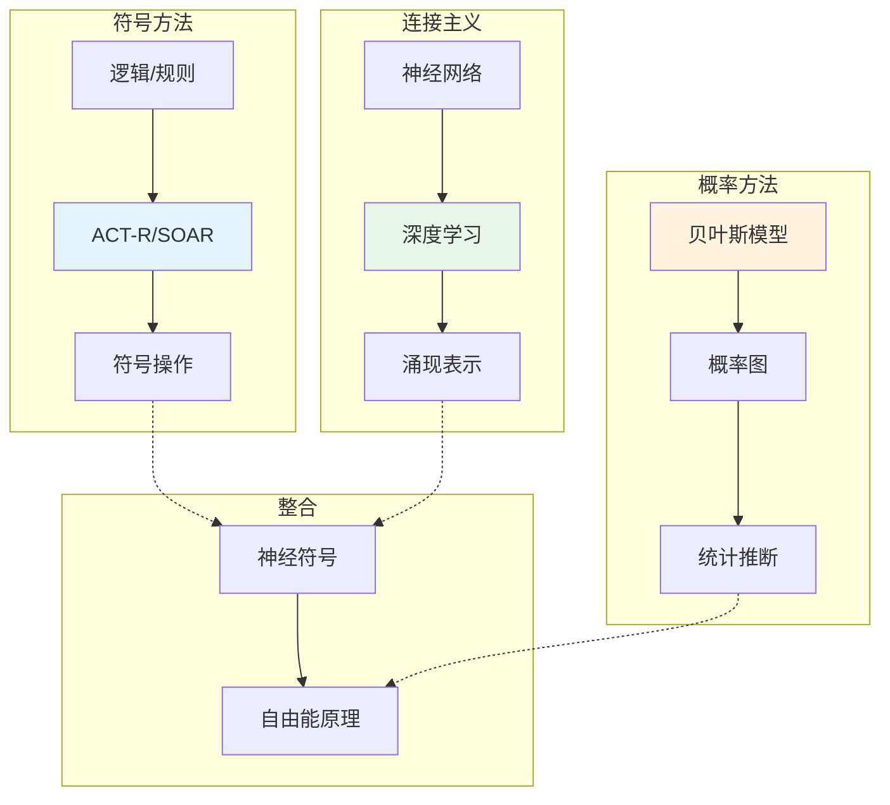
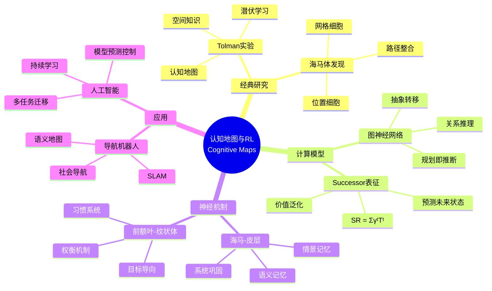

# 数学×认知科学：认知计算的形式模型

## 概述

计算认知科学运用形式化数学模型来理解人类认知过程。从符号主义的逻辑推理到连接主义的神经网络，从贝叶斯认知模型到强化学习框架，数学为认知理论提供了精确的描述和可检验的预测。

---

## 核心思维导图

---

## 认知建模方法对比

---

## 贝叶斯认知建模

| 认知领域 | 模型类型 | 核心假设 | 典型应用 |
|----------|----------|----------|----------|
| 感知 | 理想观察者 | 贝叶斯最优整合 | 线索整合、运动感知 |
| 概念学习 | 非参数贝叶斯 | 中国餐馆过程 | 类别形成、概念扩展 |
| 因果推理 | 因果贝叶斯网络 | 结构学习 | 干预推理、反事实 |
| 决策 | 贝叶斯决策理论 | 效用最大化 | 风险决策、信息寻求 |
| 语言 | 概率语法 | PCFG | 句法分析、语义理解 |

---

## 强化学习与认知映射

---

## 认知架构的数学特征

- **ACT-R**: 产生式规则 + 概率冲突解决 + 认知负荷
- **SOAR**: 通用问题求解 + 组块化 + 强化学习
- **Leabra**: 双向网络 + 误差驱动 + Hebbian学习
- **自由能原理**: 变分推断 + 主动推断 + 自组织

---

*文档版本：1.0*
*创建时间：2026年4月*
*分类：数学×认知科学 / 交叉学科*
