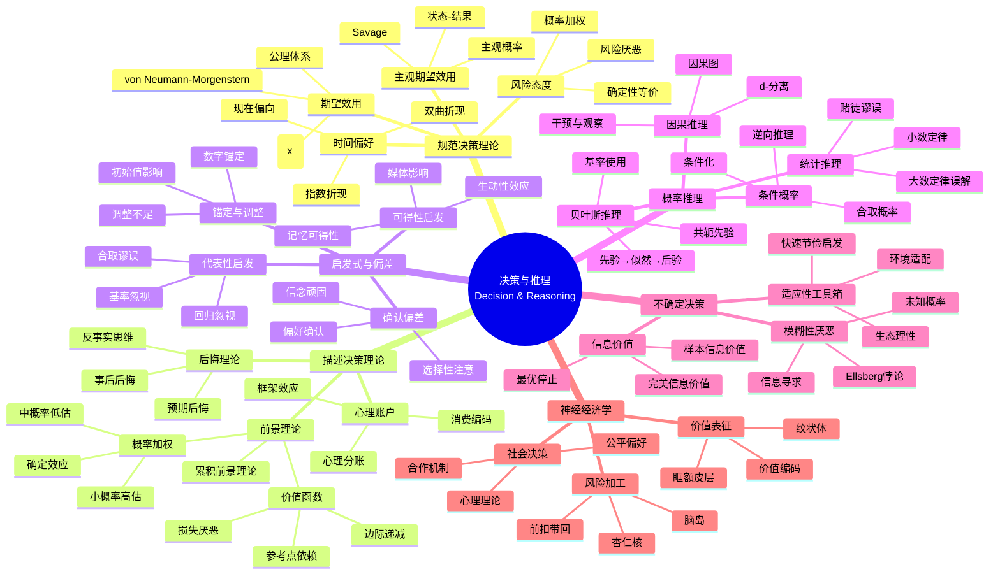

# 数学×认知科学：决策与推理的概率模型

## 概述

人类决策与推理的研究运用概率论、统计学和博弈论等数学工具来形式化描述认知过程。从期望效用理论到前景理论，从启发式到贝叶斯推理，数学模型揭示了人类判断的理性与偏差。

---

## 核心思维导图



---

## 期望效用 vs 前景理论

```mermaid
graph TD
    subgraph 期望效用
        E[EU = Σpᵢu(xᵢ)] --> L[线性概率]
        L --> R[风险态度恒定]
    end
    
    subgraph 前景理论
        P[V = Σw(pᵢ)v(xᵢ)] --> W[概率加权]
        W --> V[价值函数:<br/>参考点、损失厌恶]
    end
    
    subgraph 实验证据
        A[Allais悖论] --> PT[支持前景理论]
        K[Kahneman-Tversky] --> PT
    end
    
    E -.-> A
    
    style E fill:#e3f2fd
    style P fill:#e8f5e9
    style PT fill:#fff3e0

```

---

## 典型认知偏差

| 偏差类型 | 描述 | 实验示例 | 数学解释 |
|----------|------|----------|----------|
| 基率忽视 | 忽视先验概率 | 医生-出租车问题 | 非贝叶斯推理 |
| 合取谬误 | 认为A∧B比A更可能 | Linda问题 | 代表性启发 |
| 锚定效应 | 过度依赖初始值 | 旋转轮盘估计 | 调整不足 |
| 可得性偏差 | 以易得性判断频率 | 字母位置问题 | 记忆检索 |
| 沉没成本 | 考虑不可收回成本 | 剧院门票 | 非理性承诺 |

---

## 贝叶斯推理的困难

```mermaid
mindmap
  root((贝叶斯推理<br/>Bayesian Reasoning))
    自然频率效应
      频率格式
        100人中有15人
        更易理解
      概率格式
        15%概率
        认知负荷高
    因果关系
      因果贝叶斯
        因果结构
        解释推理
        干预推理
      障碍
        逆转条件概率
        P(A|B) vs P(B|A)

        联合概率
    改进方法
      可视化
        图标阵列
        树状图
        维恩图
      训练
        频率训练
        2×2表
        模拟学习
    理性争论
      生态理性
        环境结构
        适应价值
      有限理性
        认知资源
        满意解
      真正非理性
        系统性错误
        需要干预

```

---

## 神经经济学发现

- **价值编码**: 腹侧被盖区多巴胺神经元编码预测误差
- **风险加工**: 脑岛激活与风险厌恶正相关
- **时间折扣**: 不同脑区负责现在/未来价值
- **社会偏好**: 前扣带回与公平感知相关

---

*文档版本：1.0*
*创建时间：2026年4月*
*分类：数学×认知科学 / 交叉学科*
