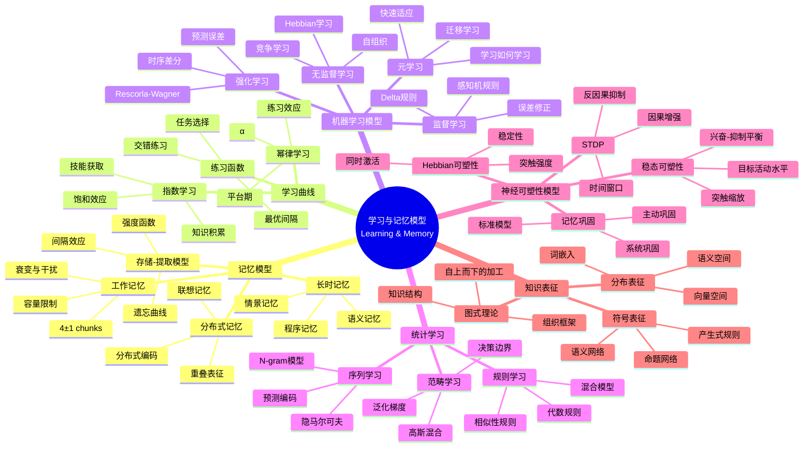
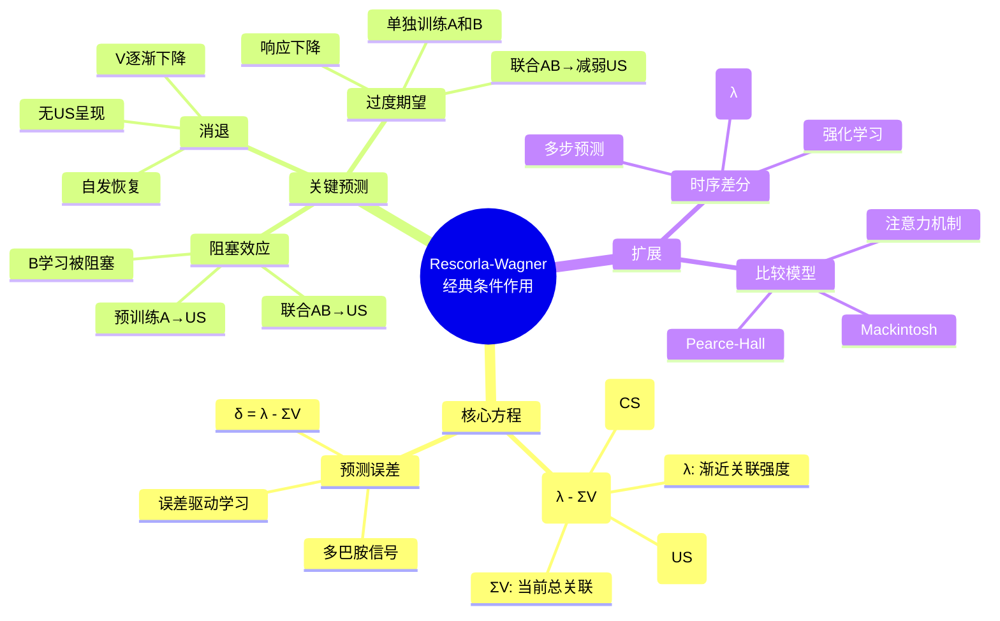

# 数学×认知科学：学习与记忆的数学模型

## 概述

学习与记忆是认知科学的核心主题，数学模型为理解这些过程提供了形式化框架。从记忆强度的指数衰减到神经网络的学习算法，从贝叶斯知识更新到信息论的编码原理，数学揭示了认知系统的基本规律。

---

## 核心思维导图



---

## 遗忘曲线与间隔效应

```mermaid
graph TD
    subgraph 遗忘曲线
        E[记忆保持<br/>R = e^(-t/S)] --> F[Ebbinghaus指数衰减]
        F --> S[强度S随练习增加]
    end
    
    subgraph 间隔效应
        M[质量练习] --> D[集中学习]
        D --> L[更快遗忘]
        S1[分散练习] --> E1[间隔效应]
        E1 --> L1[更慢遗忘]
    end
    
    S -.-> S1
    
    style E fill:#e3f2fd
    style S1 fill:#e8f5e9
    style E1 fill:#fff3e0

```

---

## 记忆模型对比

| 模型 | 核心假设 | 数学形式 | 预测 |
|------|----------|----------|------|
| Atkinson-Shiffrin | 多存储系统 | 转移概率 | 复述效应 |
| ACT-R | 激活与衰减 | Aᵢ = Bᵢ + ΣWⱼSⱼᵢ | 上下文效应 |
| REM | 概率匹配 | 贝叶斯证据积累 | 记忆强度 |
| 神经网络 | 连接权重 | Δw = ηδx | 泛化与干扰 |

---

## Rescorla-Wagner模型



---

## 学习优化策略

- **间隔重复**: 最优间隔计算、遗忘曲线建模
- **检索练习**: 测试效应、难度适当
- **交错学习**: 混合练习、辨别学习
- **生成学习**: 主动生成、精细加工
- **双重编码**: 言语+视觉、多模态整合

---

*文档版本：1.0*
*创建时间：2026年4月*
*分类：数学×认知科学 / 交叉学科*
