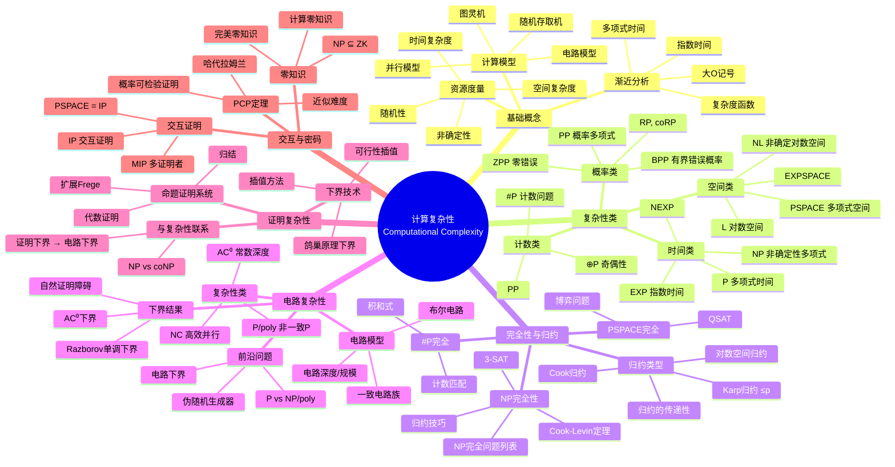
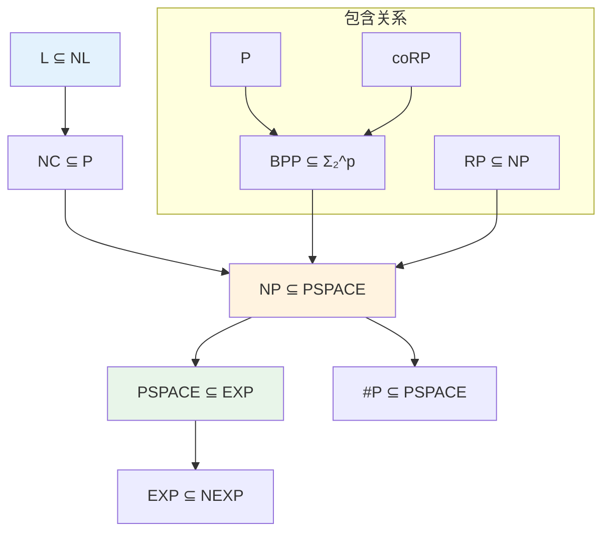

# 数学×计算机科学：计算复杂性的组合分析

## 概述

计算复杂性理论研究计算问题的内在难度，是理论计算机科学的核心分支。它运用组合数学、逻辑学和代数工具，对问题的计算资源需求进行精确分类，并探讨各类问题之间的关系。

---

## 核心思维导图



---

## 复杂性类层次结构



---

## 核心问题与猜想

| 问题 | 陈述 | 意义 |
|------|------|------|
| P vs NP | P = NP? | 数学与计算机科学核心难题 |
| NP vs coNP | NP = coNP? | 证明与反驳的等价性 |
| P vs BPP | P = BPP? | 随机性是否带来计算优势 |
| L vs NL | L = NL? | 非确定性是否节省空间 |
| NC vs P | NC = P? | 所有高效算法都可并行化? |

---

## 重要定理与结果

```mermaid
mindmap
  root((复杂性核心定理<br/>Key Theorems))
    时间层次
      确定性时间层次
        DTIME(f) ⊊ DTIME(g)
        g足够大于f
      非确定性时间层次
        NTIME(f) ⊊ NTIME(g)
      推论
        P ⊊ EXP
        NP ⊊ NEXP
    空间层次
      空间层次定理
        SPACE(f) ⊊ SPACE(g)
        Savitch定理
          NSPACE(s) ⊆ SPACE(s²)
        Immerman-Szelepcsényi
          NSPACE(s) = co-NSPACE(s)
    完全性定理
      Cook-Levin
        SAT是NP完全的
        第一个NP完全问题
      PSPACE完全
        QSAT
        博弈问题
      指数时间完全
        广义象棋、围棋
    PCP定理
      PCP[O(log n), O(1)] = NP
      概率可检验
      近似难度
        Max-3SAT无PTAS
        团问题无良好近似
    对数空间
      Reingold定理
        USTCON ∈ L
        无向图连通性
        对数空间可解
```

---

## 证明技术工具箱

- **对角化**: 层次定理、不可判定性
- **归约**: 证明完全性、相对化
- **电路复杂性**: 下界证明、自然证明障碍
- **信息论**: 通信复杂性、下界
- **代数方法**: 多项式方法、谱方法

---

*文档版本：1.0*
*创建时间：2026年4月*
*分类：数学×计算机科学 / 交叉学科*
