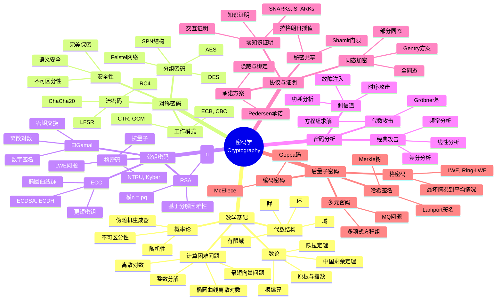
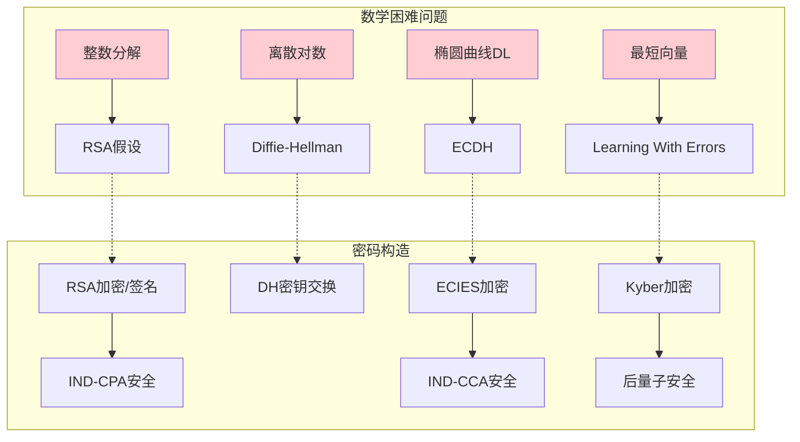
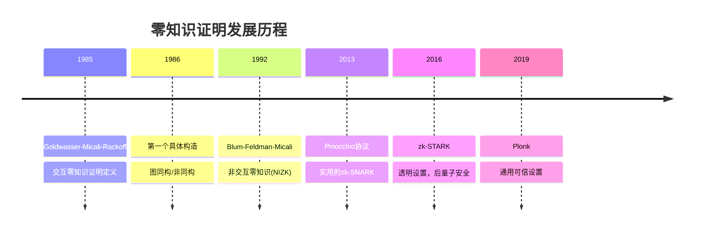
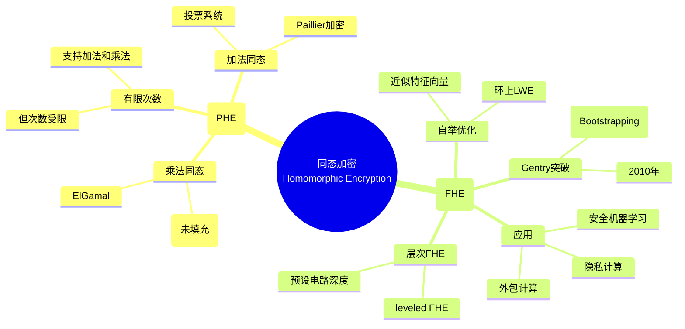

# 数学×计算机科学：密码学的数论代数

## 概述

现代密码学是建立在严格数学基础上的安全科学。从数论中的大数分解和离散对数问题，到代数中的椭圆曲线和格理论，数学困难问题构成了密码安全性的基石。

---

## 核心思维导图

---

## 困难问题与安全归约

---

## 公钥密码系统对比

| 系统 | 数学基础 | 密钥长度(128位安全) | 主要运算 | 应用 |
|------|----------|---------------------|----------|------|
| RSA | 大整数分解 | 3072位 | 模幂运算 | 签名、加密 |
| ECC | 椭圆曲线DL | 256位 | 点乘法 | 密钥交换、签名 |
| Kyber | Module-LWE | 1536位 | 多项式乘法 | 密钥封装(KEM) |
| Dilithium | Module-LWE+SIS | 性 | 多项式运算 | 数字签名 |
| McEliece | 编码理论 | 1MB | 矩阵运算 | 加密(大密钥) |

---

## 零知识证明发展

---

## 同态加密层次

---

## 密码学中的高级数学

- **代数几何**: 椭圆曲线配对、超椭圆曲线密码
- **理想格**: 环上LWE、NTRU的安全性证明
- **表示论**: 代数密码分析中的群论方法
- **算术几何**: 椭圆曲线的L函数、BSD猜想关联
- **随机矩阵**: 密码分析中的统计方法

---

*文档版本：1.0*
*创建时间：2026年4月*
*分类：数学×计算机科学 / 交叉学科*
