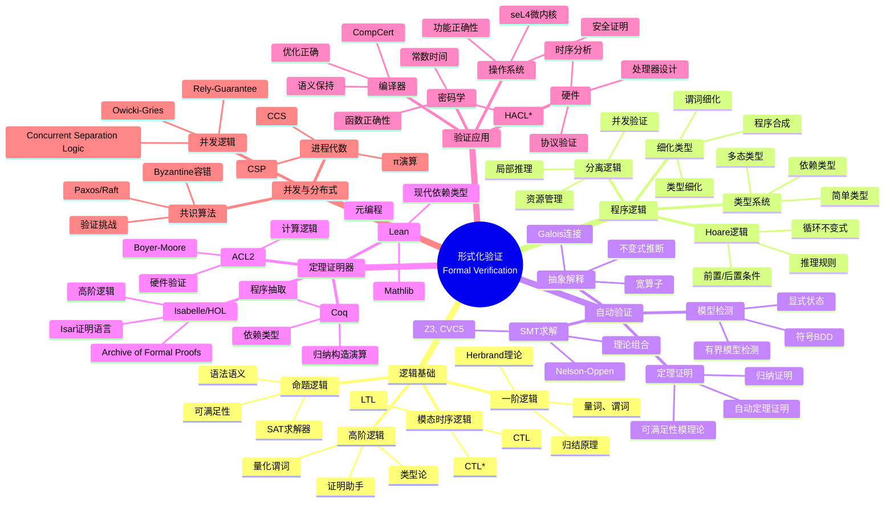
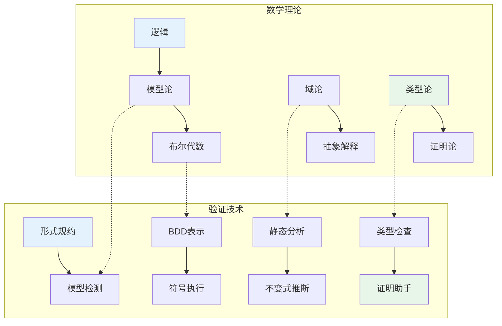
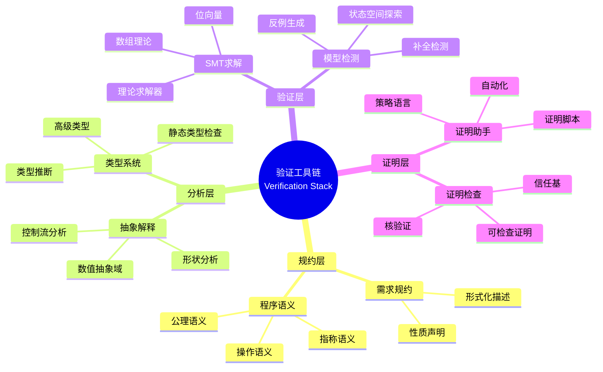

# 数学×计算机科学：形式化验证的逻辑证明

## 概述

形式化验证运用数理逻辑和自动推理技术来证明计算机系统的正确性。从程序逻辑到模型检测，从类型理论到交互式定理证明，数学的严谨性为软件可靠性提供了终极保证。

---

## 核心思维导图

---

## 验证方法的数学对应

---

## 程序逻辑推理规则

| 规则 | 形式 | 说明 |
|------|------|------|
| 赋值公理 | {Q[E/x]} x:=E {Q} | 前置条件替换 |
| 顺序组合 | {P}S1{R}, {R}S2{Q} ⊢ {P}S1;S2{Q} | 中间条件传递 |
| 条件语句 | {P∧B}S1{Q}, {P∧¬B}S2{Q} ⊢ {P}if B then S1 else S2{Q} | 分支推理 |
| while循环 | {I∧B}S{I} ⊢ {I}while B do S{I∧¬B} | 不变式维护 |
| 推论规则 | P⇒P', {P'}S{Q'}, Q'⇒Q ⊢ {P}S{Q} | 前后条件强化/弱化 |

---

## 验证工具链

---

## 工业级验证成果

- **seL4微内核**: 完整C代码功能正确性证明 (Isabelle/HOL)
- **CompCert编译器**: C到汇编的语义保持证明
- **IronFleet**: 分布式系统的完整证明 (Dafny)
- **AWS加密SDK**: 形式化安全分析
- **HACL\***: 高性能加密原语的验证实现

---

## 前沿研究方向

- **概率程序验证**: 期望推理、几乎必然终止
- **量子程序验证**: 量子Hoare逻辑、量子分离逻辑
- **机器学习验证**: 神经网络鲁棒性、公平性证明
- **连续系统**: 混合系统、网络物理系统
- **可扩展性**: 组合验证、模块化证明

---

*文档版本：1.0*
*创建时间：2026年4月*
*分类：数学×计算机科学 / 交叉学科*
