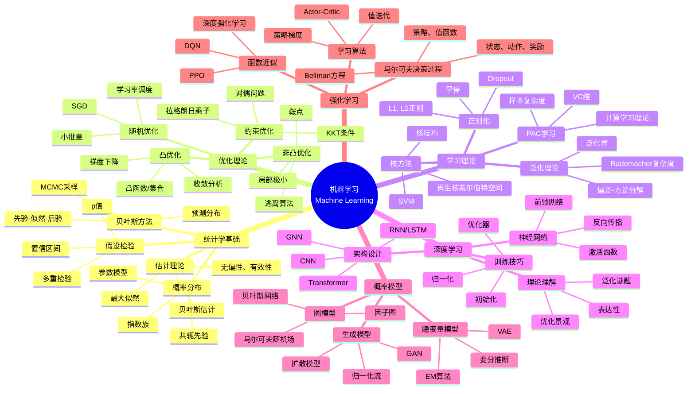
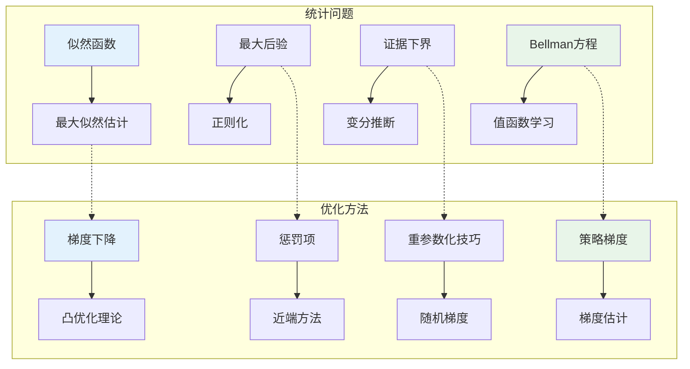
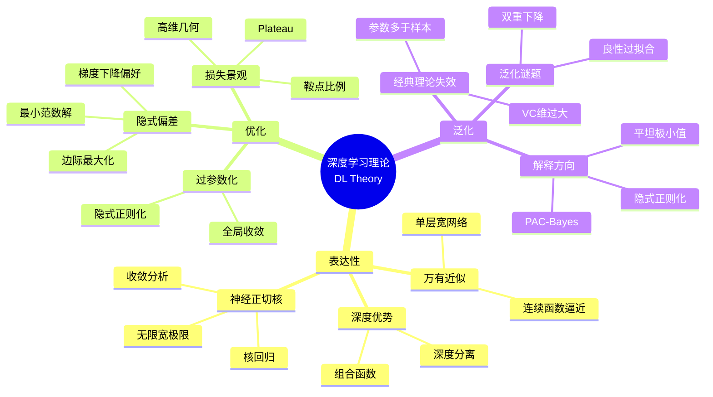
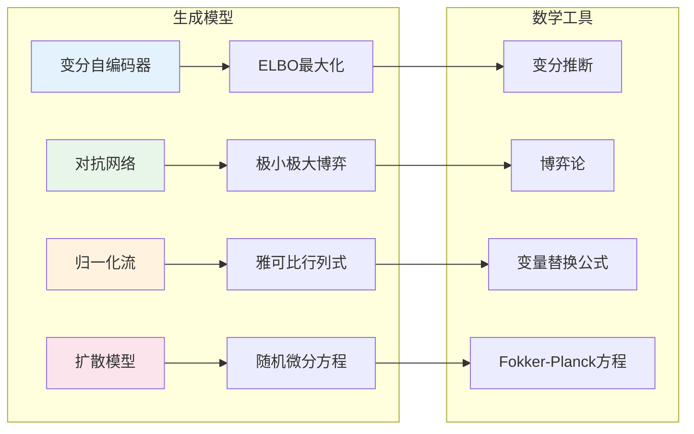

# 数学×计算机科学：机器学习的统计优化

## 概述

机器学习是计算机科学与统计学的深度融合，同时汲取了优化理论、信息论和泛函分析的精髓。从线性回归到深度神经网络，数学工具为算法的设计、分析和理解提供了坚实基础。

---

## 核心思维导图

---

## 统计学习与优化的对应

---

## 学习理论核心概念

| 概念 | 定义 | 意义 |
|------|------|------|
| VC维 | 能被假设空间打散的最大样本数 | 刻画模型复杂度 |
| Rademacher复杂度 | 假设类拟合随机噪声的能力 | 泛化界推导 |
| 覆盖数 | 度量空间中的球覆盖数 | 一致收敛率 |
| 稳定性 | 算法对训练数据扰动的敏感度 | 泛化保证 |
| 样本复杂度 | 达到精度ε所需样本数 | 计算效率分析 |

---

## 深度学习的数学谜题

---

## 生成模型的数学框架

---

## 高级数学工具

- **信息几何**: 参数空间的Fisher度量、自然梯度
- **最优输运**: Wasserstein距离、生成模型理论
- **随机矩阵**: 神经网络的高斯过程极限
- **平均场理论**: 无限宽网络的动态分析
- **代数拓扑**: 神经网络的拓扑数据分析

---

*文档版本：1.0*
*创建时间：2026年4月*
*分类：数学×计算机科学 / 交叉学科*
