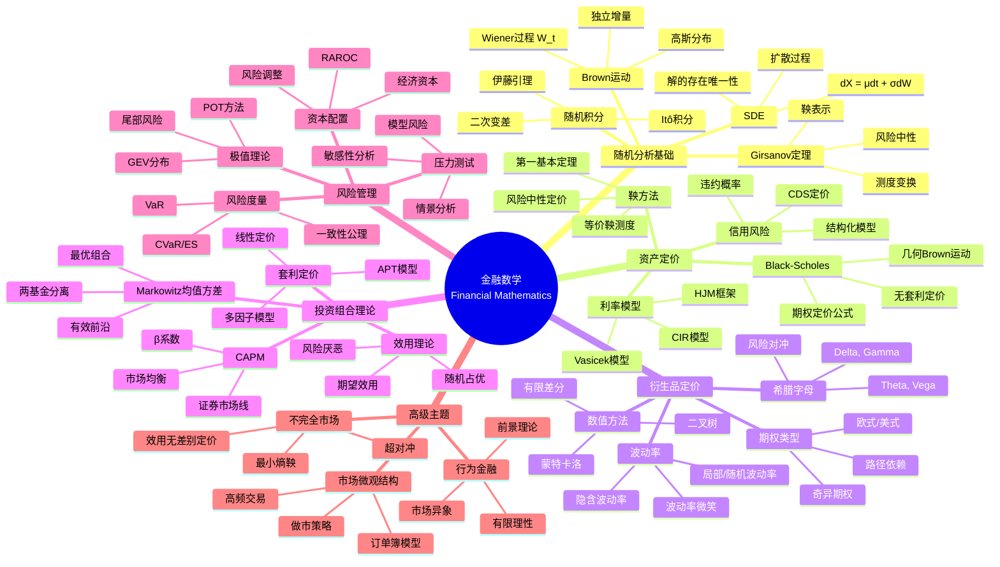

# 数学×经济学：金融数学的随机分析

## 概述

金融数学运用随机分析、偏微分方程和优化理论来研究金融市场中的资产定价、风险管理和投资组合优化。从Black-Scholes期权定价公式到现代风险度量理论，数学为金融实践提供了坚实的理论基础。

---

## 核心思维导图



---

## 定价理论的数学框架

```mermaid
graph TD
    subgraph 概率框架
        P[真实世界测度 P] --> M[等价鞅测度 Q]
        M --> E[期望定价]
        SDE[SDE dS = μSdt + σSdW] --> BS[Black-Scholes PDE]
    end
    
    subgraph 定价公式
        E --> C[看涨期权 C = e^(-rT)E_Q[max(S_T-K,0)]]
        BS --> PDE[∂V/∂t + ½σ²S²∂²V/∂S² + rS∂V/∂S - rV = 0]
    end
    
    style M fill:#e3f2fd
    style C fill:#e3f2fd
    style BS fill:#e8f5e9

```

---

## Black-Scholes公式

| 变量 | 公式 | 说明 |
|------|------|------|
| 看涨期权 | C = S₀N(d₁) - Ke^(-rT)N(d₂) | d₁,₂ = [ln(S₀/K) + (r±σ²/2)T]/(σ√T) |
| 看跌期权 | P = Ke^(-rT)N(-d₂) - S₀N(-d₁) | 看跌-看涨平价 |
| Delta | ∂C/∂S = N(d₁) | 对冲比率 |
| Gamma | ∂²C/∂S² = n(d₁)/(Sσ√T) | Delta变化率 |
| Theta | ∂C/∂t | 时间衰减 |
| Vega | ∂C/∂σ = S√T n(d₁) | 波动率敏感度 |

---

## 风险度量公理

```mermaid
mindmap
  root((一致性风险度量<br/>Coherent Risk Measures))
    Artzner公理
      单调性
        X ≤ Y ⇒ ρ(X) ≥ ρ(Y)
        较小损失风险较大
      正齐次性
        ρ(λX) = λρ(X)
        比例不变
      平移不变性
        ρ(X+m) = ρ(X) - m
        现金加减少风险
      次可加性
        ρ(X+Y) ≤ ρ(X) + ρ(Y)
        分散降低风险
    常见度量
      VaR
        分位数定义
        不满足次可加性
        监管标准
      CVaR/ES
        尾部条件期望
        一致性
        凸优化
      谱风险
        加权平均
        一般化ES
        风险厌恶函数

```

---

## 投资组合前沿

- **最小方差组合**: min wᵀΣw s.t. wᵀ1=1
- **切线组合**: 夏普比率最大
- **有效前沿**: 给定收益下最小风险
- **两基金定理**: 任何有效组合可由两个基金生成

---

*文档版本：1.0*
*创建时间：2026年4月*
*分类：数学×经济学 / 交叉学科*
