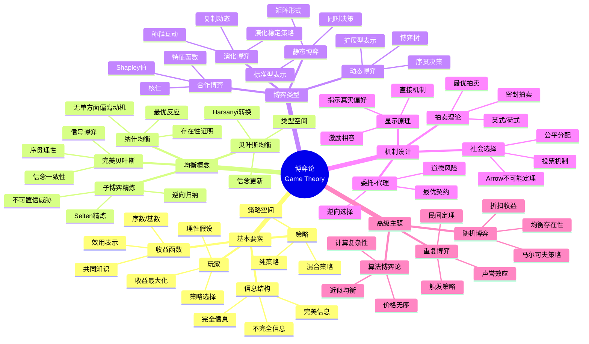
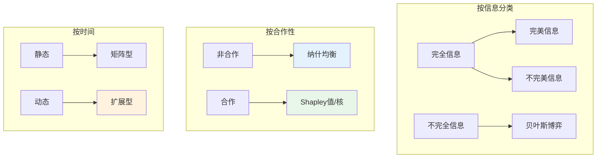
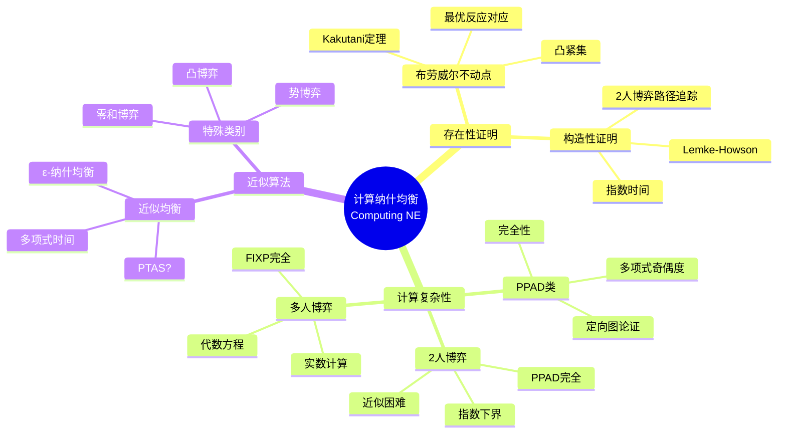
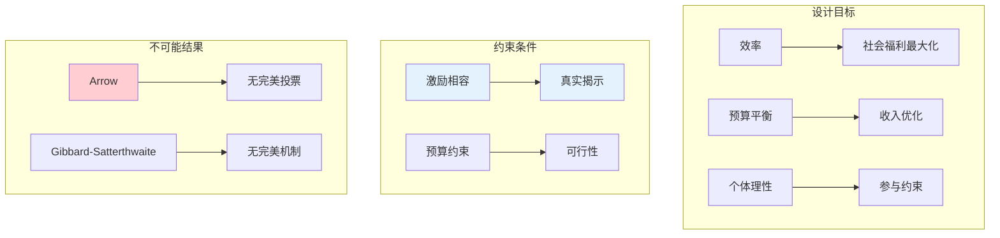

# 数学×经济学：博弈论的均衡分析

## 概述

博弈论是研究理性决策者之间策略互动的数学理论。从纳什均衡到机制设计，博弈论为理解经济学、政治学、生物学和社会科学中的策略行为提供了统一框架。

---

## 核心思维导图

---

## 博弈的分类与表示

---

## 核心均衡概念对比

| 均衡 | 适用场景 | 精炼内容 | 存在性 |
|------|----------|----------|--------|
| 纳什均衡 | 所有博弈 | 无 | 有限博弈存在 |
| 子博弈精炼 | 动态完全信息 | 排除不可置信威胁 | 有限博弈存在 |
| 贝叶斯均衡 | 静态不完全信息 | 类型依赖最优反应 | 有限博弈存在 |
| 完美贝叶斯 | 动态不完全信息 | 信念一致性 | 一般存在 |
| 序列均衡 | 动态不完全信息 | 更强一致性 | 一般存在 |

---

## 纳什均衡的计算

---

## 机制设计的数学框架

---

## 应用领域

- **拍卖设计**: FCC频谱拍卖、在线广告
- **市场设计**: 匹配市场、肾脏交换
- **平台经济学**: 双边市场、网络效应
- **政治经济学**: 投票理论、集体决策
- **生物学**: 进化稳定、动物行为

---

*文档版本：1.0*
*创建时间：2026年4月*
*分类：数学×经济学 / 交叉学科*
