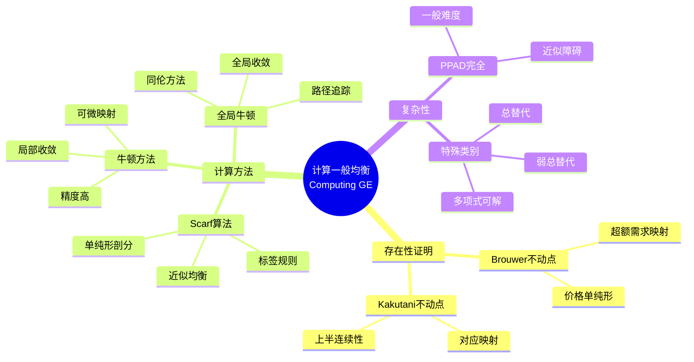

# 数学×经济学：经济优化的数学规划

## 概述

经济优化问题是数学规划的重要应用领域。从消费者效用最大化到厂商成本最小化，从资源分配到市场均衡，凸优化、线性规划和动态规划为经济决策提供了系统化的分析框架。

---

## 核心思维导图

```mermaid
mindmap
  root((经济优化<br/>Economic Optimization))
    消费者理论
      效用最大化
        max U(x) s.t. p·x ≤ I
        需求函数
        Marshall需求
      支出最小化
        min p·x s.t. U(x) ≥ Ū
        Hicks需求
        支出函数
      对偶理论
        效用-支出对偶
        Slutsky方程
        包络定理
      偏好表示
        效用函数存在性
        理性偏好公理
        显示偏好
    生产者理论
      利润最大化
        max p·y - c(y)
        供给函数
        Hotelling引理
      成本最小化
        min w·x s.t. f(x) ≥ y
        条件要素需求
        Shephard引理
      生产函数
        Cobb-Douglas
        CES
        里昂惕夫
      规模报酬
        递增/不变/递减
        欧拉定理
        成本函数性质
    一般均衡
      瓦尔拉斯均衡
        超额需求 = 0
        存在性
        唯一性
      计算均衡
        Scarf算法
        不动点迭代
        边界检验
      福利定理
        第一福利定理
        第二福利定理
        市场与效率
      不确定性
        阿罗证券
        状态依存市场
        风险分担
    机制设计优化
      拍卖设计
        最优拍卖
        Myerson设计
        虚拟价值
      税收理论
        Ramsey税收
        Mirrlees最优税
        激励约束
      契约理论
        最优契约
        参与约束
        激励相容
    动态优化
      最优控制
        Pontryagin原理
        汉密尔顿函数
        横截条件
      动态规划
        Bellman方程
        值函数
        策略迭代
      重叠代模型
        消费储蓄决策
        稳态分析
        动态效率
    博弈优化
      纳什均衡计算
        非线性互补
        变分不等式
        全局优化
      Stackelberg博弈
        领导者-跟随者
        双层规划
        均衡约束
       auction均衡
        市场出清
        价格发现
        算法机制

```

---

## 经济问题的优化结构

```mermaid
graph TD
    subgraph 原问题
        U[效用最大化<br/>max U(x), p·x≤I] --> D[需求x(p,I)]
        C[成本最小化<br/>min w·x, f(x)≥y] --> S[要素需求]
    end
    
    subgraph 对偶问题
        E[支出最小化<br/>min p·x, U(x)≥Ū] --> H[Hicks需求]
        P[利润最大化<br/>max py-c(y)] --> Y[供给y(p)]
    end
    
    D -.-> E
    S -.-> P
    
    style U fill:#e3f2fd
    style D fill:#e3f2fd
    style C fill:#e8f5e9
    style S fill:#e8f5e9

```

---

## 经典优化问题

| 问题 | 数学形式 | 关键结果 | 应用 |
|------|----------|----------|------|
| 效用最大化 | max U(x), p·x≤I | 边际替代率=价格比 | 需求理论 |
| 成本最小化 | min w·x, f(x)≥y | 边际技术替代率=要素价格比 | 要素需求 |
| 福利最大化 | max ΣλᵢUᵢ | Lindahl均衡 | 公共品 |
| 最优税收 | max SWF s.t. 税收约束 | Ramsey规则 | 税收政策 |
| 动态最优消费 | max E[∑βᵗu(cₜ)] | 欧拉方程 | 宏观经济学 |

---

## 一般均衡的计算



---

## 动态规划的Bellman方程

- **值函数**: V(k) = max_c {u(c) + βV(k')}
- **策略函数**: c = g(k), k' = h(k)
- **欧拉方程**: u'(c) = β(1+r)E[u'(c')]
- **横截条件**: lim βᵗu'(cₜ)kₜ₊₁ = 0

---

*文档版本：1.0*
*创建时间：2026年4月*
*分类：数学×经济学 / 交叉学科*
