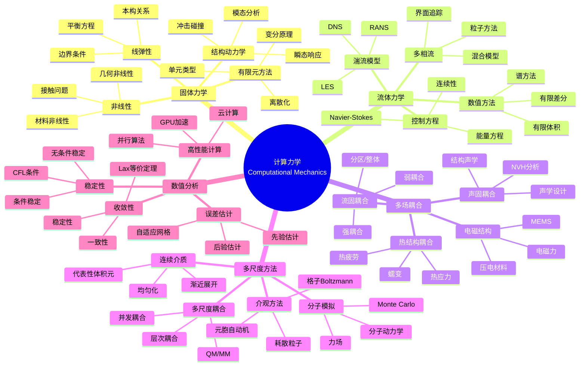
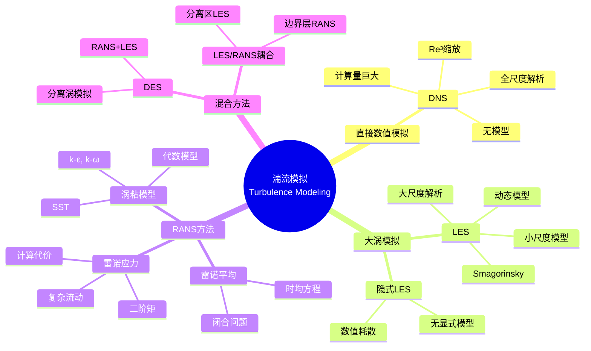

# 数学×工程学：计算力学的数值方法

## 概述

计算力学运用数值方法求解力学问题，是工程设计与分析的核心工具。从有限元方法到计算流体力学，从分子动力学到多尺度模拟，数学方法使复杂工程系统的精确预测成为可能。

---

## 核心思维导图



---

## 有限元方法框架

```mermaid
graph TD
    subgraph 连续问题
        V[变分形式<br/>Find u∈V: a(u,v)=F(v)] --> S[强形式<br/>-∇·σ = f]
    end
    
    subgraph 离散化
        V --> D[有限维子空间 V_h]
        D --> A[刚度矩阵 K]
        D --> L[载荷向量 F]
    end
    
    subgraph 求解
        A --> E[线性系统 KU=F]
        E --> SOL[解 U]
    end
    
    style V fill:#e3f2fd
    style D fill:#e8f5e9
    style E fill:#fff3e0

```

---

## 数值方法比较

| 方法 | 适用问题 | 网格类型 | 优势 | 挑战 |
|------|----------|----------|------|------|
| 有限元(FEM) | 固体力学 | 非结构化 | 几何灵活 | 大变形 |
| 有限差分(FDM) | 简单几何 | 结构化 | 实现简单 | 复杂边界 |
| 有限体积(FVM) | CFD | 任意 | 守恒性好 | 精度 |
| 谱方法 | 光滑解 | 全局 | 指数收敛 | 间断困难 |
| 无网格 | 大变形 | 无网格 | 避免重划分 | 计算代价 |

---

## 湍流模拟方法层次



---

## 多尺度耦合策略

| 方法 | 耦合方式 | 应用 | 代表软件 |
|------|----------|------|----------|
| 并发耦合 | 同时求解 | 裂纹尖端 | 自定义 |
| 层次耦合 | 逐级传递 | 复合材料 | Digimat |
| QM/MM | 量子/分子 | 催化反应 | Gaussian/NAMD |
| FE² | 微观-宏观 | 多晶材料 | FEniCS |

---

## 前沿方向

- **数据驱动建模**: 物理信息神经网络(PINN)
- **数字孪生**: 实时仿真、模型更新
- **不确定性量化**: 可靠性分析、随机有限元
- **极端力学**: 冲击、爆炸、超高速碰撞
- **生物力学**: 软组织、血流、细胞力学

---

*文档版本：1.0*
*创建时间：2026年4月*
*分类：数学×工程学 / 交叉学科*
