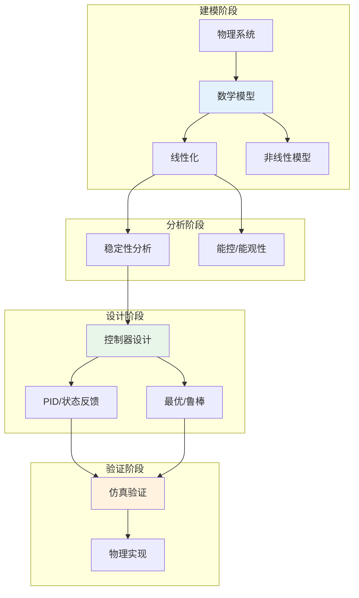

# 数学×工程学：控制理论的系统分析

## 概述

控制理论是研究动态系统行为调节的数学学科，广泛应用于航空航天、机器人、自动化和过程控制等领域。从经典PID控制到现代状态空间方法，从最优控制到鲁棒控制，数学工具为工程系统的设计和分析提供了坚实基础。

---

## 核心思维导图

```mermaid
mindmap
  root((控制理论<br/>Control Theory))
    系统描述
      微分方程
        状态空间
        ẋ = Ax + Bu
        线性/非线性
      传递函数
        Laplace变换
        G(s) = C(sI-A)⁻¹B
        零极点
      频域分析
        Bode图
        Nyquist图
        波特图
      离散系统
        Z变换
        差分方程
        采样与保持
    稳定性分析
      Lyapunov方法
        直接法
        能量函数
        渐近稳定
      频域判据
        Nyquist判据
        相位裕度
        增益裕度
      根轨迹
        特征方程
        极点移动
        参数变化
      Routh-Hurwitz
        代数判据
        系数条件
        临界稳定
    经典控制
      PID控制
        比例P
        积分I
        微分D
        参数整定
      超前滞后
        相位补偿
        增益调节
        性能改善
      串联校正
        期望特性
        综合设计
    状态空间设计
      能控能观
        能控性矩阵
        能观性矩阵
        Kalman分解
      状态反馈
        极点配置
        Ackermann公式
        LQR设计
      观测器
        全维观测器
        降维观测器
        Kalman滤波
      分离原理
        反馈与观测
        独立设计
    最优控制
      变分法
        Euler-Lagrange
        横截条件
        最优轨迹
      Pontryagin原理
        Hamilton函数
        协态方程
        极小值条件
      动态规划
        Bellman方程
        值函数
        HJB方程
      LQR/LQG
        二次性能指标
        Riccati方程
        高斯噪声
    鲁棒控制
      H∞控制
        范数最小化
        灵敏度函数
        混合灵敏度
      μ分析
        结构化奇异值
        鲁棒稳定性
        鲁棒性能
      自适应控制
        模型参考
        自校正
        在线辨识
```

---

## 控制系统设计流程



---

## 稳定性判据对比

| 方法 | 适用范围 | 判据内容 | 优点 | 缺点 |
|------|----------|----------|------|------|
| Routh-Hurwitz | 线性定常 | 特征方程系数条件 | 代数方法 | 高阶复杂 |
| Nyquist | 线性定常 | G(s)包围(-1,j0) | 频域直观 | 需绘图 |
| Lyapunov | 线性/非线性 | 存在正定V, V̇负定 | 通用性强 | 构造困难 |
| 根轨迹 | 线性定常 | 极点位置 | 参数影响直观 | 单参数 |

---

## LQR最优控制

```mermaid
mindmap
  root((LQR设计<br/>Linear Quadratic Regulator))
    问题描述
      系统
        ẋ = Ax + Bu
        线性时不变
      性能指标
        J = ∫(xᵀQx + uᵀRu)dt
        Q半正定
        R正定
      目标
        最小化J
        状态调节
        能量权衡
    Riccati方程
      代数Riccati
        AᵀP + PA - PBR⁻¹BᵀP + Q = 0
        半正定解
        唯一性条件
      数值解法
        特征向量法
        迭代法
        Schur分解
    最优反馈
      控制律
        u = -Kx
        K = R⁻¹BᵀP
      闭环系统
        ẋ = (A-BK)x
        稳定保证
        最优性
    扩展
      跟踪问题
        参考输入
        稳态误差
      时变系统
        微分Riccati
        有限时域
```

---

## 现代控制理论发展

- **非线性控制**: 反馈线性化、滑模控制、反步设计
- **预测控制**: MPC, 约束处理、滚动优化
- **网络化控制**: 延迟、丢包、事件触发
- **分布式控制**: 多智能体、一致性、协同控制
- **数据驱动**: 系统辨识、强化学习控制

---

*文档版本：1.0*
*创建时间：2026年4月*
*分类：数学×工程学 / 交叉学科*
