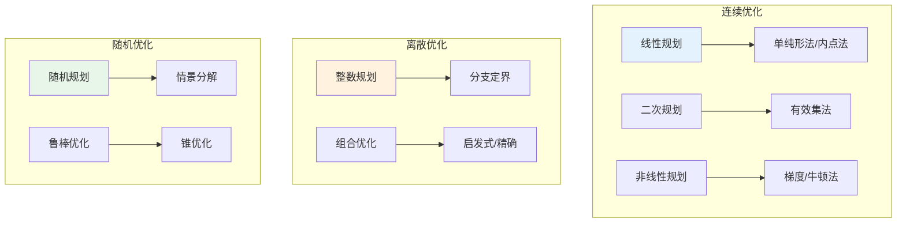
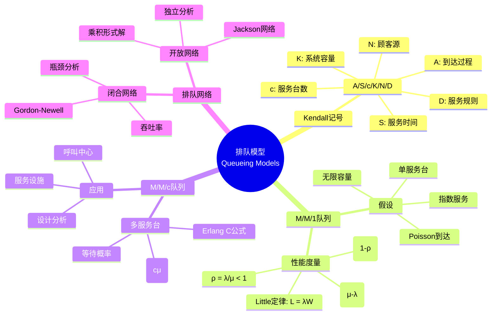

# 数学×工程学：运筹学的优化方法

## 概述

运筹学运用数学建模、统计分析和优化算法来解决复杂决策问题。从线性规划到整数规划，从排队论到库存管理，运筹学方法广泛应用于物流、制造、金融和服务业等领域。

---

## 核心思维导图

```mermaid
mindmap
  root((运筹学<br/>Operations Research))
    数学规划
      线性规划
        标准型
        单纯形法
        对偶理论
        灵敏度分析
      整数规划
        分支定界
        割平面
        完全单模
      非线性规划
        凸优化
        KKT条件
        梯度方法
      多目标规划
        Pareto最优
        加权法
        ε-约束法
    组合优化
      网络流
        最大流
        最小费用流
        运输问题
      匹配
        二分匹配
        最大匹配
        指派问题
      旅行商
        启发式
        分支切割
        近似算法
      背包与覆盖
        动态规划
        贪心近似
        原始对偶
    随机模型
      排队论
        M/M/1
        M/M/c
        排队网络
      库存论
        EOQ模型
        报童模型
        (s,S)策略
      可靠性
        系统可靠性
        维护策略
        寿命分布
      马尔可夫决策
        策略迭代
        值迭代
        折扣/平均
    启发式算法
      元启发式
        遗传算法
        模拟退火
        禁忌搜索
      群体智能
        蚁群优化
        粒子群
        人工蜂群
      邻域搜索
        局部搜索
        变邻域
        大邻域
    决策分析
      多属性决策
        AHP
        TOPSIS
        效用理论
      博弈论
        纳什均衡
        合作博弈
        机制设计
      风险分析
        决策树
        期望效用
        随机占优
    仿真技术
      蒙特卡洛
        随机采样
        方差缩减
        优化
      离散事件
        事件调度
        过程交互
        活动扫描
      系统动力学
        因果回路
        存量流量
        反馈

```

---

## 优化问题分类与算法



---

## 经典问题数学形式

| 问题 | 数学形式 | 算法 | 复杂度 |
|------|----------|------|--------|
| 线性规划 | min cᵀx, s.t. Ax≤b | 单纯形/内点 | 多项式(弱) |
| 整数规划 | min cᵀx, s.t. Ax≤b, x∈ℤⁿ | 分支定界 | NP-hard |
| 运输问题 | min Σcᵢⱼxᵢⱼ, s.t. 供需约束 | 网络单纯形 | 多项式 |
| 指派问题 | min Σcᵢⱼxᵢⱼ, x为置换 | 匈牙利算法 | O(n³) |
| 最大流 | max Σf | Ford-Fulkerson | O(VE²) |
| TSP | min 巡回长度 | Concorde | NP-hard |

---

## 排队论基础模型



---

## 现代运筹学方向

- **大数据优化**: 分布式优化、在线学习
- **鲁棒与随机优化**: 不确定性量化、分布鲁棒
- **多智能体优化**: 博弈均衡、分布式决策
- **可持续运营**: 绿色物流、循环经济
- **人机协同**: 人机交互、智能决策支持

---

*文档版本：1.0*
*创建时间：2026年4月*
*分类：数学×工程学 / 交叉学科*
