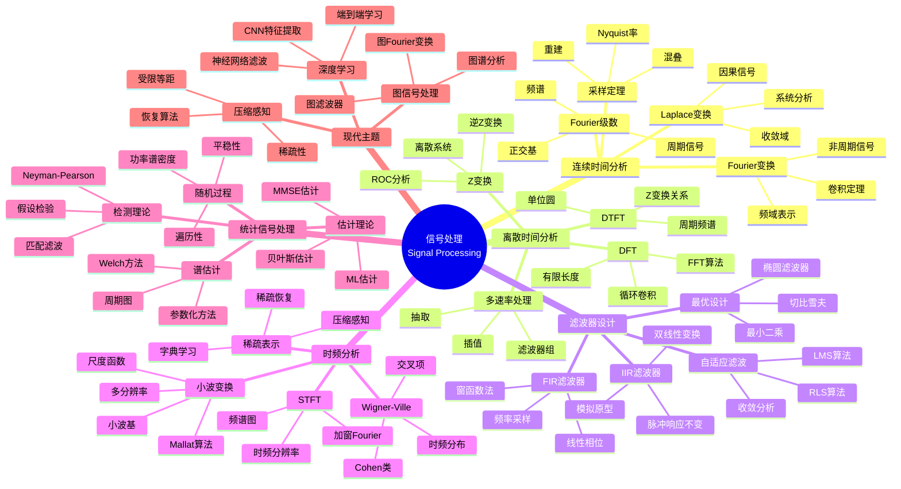
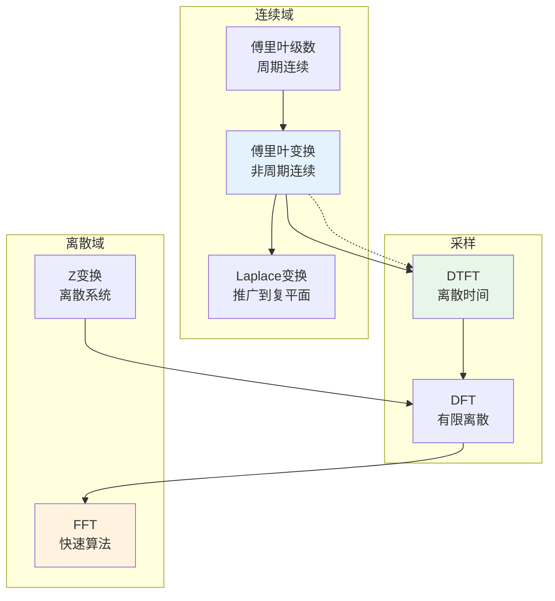
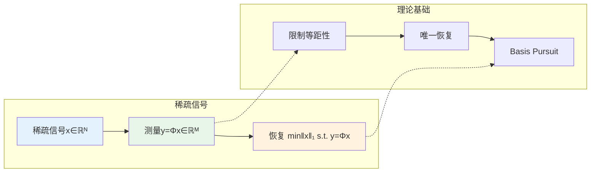

# 数学×工程学：信号处理的调和分析

## 概述

信号处理研究信号的获取、表示、变换、滤波和解释，其数学基础根植于调和分析、线性代数和概率论。从傅里叶分析到小波变换，从滤波器设计到压缩感知，数学工具使现代数字通信和多媒体技术成为可能。

---

## 核心思维导图



---

## 变换之间的关系



---

## 滤波器特性对比

| 类型 | 相位特性 | 设计方法 | 稳定性 | 计算复杂度 |
|------|----------|----------|--------|------------|
| FIR | 严格线性相位 | 窗函数、最优化 | 无条件稳定 | 较高(N阶) |
| IIR | 非线性相位 | 原型变换 | 需检查极点 | 较低(2N阶) |
| 自适应 | 随时间变化 | 迭代算法 | 收敛依赖 | 实时更新 |

---

## 小波变换的多分辨率

```mermaid
mindmap
  root((小波多分辨率<br/>Multiresolution Analysis))
    基本概念
      嵌套子空间
        ...⊂V₋₁⊂V₀⊂V₁⊂...
        完备性
        分离性
      尺度函数φ
        两尺度方程
        φ(t) = Σh[n]φ(2t-n)
        低通滤波器
      小波函数ψ
        小波方程
        ψ(t) = Σg[n]φ(2t-n)
        带通滤波器
    Mallat算法
      分解
        近似系数 a_j
        细节系数 d_j
        滤波+抽取
      重构
        插值+滤波
        完美重建
        正交/双正交
    常见小波
      Haar
        最简单
        不连续
        紧支撑
      Daubechies
        紧支撑正交
        消失矩
        光滑性
      样条小波
        对称性
        线性相位
        计算高效

```

---

## 压缩感知理论



---

## 前沿方向

- **量子信号处理**: 量子傅里叶变换、量子滤波
- **神经信号处理**: 脑机接口、神经编码
- **分布式处理**: 传感器网络、一致估计
- **图深度学习**: 图卷积网络、几何深度学习

---

*文档版本：1.0*
*创建时间：2026年4月*
*分类：数学×工程学 / 交叉学科*
