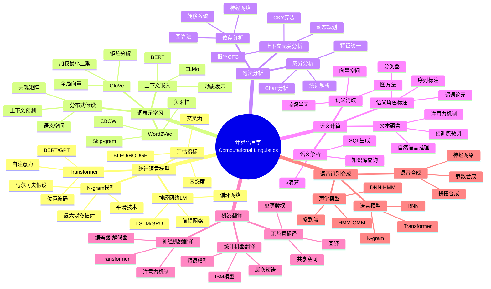
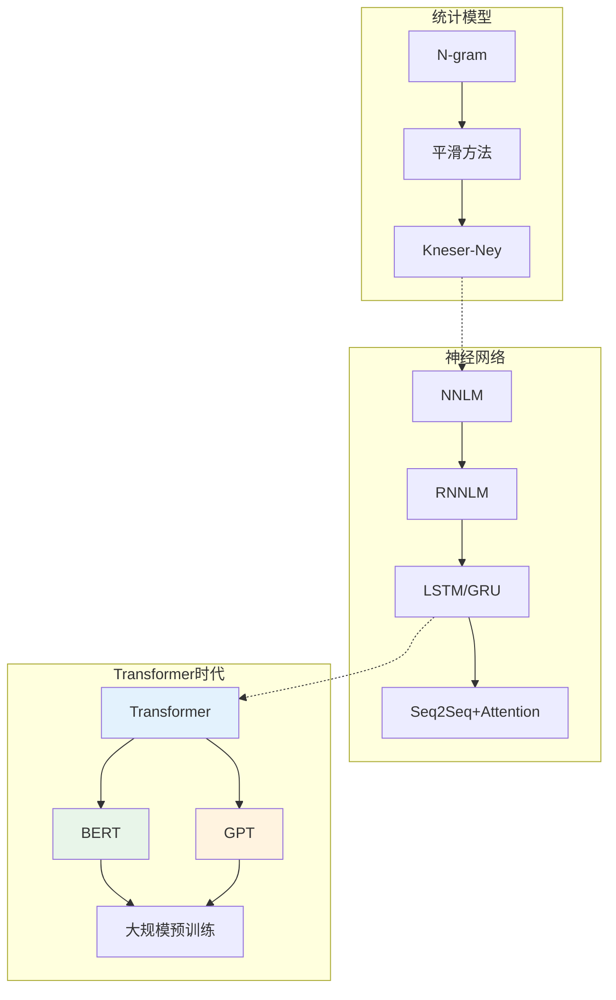

# 数学×语言学：计算语言学的统计模型

## 概述

计算语言学运用统计学和机器学习方法来处理和分析自然语言数据。从n-gram语言模型到神经机器翻译，从隐马尔可夫模型到Transformer架构，数学和计算工具推动了自然语言处理的革命性发展。

---

## 核心思维导图



---

## 语言模型发展



---

## 词嵌入方法对比

| 方法 | 训练目标 | 上下文定义 | 特点 |
|------|----------|------------|------|
| Word2Vec(CBOW) | 上下文预测中心词 | 窗口 | 高效、局部 |
| Word2Vec(Skip-gram) | 中心词预测上下文 | 窗口 | 罕见词友好 |
| GloVe | 共现矩阵重构 | 全局 | 融合全局统计 |
| FastText | 子词预测 | 窗口+子词 | OOV处理 |
| BERT | 掩码语言模型 | 双向上下文 | 上下文相关 |
| ELMo | 双向LM | 整句 | 多层表示 |

---

## Transformer架构

```mermaid
mindmap
  root((Transformer架构))
    自注意力机制
      缩放点积注意力
        Q, K, V矩阵
        Attention = softmax(QKᵀ/√d)V
        并行计算
      多头注意力
        多子空间投影
        h=8 or 16
        拼接+线性变换
      自注意力
        每个位置关注所有位置
        捕获长距离依赖
        可解释性
    位置编码
      正弦编码
        PE(pos,2i) = sin(pos/10000^(2i/d))
        PE(pos,2i+1) = cos(...)
        外推性
      可学习编码
        位置嵌入
        固定长度
    前馈网络
      位置前馈
        FFN(x) = max(0, xW₁+b₁)W₂+b₂
        独立处理每个位置
      残差连接
        LayerNorm(x + Sublayer(x))
        梯度传播
    应用
      编码器(BERT)
        双向上下文
        掩码LM
        下游任务微调
      解码器(GPT)
        单向生成
        自回归
        因果掩码
      编码器-解码器(T5)
        翻译/摘要
        前缀LM

```

---

## 前沿方向

- **多模态学习**: 视觉-语言预训练
- **知识增强**: 符号知识注入
- **因果NLP**: 因果推断与反事实
- **低资源学习**: 跨语言迁移、元学习
- **可解释性**: 注意力分析、探测任务

---

*文档版本：1.0*
*创建时间：2026年4月*
*分类：数学×语言学 / 交叉学科*
